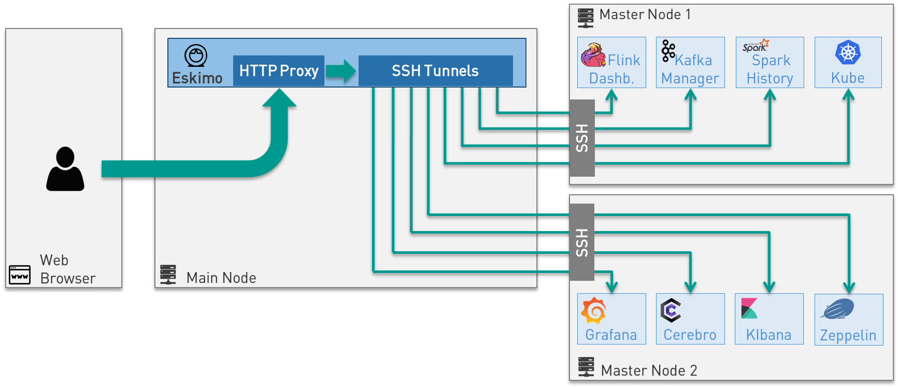

== Eskimo Architecture and Design Elements

This section presents various architecture and design elements of Eskimo.

[[ssh-tunneling]]
=== SSH Tunelling

One of the most important features of Eskimo is the abilityof its _Web Console_ to provide in a single and unified
Graphical User Interface all the underlying component administration Consoles such as the _Kubernetes Dashboard_ or
the _Kafka Manager_, just as the essential Data Science Applications such as _Kibana_ and _Zeppelin_.

The Eskimo Frontend wraps these other web applicationss in its own _User Interface_ and the Eskimo backend proxies their
HTTP data flows to their respective backend through SSH, in a transparent and secured way. +
The actual location of these software components (the runtime cluster node on which they are actually executed) is only
known by the eskimo backend (or kubernetes) and is handled automatically. +
Whenever such a console or service is moved from a node to another node (either manually or automatically by
Kubernetes), that is completely transparent to the end user.

Eskimo provides full *abstraction of location* on Managed Services, for both Kubernetes services and node native
services.

=== Security

This section presents different important aspects of the security principle within Eskimo.

=== Confidentiality and cluster protection

The key principle on which Eskimo leverages consists in *protecting the cluster nodes from external accesses.*

Eskimo makes it so that each and every access to the eskimo cluster services are made through Eskimo. It acts as a proxy
between the external world and the eskimo cluster nodes (See <<ssh-tunneling>> above).

When building eskimo cluster nodes, preparing for Eskimo's installation, administrators should ensure to leverage on
`iptables` or `firewalld` to ensure:

* Only IP addresses within the Eskimo cluster nodes range or sub-network can have open and wide access to the other
  Eskimo nodes.
* All external IP addresses (external to the eskimo cluster) should have access only to
** Port 22 for eskimo to be able to reach them - if the eskimo application itself is installed outside of the eskimo
   cluster
** Port 80 of the node running eskimo - if the eskimo application itself is installed on one of the eskimo cluster node
   (or the port on which Eskimo is configured to listen).

This principle is illustrated by the schema at <<sample_system_archi>>.

When setting up Eskimo, administrators have to provide the SSH private key that Eskimo will use to operate every node
on the Eskimo cluster.
It is of utmost importance to treat this key with great confidentiality and to ensure it is only usable by the Eskimo
system user.

==== Data Encryption

Eskimo recommends to encrypt filesystem partitions use for data storage, either at hardware level if that is supported
or at Operating System level.

Especially following folders or mount points have to be encrypted (depending on the services being installed)

* `/var/lib/gluster` used for gluster bricks storage (and kafka, spark, etc. data in the current eskimo version)
* `/var/lib/elasticsearch` used for elasticsearch data storage

It's also possible within Eskimo to customize the ElasticSearch instances setup script to leverage on ElasticSearch's
native data at rest encryption abilities.

==== User rights segregation and user imprersonation

A note on user impersonation and user rights segregation: Eskimo Community Edition doesn't support custom user rights
segregation.
All users within Eskimo Community Edition either have the `user` role - in which case they have access to business
console and a few utilities - or the `administrator` role, who have full access to all Eskimo user and administration
features.

If user rights segregation, authorizations enforcement and user impersonation are key concerns for one's enterprise
environment, one should consider upgrading to *Eskimo Enterprise Edition* which provides state of the art
implementations of each and every Enterprise Grade requirement.

=== High availability

Eskimo _Community Edition_ provides only partial HA - High Availability - support.

Basically:

* Flink and Spark applications, leveraging on kubernetes, are natively Highly Available and resilient to slave nodes
  vanishing.
* ElasticSearch as well is natively highly-available as long as the applications reaching it support using multiple
  bootstrap nodes.
* All web consoles and administration applications leveraging on kubernetes (such as Kibana, Zeppelin, Cerebro,
  the kafka-manager, etc. are natively available as well.

However in Eskimo _Community Edition_, some services are not highly-available and form single point of failure forcing
administrators to take manual actions when problems occur (service crash or node vanishing). +
These Single Point of Failure services - not highly available - are: Zookeeper and Kube-Master.

If full high-availability is an important requirement for one's applications, then one should consider upgrading to
*Eskimo Enterprise Edition* which implements 100% high availability for every components.

