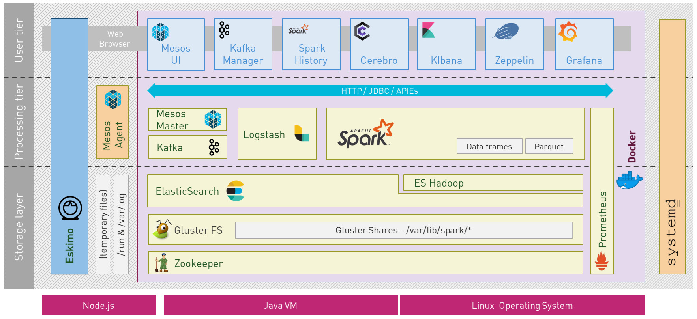
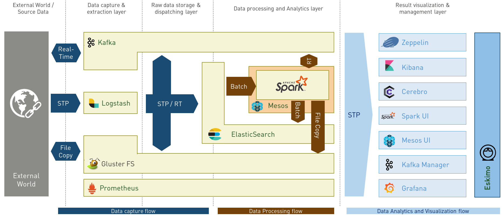
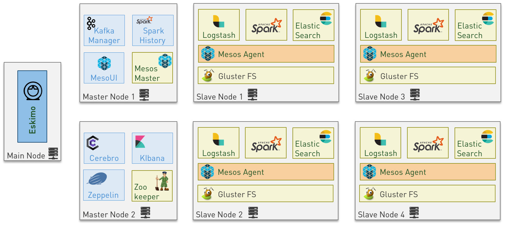

////
This file is part of the eskimo project referenced at www.eskimo.sh. The licensing information below apply just as
well to this individual file than to the Eskimo Project as a whole.

Copyright 2019 eskimo.sh / https://www.eskimo.sh - All rights reserved.
Author : eskimo.sh / https://www.eskimo.sh

Eskimo is available under a dual licensing model : commercial and GNU AGPL.
If you did not acquire a commercial licence for Eskimo, you can still use it and consider it free software under the
terms of the GNU Affero Public License. You can redistribute it and/or modify it under the terms of the GNU Affero
Public License  as published by the Free Software Foundation, either version 3 of the License, or (at your option)
any later version.
Compliance to each and every aspect of the GNU Affero Public License is mandatory for users who did no acquire a
commercial license.

Eskimo is distributed as a free software under GNU AGPL in the hope that it will be useful, but WITHOUT ANY
WARRANTY; without even the implied warranty of MERCHANTABILITY or FITNESS FOR A PARTICULAR PURPOSE. See the GNU
Affero Public License for more details.

You should have received a copy of the GNU Affero Public License along with Eskimo. If not,
see <https://www.gnu.org/licenses/> or write to the Free Software Foundation, Inc., 51 Franklin Street, Fifth Floor,
Boston, MA, 02110-1301 USA.

You can be released from the requirements of the license by purchasing a commercial license. Buying such a
commercial license is mandatory as soon as :
- you develop activities involving Eskimo without disclosing the source code of your own product, software,  use case.
  platform, use cases or scripts.
- you deploy eskimo as part of a commercial product, platform or software.
For more information, please contact eskimo.sh at https://www.eskimo.sh

The above copyright notice and this licensing notice shall be included in all copies or substantial portions of the
Software.
////

:sectnums:
:toc:
:authors: eskimo.sh / https://www.eskimo.sh / 2019
:copyright: eskimo.sh / https://www.eskimo.sh / 2019

= Eskimo User Guide

[[chap-introduction]]
== Eskimo Introduction

Eskimo is a Big Data Management Web Console to _build_, _manage_ and _operate_
*Big Data 2.0* clusters using *Docker* and *Mesos*.

image::pngs/eskimo.jpg[50, 50, align="center"]

Eskimo is in a certain way the Operating System of your Big Data Cluster:

* an Administration Application aimed at drastically simplifying the deployment, administration and operation of your
  Big Data Cluster
* a state of the art *Big Data 2.0* platform based on *Docker, Mesos and Systemd* and packaging *Gluster, Spark,
  Kafka and ElasticSearch* with all the required tools and consoles to manage them such as *Cerebro, Kibana, Zeppelin,
  Kafka-Manager, Grafana and Prometheus*.
* a collection of ready to use docker containers packaging fine-tuned and highly customized plug and play services
* a framework for building and deploying Big Data and NoSQL services based on docker and systemd

=== Key Features

Eskimo key features are as follows:

[cols=">.^20%,80%"]
|===
a|image::pngs/location.jpg[60, 60]| *Abstraction of Location*

Just define where you want to run which services and let eskimo take care of everything.

Move services between nodes or install new services in just a few clicks.

Don’t bother remembering where you installed Web consoles and UI applications, Eskimo wraps them all in a single UI.

a|image::pngs/console.jpg[60, 60]| *Eskimo Web Console*

Eskimo’s tip of the iceberg is its flagship web console.

The Eskimo Console is the single and entry point to all your cluster operations, from services installation to
accessing Kibana, Zeppelin and other UI applications.

The Eskimo Console also provides SSH consoles, File browser access and monitoring to your cluster.

a|image::pngs/framework.jpg[60, 60]| *Services Framework*

Eskimo is a Big Data Components service development and integration framework based on Docker and Systemd.

Eskimo provides out of the box ready-to use components such as Spark, ElasticSearch, Kafka, Mesos, Zeppelin, etc.

Eskimo also enables the user to develop his own services very easily.
|===

=== Why is Eskimo cool ?

* *Taking care of it !* +
Making Mesos, Kafka, ElasticSearch, Flink, Spark, etc. work perfectly together is difficult and tedious. +
Eskimo takes care of everything.

* *Big Data 2.0* +
Most if not all private-cloud Big Data Platform such as Hortonworks, Cloudera, MapR, etc. are based on Hadoop, HDFS,
YARN, etc. which are quite old components and technology.Eskimo is based on Mesos, ElasticSearch, Kafka and Spark,
cutting edge components from a newer generation.

* *Leveraging on docker* +
Most if not all private-cloud Big Data Platform such as Hortonworks, Cloudera, MapR, etc. install components natively,
thus having strong requirements and impacts on  underlying nodes.Eskimo uses docker to isolates Eskimo components
from underlying hosts and vice versa.

* *Eskimo is an open platform.* +
Eskimo works out of the box but users can customize and extend the way they like, the way they decide

=== Eskimo's DNA

[cols=">.^20%,80%"]
|===
a|image::pngs/big_data.jpg[80, 80] a| *Big Data 2.0*

In contrary to popular Hadoop-based and other Big Data Platforms, Eskimo is based on cutting-edge technologies:

* GlusterFS instead of HDFS
* Spark instead of Hive and Pig
* Mesos instead of Yarn
* Docker instead of not native deployment
* ElasticSearch instead of not HBase
* Flink instead of not Storm

These new generation Big Data components form together a Big Dats 2.0 stack, lightweight and efficient and leveraging
on modern computing abilities (memory oriented vs. IO oriented). +
This Big Data 2.0 software stack is much more efficient and effective than any hadoop based Big Data processing cluster,
while covering an extended subset of the same use cases.

In addition, in contrary to hadoop these software components behave just as good on a single node machine with plenty of
RAM and processor than it does on a cluster of a few small nodes, thanks to their ability of benefiting from the
multi-processor architecture of modern machines. +
In addition, this comes with an interesting benefit : the ability to build on one's machine the very same environment
than on a large production cluster.

a|image::pngs/ring.jpg[80, 80] a| *One ring to Rule them all*

Making docker, gluster, elasticsearch, kafka, spark, zeppelin, etc. all work perfectly and 100% together is very
tedious and difficult.

Eskimo takes care of everything and fine tunes all these services to make them understand each other and work together.

Eskimo enables you one-click administration of all of them, moving services, provisioning nodes, etc.

Yet it's open : open-source and built on standards

a|image::pngs/one_size.jpg[80, 80] a| *One size fits all*

Do you want to build a production grade Big Data Processing cluster with thousands of nodes to analyze the internet ?

Or do you want to build a small AI laboratory on your own laptop ?

Eskimo is made for you in these both cases.

a|image::pngs/lightweight.jpg[80, 80] a| *Lightweight in DNA*

MapR, Hortonworks, Cloudera and every other hadoop based Big Data Platforms are Behemoths.

Eskimo leverages on gluster, mesos, spark, elasticsearch, logstash, kibana, Zeppelin, etc. - simple and extremely
lightweight components that have a broad use cases coverage while simplifying administration, operation and usage.

a|image::pngs/platform.jpg[80, 80] a| *Open platform extensible and customizable*

Eskimo works out of the box, taking care of the burden to make all this software works perfectly and 100% together.

Eskimo is not a black box, it’s an open platform. One can fine tune and adapt everything exactly as desired : from
the docker containers building to the services setup on the platform.

Want to leverage on eskimo to integrate other services such as Apache Flink or Cassandra ? declare your own services
and import your own containers, built it as you like !

a|image::pngs/universal.jpg[80, 80] a| *Universal Platform*

Eskimo is exhaustively built on top of Docker.

Only mesos agents need to be compiled and adapted to the host linux OS running your cluster nodes. +
All the other components - from kafka to zeppelin through spark - run on docker

Eskimo is successfully tested on Ubuntu, Debian, CentOS and Fedora nodes so far ... more are coming.

a|image::pngs/simplicity.jpg[80, 80] a| *Simplicity as a core value*

Eskimo leverages on simple approaches and technologies.

No fancy scripting language, just plain old shell scripts. +
No fancy container management middleware, just plain old docker and systemd.

Eskimo doesn’t require you to learn anything else than Linux standard tools.

a|image::pngs/cloud.jpg[80, 80] a| *Cloud Friendly*

Build your own Big Data Cloud

Eskimo is VM friendly. +
You have a bunch of VMs somewhere on Amazon or google cloud ? +
Make it a state of the art big data cluster, your way, not amazon or google's predefined, fixed and constraining way.

Choose your services and let eskimo take care of everything.

|===

=== Eskimo Architecture

==== Techical Architecture

Eskimo's technical architecture can be illustraed as follows:

Three components are available in the storage layer

* ElasticSearch
* Gluster FS
* Zookeeper

The processing layer makes the following services available:

* Kafka : used for real-time integration and streaming abilities
* Spark : the large scale very versatile computation engine
* As a sidenote, ElasticSearch can also be considered part of the processing tier since it provides many processing
abilities (ppeline computations, aggregations, etc.)
* logstash : used for data processing and ingestion

Spark is operation by mesos to achieve cluster resources booking and negotiation.

The user layer is intended for data / result visualizations and platform administration with the following components:

* Kibana, Grafana and Zeppelin for data and result visualizations
* Cerebro, The Spark Console, the Kafka Manager and the Mesos UI for platform administration

Docker is used to operate and manage services and components along with systemd.

==== Typical Application architecture

A typical Eskimo application architecture can be illustrated as follows:

The above schema illustrates typical data flows within Eskimo

==== Sample System Architecture

This is an example of a possible deployment of Eskimo on a 6 nodes cluster:

The Eskimo application itself can be deployed on any of the cluster nodes or on another machine, as in the example
above.

=== Eskimo building

Eskimo build instructions are given in the file `README.adoc` located in the root folder of the eskimo source code
distribution.

[[chap-installation]]
== Eskimo Installation

WARNING: Currently, in this early stage, Eskimo runs only on Linux since it has dependencies on shell scripts and docker
to build package images. In the next version (within a few weeks), the possibility to download pre-built packages will
be added to eskimo and make it possible to run eskimo on Windows. +
Aside from this dependency on shell scripts and docker to build images, eskimo runs runs theoretically perfectly on
MS Windows. One may want to give cygwin a try regarding this shell dependency.

=== Prerequisites

Some noteworthy elements need to be beared in mind regarding eskimo prerequisites.

==== Java 8 or greater

Eskimo needs Java 8 or greater to run.

In addition, one needs to have either `java` in the path or the `JAVA_HOME` environment variable properly set in prior
to starting eskimo.

Use for instance the following commands on Linux:

.Put java in PATH on Linux
----
export JAVA_HOME=/usr/local/lib/jdk-9
export PATH=$JAVA_HOME/bin:$PATH
----

(You might want to put above commands in your `/etc/profile` or `/etc/bash.bashrc`)

And for instance the following commands on Windows

.Put java in PATH on Windows
----
set JAVA_HOME=C:\programs\jdk-9
set PATH=%JAVA_HOME%\bin;%PATH%
----

==== Prerequisites on eskimo cluster nodes

Linux distributions successfully tested with Eskimo and officially supprted are the following:

* Debian Stretch and greater
* Ubuntu Xenial and greater
* CentOS 7.x and 8.x
* Fedora 29 and greater

===== Firewall open ports on eskimo nodes

In case a firewall (firewalld or simple iptables configuration) is installed on eskimo cluster nodes, then
the following port numbers need to be explicitly open (for both UDP and TCP) for inside eskimo cluster communications:

* [cerebro] : 9000
* [elasticsearch] : 9200, 9300
* [gdash] : 28180
* [gluster] : 24007, 24008, 24009, 24010, 49152, 38465, 38466, 38467
* [grafana] : 3000
* [kafka] : 9092, 9093, 9999
* [kafka-manager] : 22080
* [kibana] : 5601
* [mesos] : 53, 61003, 61003, 61091, 61420, 62080, 62501, 64000, 5050, 7070, 8101, 8123, 8200, 8201, 8443, 8888, 9090,
9443, 9990, 15055, 15201, 61053, 61430, 61053
* [ntp] 123
* [prometheus] : 9090, 9091, 9093, 9094, 9100
* [spark] : 7077, 8580, 8980, 8581, 8981, 2304, 18480, 7337, 7222, 8032, 7222
* [spark-history-server] : 18080
* [zeppelin] : 38080, 38081
* [zookeeper] : 2181, 2888, 3888

Again, most of these ports need to be opened only for internal eskimo cluster node communications. +
But many of these service need to be acceses from the outside world as well so all in all administrators would be well
advised to open them externally as well.

===== Eskimo system user

Eskimo requires to have a system user properly defined and with SSH access to reach and operate the cluster nodes.
That user can be any user but it has to be configured in Eskimo - see <<user_configuration>> - and has to have SSH
access to every single node to be operated by eskimo using SSH Public Key Authentication -
see <<ssh_key_authentication>>.

*In addition, that user needs to have sudo access without requiring to enter a password!*

==== Internet access on cluster nodes

Eskimo performs some initial setup operations on every node of the cluster it needs to operate. Some of these
operations require Internet access to download dependencies (either RPM or DEB packages).

In case it is not possible to give access to internet to the nodes in the cluster you wish to operate using eskimo, you
will find below the `yum` and `apt` commands used during nodes setup. +
*You can reproduce these commands on your environment to find out about the packages that need to be installed in prior
to have eskimo operating your cluster nodes:*

Following commands are executed on a debian-based node:

.debian based node setup
----
# system update
apt-get -yq update

# docker dependencies
apt-get -yq install apt-transport-https ca-certificates curl software-properties-common
apt-get -yq install gnupg-agent gnupg2

# docker installation
curl -fsSL https://download.docker.com/linux/$LINUX_DISTRIBUTION/gpg | sudo apt-key add
add-apt-repository deb [arch=amd64] https://download.docker.com/linux/$LINUX_DISTRIBUTION $(lsb_release -cs) stable
apt-get -yq update
apt-get -yq install docker-ce docker-ce-cli containerd.io

# mesos dependencies
apt-get -y install libcurl4-nss-dev libsasl2-dev libsasl2-modules maven libapr1-dev libsvn-dev zlib1g-dev

# other dependencies
apt-get -yq install net-tools attr

# glusterfs client
apt-get -y install glusterfs-client
----

Following commands are executed on a redhat-based node:

.redhat based node setup
----
# system update
yum update

# docker dependencies
yum install -y yum-utils device-mapper-persistent-data lvm2

# docker installation
yum-config-manager --add-repo https://download.docker.com/linux/$LINUX_DISTRIBUTION/docker-ce.repo
yum install -y docker-ce docker-ce-cli containerd.io

# mesos dependencies
yum install -y zlib-devel libcurl-devel openssl-devel cyrus-sasl-devel cyrus-sasl-md5 apr-devel subversion-devel apr-util-devel

# other dependencies
yum install -y net-tools anacron

# glusterfs client
yum -y install glusterfs glusterfs-fuse
----

=== Extract archive.

After downloading either the zip ot the tarball archive of eskimo, it needs to be extracted on the local filesystem.

Then in the folder `bin` under the newly extracted eskimo binary distribution folder, one can find two scripts:

* a script `eskimo.bat` to execute eskimo on Windows
* a script `eskimo.sh` to execute eskimo on Linux.

=== Access eskimo

With eskimo properly started using the above scripts, one can reach eskimo using http://machine_ip:9090. +
The default port number is 9090. This can be changed in configuration file `eskimo.properties`.

The default login / password credentials are _admin_ / _password_.

=== Typical startup issues

Several issues can happen upon first eskimo startup. +
This section describes common issues and ways to resolve them.

==== eskimo-users.json cannot be written

If you meet an error as the following one upon startup:

.Impossible to write eskimo-users.json
----
Caused by: ch.niceideas.common.utils.FileException: ./eskimo-users.json (Unauthorized access)
        at ch.niceideas.common.utils.FileUtils.writeFile(FileUtils.java:154)
        at ch.niceideas.eskimo.security.JSONBackedUserDetailsManager.<init>(JSONBackedUserDetailsManager.java:81)
        at ch.niceideas.eskimo.configurations.WebSecurityConfiguration.userDetailsService(WebSecurityConfiguration.java:127)
        ... 50 more
Caused by: java.io.FileNotFoundException: ./eskimo-users.json (Unauthorized access)
        at java.base/java.io.FileOutputStream.open0(Native Method)
        at java.base/java.io.FileOutputStream.open(FileOutputStream.java:276)
        at java.base/java.io.FileOutputStream.<init>(FileOutputStream.java:220)
        at java.base/java.io.FileOutputStream.<init>(FileOutputStream.java:170)
        at java.base/java.io.FileWriter.<init>(FileWriter.java:90)
        at ch.niceideas.common.utils.FileUtils.writeFile(FileUtils.java:149)
        ... 52 more
----

Eskimo uses a local file to define users and access credentials. Upon first startup, if that file doesn't exist already,
it is created by eskimo (with the default credentials above) at the path pointed to by the property
`security.userJsonFile` in `eskimo.properties`.

If you experience the error above or something alike, change that propery to point to a location where the first
version of the file can successfully be created.

[[user_configuration]]
=== First run and initial setup

Upon first run, eskimo needs to be setup. Only the setup page is accessible until setup is properly given and service
docker images have been downloaded or built
*(Note: only building services - except Mesos - is possible in this version, downloading pre-built packages is not
implemented yet)*

The setup page is as follows:

image::pngs/eskimo-setup.png[800, 800, align="center"]

On the setup page, the user needs to input following information:

* *Configuration Storage Path* : a folder on the filesystem where the system user running eskimo needs to have write
access to. The dynamic configuration and state persistence of eskimo will be stored in this location.
* *SSH Username* : the name of the SSH user eskimo has to use to access the cluster nodes. Every node that need to be
managed by eskimo needs to have granted access using SSH Public Key authentication to this user.
* *SSH private key* : the private key to use for SSH Public Key authentication for the above user. See the next section
in regards to how to generate this key : <<ssh_key_authentication>>
* *Mesos Origin* : the user needs to choose whether Mesos needs to be built locally (on eskimo host node) or
whether a pre-built version needs to be downloaded from https://www.niceideas.ch. Both options are already supported in
the current version of eskimo.
* *Docker Images Origin* : the user needs to choose whether service package images needs to be built locally or whether
they need to be downloaded from https://www.niceideas.ch. *Unfortunately, in this early version, only building locally
is supported.*

Once the settings have been chosen by the user, clicking "Save and Apply Setup" will launch the initial setup process
and the archives will be built locally or downloaded. This can take a few dozen of minutes depending on your internet
connection and/or the eskimp host machine processing abilities.

[[ssh_key_authentication]]
=== Setting up SSH Public Key Authentication

==== Introduction

Public key authentication is a way of logging into an SSH/SFTP account using a cryptographic key rather than a
password. This ia a strong requirement in the current version of eskimo.

==== How Public Key Authentication Works

Keys come in pairs of a public key and a private key. Each key pair is unique, and the two keys work together.

These two keys have a very special and beautiful mathematical property: if you have the private key, you can prove your
identify and authenticate without showing it, by using it to sign some information in a way that only your private key
can do.

Public key authentication works like this:

. Generate a key pair.
. Give someone (or a server) the public key.
. Later, anytime you want to authenticate, the person (or the server) asks you to prove you have the private key that
corresponds to the public key.
. You prove you have the private key.
. You don't have to do the math or implement the key exchange yourself. The SSH server and client programs take care of
this for you.

==== Generate an SSH Key Pair

You should generate your key pair on your laptop, not on your server. All Mac and Linux systems include a command called
ssh-keygen that will generate a new key pair.

If you're using Windows, you can generate the keys on your server. Just remember to copy your keys to your laptop and
delete your private key from the server after you've generated it.

To generate an SSH key pair, run the command `ssh-keygen`.

.Calling `ssh-keygen`
----
badtrash@badbooknew:/tmp$ ssh-keygen
Generating public/private rsa key pair.
----

You'll be prompted to choose the location to store the keys. The default location is good unless you already have a key.
Press Enter to choose the default location *unless you already have a key pair there in which case you might want to
take great care not to overwrite it*.

----
Enter file in which to save the key (/home/badtrash/.ssh/id_rsa): /tmp/badtrash/id_rsa
----

Next, you'll be asked to choose a password. Using a password means a password will be required to use the private key.
*Eskimo requires at all cost that you leave the password empty otherwise the key won't be usable with eskimo - at least
in this current version*. +
Press two times "Enter" there :

----
Enter passphrase (empty for no passphrase):
Enter same passphrase again:
----

After that, your public and private keys will be generated. There will be two different files. The one named `id_rsa` is
your private key. The one named `id_rsa.pub` is your public key.

----
Your identification has been saved in /tmp/badtrash/id_rsa.
Your public key has been saved in /tmp/badtrash/id_rsa.pub.
----

You'll also be shown a fingerprint and "visual fingerprint" of your key. You do not need to save these.

----
The key fingerprint is:
SHA256:/HPC91ROJtCQ6Q5FBdsqyPyppzU8xScfUThLj+3OKuw badtrash@badbooknew
The key's randomart image is:
+---[RSA 2048]----+
|           .+=...|
|            +=+. |
|           oo.+* |
|       + ....oo.o|
|        S .o= +.+|
|         = +.+ B.|
|          %.o oo.|
|         o.Boo  o|
|        oo .E.o. |
+----[SHA256]-----+
----

==== Configure an SSH/SFTP User for Your Key

===== Method 1: Using ssh-copy-id

Now that you have an SSH key pair, you're ready to configure your app's system user so you can SSH or SFTP in using your
private key.

To copy your public key to your server, run the following command. Be sure to replace "`x.x.x.x`" with your server's IP
address and `SYSUSER` with the name of the the system user your app belongs to.

----
ssh-copy-id SYSUSER@x.x.x.x
----

===== Method 2: Manual Configuration

If you don't have the `ssh-copy-id` command (for instance, if you are using Windows), you can instead SSH in to your
server and manually create the `~/.ssh/authorized_keys` file so it contains your public key.

First, run the following commands to make create the file with the correct permissions.

----
(umask 077 && test -d ~/.ssh || mkdir ~/.ssh)
(umask 077 && touch ~/.ssh/authorized_keys)
----

Next, edit the file `.ssh/authorized_keys` using your preferred editor. Copy and paste your id_rsa.pub file into the
file.

==== Log In Using Your Private Key

You can now SSH or SFTP into your server using your private key. From the command line, you can use:

----
ssh SYSUSER@x.x.x.x
----

If you didn't create your key in the default location, you'll need to specify the location:

----
ssh -i ~/.ssh/custom_key_name SYSUSER@x.x.x.x
----

If you're using a Windows SSH client, such as PuTTy, look in the configuration settings to specify the path to your
private key.

==== Granting Access to Multiple Keys

The `~/.ssh/authorized_keys` file you created above uses a very simple format: it can contain many keys as long as you
put one key on each line in the file.

If you have multiple keys (for example, one on each of your laptops) or multiple developers you need to grant access
to, just follow the same instructions above using ssh-copy-id or manually editing the file to paste in additional
keys, one on each line.

When you're done, the .ssh/authorized_keys file will look something like this (don't copy this, use your own public
keys):

----
ssh-rsa AAAAB3NzaC1yc2EAAAADAQABAAABAQDSkT3A1j89RT/540ghIMHXIVwNlAEM3WtmqVG7YN/wYwtsJ8iCszg4/lXQsfLFxYmEVe8L9atgtMGCi5QdYPl4X/c+5YxFfm88Yjfx+2xEgUdOr864eaI22yaNMQ0AlyilmK+PcSyxKP4dzkf6B5Nsw8lhfB5n9F5md6GHLLjOGuBbHYlesKJKnt2cMzzS90BdRk73qW6wJ+MCUWo+cyBFZVGOzrjJGEcHewOCbVs+IJWBFSi6w1enbKGc+RY9KrnzeDKWWqzYnNofiHGVFAuMxrmZOasqlTIKiC2UK3RmLxZicWiQmPnpnjJRo7pL0oYM9r/sIWzD6i2S9szDy6aZ badtrash@badbook
ssh-rsa AAAAB3NzaC1yc2EAAAADAQABAAABAQCzlL9Wo8ywEFXSvMJ8FYmxP6HHHMDTyYAWwM3AOtsc96DcYVQIJ5VsydZf5/4NWuq55MqnzdnGB2IfjQvOrW4JEn0cI5UFTvAG4PkfYZb00Hbvwho8JsSAwChvWU6IuhgiiUBofKSMMifKg+pEJ0dLjks2GUcfxeBwbNnAgxsBvY6BCXRfezIddPlqyfWfnftqnafIFvuiRFB1DeeBr24kik/550MaieQpJ848+MgIeVCjko4NPPLssJ/1jhGEHOTlGJpWKGDqQK+QBaOQZh7JB7ehTK+pwIFHbUaeAkr66iVYJuC05iA7ot9FZX8XGkxgmhlnaFHNf0l8ynosanqt badtrash@desktop
----

==== Use the private key in eskimo

Once the above procedure properly followed and the public keys addedd to the authorized key for your the user to be used
by eskimo, you can use the corresponding private key in the eskimo setup page to grand access to eskimo to the cluster
nodes.

[[chap-usage]]
== Eskimo User Guide

This chapter is actually more of an administration guide since eskimo is a platform administration tool.

=== Eskimo User Interface Introduction

One of the most essential screen of the Eskimo Web Console, the one which is reach just after login, is the
_System status screen_.

This is an example of the status screen showing a three nodes cluster and the services installed on this cluster.

image::pngs/eskimo-status.png[800, 800, align="center"]

On the example above, all services are in _white_, which indicates that they are working fine.

Services can be in:

* white : the service is working alright
* [red]#red# : the service is down or in error
* [purple]#violet# : the service is running but pending removal from the node.

The user can choose between the node view (default) as above or the table view which is more suited to monitor large
clusters with hundred of nodes.

When _mouse-over_'ing a service on a node - both in the node view and in the table view - the user has access to the
service context menu which he can use to stop / start / restart a service or even force its full reinstallation.

==== The menu

The menu on the left is separated in two parts :

. *Eskimo Services* : Eskimo services declaring a web console are automatically available from within this menu. The
  web console is available in an iframe from within eskimo. Clicking again on the menu entry while the web console is
  already displayed forced a refresh of the iframe.

. *Platform Administration* : This is where eskimo is configured, the layout of the services on cluster nodes defined
  and the cluster monitored.

=== Nodes and services layout configuration

The third menu entry under "*Platform Administration*" is the most important part of the Eskimo Administration console:
it provides the system administrators / Eskimo Users with the way to deploy the eskimo managed services on the cluster
of nodes to be managed by eskimo.

Eskimo services are docker containers managed (started / stopped / monitored / etc.) by systemd.

Setting up a cluster with eskimo usually boils down to these 2 phases :

* Adding nodes to the eskimo cluster - using the _Add Node_ buttong or ranges of nodes using the _Add Range_ button.
* Selecting the services that should be deployed and operated and the configured nodes

Below is an example of a small cluster with three nodes setup:

image::pngs/eskimo-nodes-config.png[800, 800, align="center"]

On the above example, we can see:

* One master node being configured as a standalone node configuration (which is always the case for nodes running
  master or unique services) declaring master services as well as slave services.
* Two slave nodes being configured as a range of nodes whith a single configuration declaring slave services.

==== Adding nodes to the eskimo cluster

Whenever one wants to operate a cluster of a hundred of nodes with Eskimo, one doesn't want to have to define the
hundred nodes one after the other. Not to mention that wouldn't make any sense since most nodes of that cluster would
actually have the very same configuration (in terms of services topology).

This is the rationality behind the notion of "_Range of nodes_"- The idea here is to be able to add a single and
consistent configuration to all the nodes sharing the same configuration.

Single node configurations and range of nodes can be combined at will. Eskimo will however refuse to apply configuration
if the resolution of the various ranges and single nodes leads to an IP address being defined several times.

Also, all nodes in a range are expected to be up and running and Eskimo will consider them so and report errors if one
node in a range is not answering. +
Should you have holdes in your range of IP addresses, you are expected to define multiple ranges, getting rid of the
holes in your range of IPs.

WARNING: In its current version (0.1 at the time of writing this document), eskimo *requires at all cost* nodes to be
defined using IP addresses and in no way are hostnames or DNS names supported. In this version of eskimo, only IP
adresses are supported, period. +
Unfortunately with big data technologies and especially spark and mesos, supporting DNS or hostnames is significantly
more complicated than direct IP addresses resolutions. +
We are working on this and the next version of eskimo will support working with hostnames instead of IP addresses. But
for the time being, administrators need to configure eskimo using IP addresses and only IP addresses.

==== Deploying services

With all nodes from the cluster to be managed by eskimo properly identified either as single node or as part of a range
of nodes, services can be configured and deployed.

==== Master services

Some service are considered *master services* and are identified on the _services selection_ window as unique services
(understand services that can be deployed only once, e.g. Kibana, Zeppelin, Mesos-Master, etc.) and configured using
a radio button

These "_Master services_" - considered unique - can only be configured in single node configuration and only once for
the whole cluster:

image::pngs/unique-services.png[600, 600, align="center"]

==== Slave services

Some other services are considered *slave services* and can be deployed at will, on one single or all nodes of the
cluster (understand services that can be deployed multiple times, e.g. elasticsearch, kafka, mesos-agent, etc.) and
configured using a checkbox on the _services selection_ window.

These "_Slave Services_" - considered multiple - can be configured at will:

image::pngs/multiple-services.png[600, 600, align="center"]

==== Applying nodes configuration

Once al nodes are properly configured with their desired set of services, clicking on "_Apply Configuration_" will
initiate the *Nodes Configuration process*.

That setup process can be quite long on large clusters with plenty of nodes even though a lot of tasks are performed in
parallel.

*One should note that this configuration can be changed at will ! Master services can be moved back and forth between
nodes, slave services can be removed from nodes or added at will after the initial configuration has been applied,
Eskimo takes care of everything !*

=== SSH and SFTP Client

The last and last but one menu entries in the "_Eskimo Services_" part are special consoles implemented within eskimo to
administer the cluster nodes.

The menu "*SSH Terminals*" gives access to SSH terminals to each and every node configured in the eskimo cluster, just
as a plain old SSH console, but from within your web browser.

image::pngs/eskimo_ssh_demo.png[800, 800, align="center"]

The Menu "*SFTP File Manager*" gives access to a web file manager which one can use to

* Browse the nodes filesystem
* Visualize text files stored on nodes
* Download binary file stored on nodes
* Upload files on nodes
* etc.

image::pngs/eskimo_file_manager_demo.png[800, 800, align="center"]

=== Services Web Consoles

Some services managed by eskimo are actually application with a _Web Graphical User Interface_ or *Web Console* in the
Eskimo terminology. +
If properly configured for it - See _Eskimo Services Developer Guide_ - these web consoles are detected as is and
available from within Eskimo.

They are disposed in the menu under "_Eskimo Services_".

The pre-packaged web consoles with Eskimo are Zeppelin, Gdash, Kibana, Grafana, Cerebro, Spark History Server, Kafka
Manager and Mesos Console.

== Eskimo pre-Packaged services

In the current version, eskimo provides pre-packaged docker images as well as services setup configurations for the
following software components:

* *ntp* : Network Time Protocol setup to synchronize all node clocks on the eskimo cluster
* *Zookeeper* : a distributed configuration and election tool used to synchronize kafka and mesos nodes
* *glusterFS* : to have a common distributed filesystem between eskimo cluster nodes
* *GDASH* : GLuster Dashboard : to monitor gluster shares
* *ElasticSearch* : a documented oriented real-time and distributed NoSQL database management system
* *Cerebro* : to minitor elasticsearch nodes
* *Kibana* : A data Visualization tool designed to plug on ElasticSearch
* *Kafka* : A distributed and low-latency data distribution and processing framework
* *Kafka-Manager* : to administer and monitor kafka nodes and topics
* *Mesos* : to manage cluster nodes resources and distribute spark workload
* *Spark* : a very versatile Big Data Processing engine
* *Zeppelin* : a development tool and application to design Big Data Processing Jobs
* *Prometheus* : a monitoring framework
* *Grafana* : a Data visualization tool aimed at visualiting Prometheus raw data

Eskimo takes care of everything regarding the building of the docker images for these software components as well
their setup, installation and operation on the eskimo cluster nodes.

This chapter gives some additional information related to these software components as well as present some design
decisions regarding their operation.

=== Operation principles

We won't go into all details of each and every of the list of software components packaged within eskimo.

We are just describing hereunder, in a raw fashion, some important specificities for some of them.

==== Gluster shares management

Gluster shares are mounted using standard mount command (fuse filesystem).

However eskimo provides wrapper that takes care of all the burden of managing shared folders with gluster.

The entry point to this wrapper is the following script: `/usr/local/sbin/gluster_mount.sh`. +
This script is called as follows:

.calling /usr/local/sbin/gluster_mount.sh
----
/usr/local/sbin/gluster_mount.sh VOLUME_NAME MOUNT_POINT
----

where:

* `VOLUME_NAME` is the name of the volume to be created in the gluster cluster
* `MOUNT_POINT` is the folder where to mount that volume on the local filesystem.

The beauty of this script is that it takes care of everything:

* Registering the local node with the gluster cluster if not already done
* Creating the volume in gluster if not already done
* Registering the mount point in `/etc/fstab` and systemd for automatic remount

===== Gluster shares for Spark

Nodes where spark is installed (either spark executor or spark history server or zeppelin) automatically have following
gluster shares created and mounted:

* `/var/lib/spark/data` where spark stores its own data but the user can store his own data to be used accross spark
executors as well
* `/var/lib/spark/eventlog` where the spark executors and the spark driver store their logs and used by the spark
history server to monitor spark jobs.

==== Systemd system configuration files

Eskimo used systemd to manage and operate services. Services themselves are docker container.

This is how docker operations are mapped to systemctl commands :

* `systemctl stop service`: kills and removed the service docker container
* `systemctl start service`: creates and starts a new docker container from the reference image

Since every restart of a service creates actually a new docker container, containers are inheritently not stateful and
freshly restarted every time. +
This is why the persistent data is stored under sub-folders if `/var/lib` which is mounted to the docker container.

==== Commands wrappers for kafka, logstash and spark

Commands such as kafka `create-producer.sh` or spark's `spark-submit` work only from within the respective kafka or spark
executor container.

For this reason, eskimo provides host-level wrappers in `/usr/local/bin` and `/usr/local/sbin` for most important
commands. +
These wrappers take care of calling the corresponding command in the required container.

[appendix]
== Copyright and License

Eskimo is Copyright 2019 eskimo.sh / https://www.eskimo.sh - All rights reserved. +
Author : eskimo.sh / https://www.eskimo.sh

Eskimo is available under a dual licensing model : commercial and GNU AGPL. +
If you did not acquire a commercial licence for Eskimo, you can still use it and consider it free software under the
terms of the GNU Affero Public License. You can redistribute it and/or modify it under the terms of the GNU Affero
Public License  as published by the Free Software Foundation, either version 3 of the License, or (at your option)
any later version. +
Compliance to each and every aspect of the GNU Affero Public License is mandatory for users who did no acquire a
commercial license.

Eskimo is distributed as a free software under GNU AGPL in the hope that it will be useful, but WITHOUT ANY
WARRANTY; without even the implied warranty of MERCHANTABILITY or FITNESS FOR A PARTICULAR PURPOSE. See the GNU
Affero Public License for more details.

You should have received a copy of the GNU Affero Public License along with Eskimo. If not,
see <https://www.gnu.org/licenses/> or write to the Free Software Foundation, Inc., 51 Franklin Street, Fifth Floor,
Boston, MA, 02110-1301 USA.

You can be released from the requirements of the license by purchasing a commercial license. Buying such a
commercial license is mandatory as soon as :

* you develop activities involving Eskimo without disclosing the source code of your own product, software, platform,
  use cases or scripts.
* you deploy eskimo as part of a commercial product, platform or software.

For more information, please contact eskimo.sh at https://www.eskimo.sh

The above copyright notice and this licensing notice shall be included in all copies or substantial portions of the
Software.
