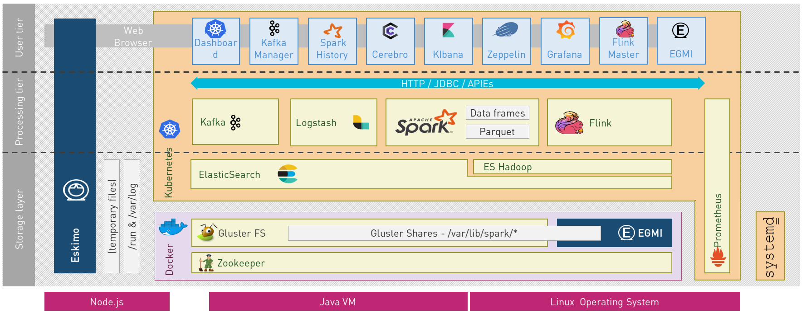
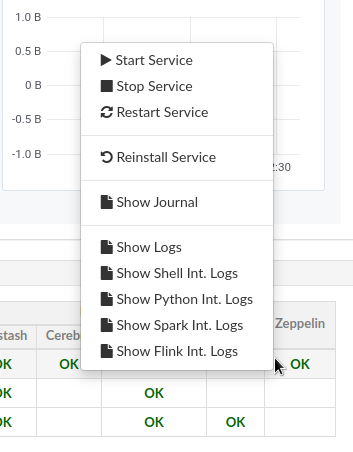

////
This file is part of the eskimo project referenced at www.eskimo.sh. The licensing information below apply just as
well to this individual file than to the Eskimo Project as a whole.

Copyright 2019 eskimo.sh / https://www.eskimo.sh - All rights reserved.
Author : eskimo.sh / https://www.eskimo.sh

Eskimo is available under a dual licensing model : commercial and GNU AGPL.
If you did not acquire a commercial licence for Eskimo, you can still use it and consider it free software under the
terms of the GNU Affero Public License. You can redistribute it and/or modify it under the terms of the GNU Affero
Public License  as published by the Free Software Foundation, either version 3 of the License, or (at your option)
any later version.
Compliance to each and every aspect of the GNU Affero Public License is mandatory for users who did no acquire a
commercial license.

Eskimo is distributed as a free software under GNU AGPL in the hope that it will be useful, but WITHOUT ANY
WARRANTY; without even the implied warranty of MERCHANTABILITY or FITNESS FOR A PARTICULAR PURPOSE. See the GNU
Affero Public License for more details.

You should have received a copy of the GNU Affero Public License along with Eskimo. If not,
see <https://www.gnu.org/licenses/> or write to the Free Software Foundation, Inc., 51 Franklin Street, Fifth Floor,
Boston, MA, 02110-1301 USA.

You can be released from the requirements of the license by purchasing a commercial license. Buying such a
commercial license is mandatory as soon as :
- you develop activities involving Eskimo without disclosing the source code of your own product, software,  use case.
  platform, use cases or scripts.
- you deploy eskimo as part of a commercial product, platform or software.
For more information, please contact eskimo.sh at https://www.eskimo.sh

The above copyright notice and this licensing notice shall be included in all copies or substantial portions of the
Software.
////

:sectnums:
:toc:
:authors: eskimo.sh / https://www.eskimo.sh / 2019-2020
:copyright: eskimo.sh / https://www.eskimo.sh / 2019-2020

= Eskimo User and Administration Guide

[[chap-introduction]]

== Eskimo Introduction

A state of the art _Big Data Infrastructure_ and _Management Web Console_ to _build_, _manage_ and _operate_
*Big Data 2.0 Analytics clusters*

image::pngs/eskimo.jpg[50, 50, align="center"]

Eskimo is in a certain way the Operating System of your Big Data Cluster:

* A _plug and play_, working _out of the Box_, *Big Data Analytics platform* fulfilling _enterprise environment
requirements_.
* A *state of the art Big Data 2.0 platform*
** based on _Docker_, _Marathon_, _Mesos_ and _Systemd_
** packaging _Gluster_, _Spark_, _Kafka_, _Flink_, _Nifi_ and _ElasticSearch_
** with all the administration and management consoles such as _Cerebro_, _Kibana_, _Zeppelin_, _Kafka-Manager_,
_Grafana_ and _Prometheus_.
* An _Administration Application_ aimed at drastically simplifying the *deployment, administration and operation* of
your Big Data Cluster
* A _Data Science Laboratory_ and _Production environment_ where Data Analytics is both
** developed and
** operated in production

Eskimo is as well:

* a collection of ready to use docker containers packaging fine-tuned and highly customized plug and play services with
  all the _nuts and bolds_ required to make them work well together.
* a framework for building and deploying Big Data and NoSQL services based on docker and systemd

image::pngs/eskimo_platform.png[800, 800, align="center"]

=== Key Features

Eskimo key features are as follows:

[cols=">.^20%,80%"]
|===
a|image::pngs/location.jpg[60, 60]| *Abstraction of Location*

Just define where you want to run which services and let eskimo take care of everything.

Move services between nodes or install new services in just a few clicks.

Don’t bother remembering where you installed Web consoles and UI applications, Eskimo wraps them all in a single and
consistent UI.

a|image::pngs/console.jpg[60, 60]| *Eskimo Web Console*

Eskimo’s tip of the iceberg is its flagship web console.

The Eskimo Console is the single and entry point to all your cluster operations, from services installation to
accessing Kibana, Zeppelin and other UI applications.

The Eskimo Console also provides SSH consoles, File browser access and monitoring to your cluster.

a|image::pngs/framework.jpg[60, 60]| *Services Framework*

Eskimo is a Big Data Components service development and integration framework based on Docker and Systemd.

Eskimo provides out of the box ready-to use components such as Spark, Flink, ElasticSearch, Kafka, Mesos, Zeppelin, etc.

Eskimo also enables the user to develop his own services very easily.
|===

=== Why is Eskimo cool ?

* *Taking care of it !* +
Making Zookeeper, Mesos, Kafka, ElasticSearch, Flink, Spark, etc. work perfectly together is difficult and tedious. +
Eskimo takes care of everything.

* *Big Data 2.0* +
Most if not all private-cloud Big Data Platform such as Hortonworks, Cloudera, MapR, etc. are based on Hadoop, HDFS,
YARN, etc. which are quite old components and technology. +
Eskimo is based on Mesos, ElasticSearch, Kafka and Spark,
cutting edge components from a newer generation.

* *Leveraging on docker* +
Most if not all private-cloud Big Data Platform such as those mentioned above would install components natively,
thus having strong requirements and impacts on underlying nodes. +
Eskimo uses docker to isolates Eskimo components from the underlying host OS and vice versa.

* *Eskimo is an open platform.* +
Eskimo works out of the box but users can customize and extend it the way they like, the way they decide

=== Eskimo's DNA

[cols=">.^20%,80%"]
|===
a|image::pngs/big_data_scientist.png[80, 80] a| *Big Data Scientist*

With eskimo, Big Data Scientists can prototype and run their analytics use cases on a thousand nodes cluster should they
need it.

With Flink ML and Spark ML natively available on Flink and Spark and usable from within Zeppelin, Data Scientists can
bring their mission to the next level: the big data way.

SciKit Learn and TensorFlow are also available from within Zeppelin of course.

a|image::pngs/big_data.jpg[80, 80] a| *Big Data 2.0*

In contrary to popular Hadoop-based and other Big Data Platforms, Eskimo is based on cutting-edge technologies:

* GlusterFS instead of HDFS
* Spark instead of Hive or Pig
* Flink instead of Storm
* Mesos instead of Yarn
* Docker instead of not native deployment
* ElasticSearch instead of HBase or Hive

These new generation Big Data components form together a Big Dats 2.0 stack, lightweight and efficient and leveraging
on modern computing abilities (memory oriented vs. IO oriented). +
This Big Data 2.0 software stack is much more efficient and effective than any hadoop based Big Data processing cluster,
while covering an extended subset of the same use cases.

In addition, in contrary to hadoop these software components behave just as good on a single node machine with plenty of
RAM and processor than it does on a cluster of a few small nodes, thanks to their ability of benefiting from the
multi-processor architecture of modern machines. +
In addition, this comes with an interesting benefit : the ability to build on one's machine the very same environment
than on a large production cluster.

a|image::pngs/ring.jpg[80, 80] a| *One ring to Rule them all*

Making docker, gluster, elasticsearch, kafka, spark, Flink, zeppelin, etc. all work perfectly and 100% together is very
tedious and difficult.

Eskimo takes care of everything and fine tunes all these services to make them understand each other and work together.

Eskimo enables you one-click administration of all of them, moving services, provisioning nodes, etc.

Yet it's open : open-source and built on standards

a|image::pngs/one_size.jpg[80, 80] a| *One size fits all*

Do you want to build a production grade Big Data Processing cluster with thousands of nodes to analyze the internet ?

Or do you want to build a small AI laboratory on your own laptop ?

Eskimo is made for you in these both cases.

a|image::pngs/lightweight.jpg[80, 80] a| *Lightweight in DNA*

MapR, Hortonworks, Cloudera and every other hadoop based Big Data Platforms are Behemoths.

Eskimo leverages on gluster, mesos, spark, flink, elasticsearch, logstash, kibana, Zeppelin, etc. - simple and extremely
lightweight components that have a broad use cases coverage while simplifying administration, operation and usage.

a|image::pngs/platform.jpg[80, 80] a| *Open platform extensible and customizable*

Eskimo works out of the box, taking care of the burden to make all this software works perfectly and 100% together.

Eskimo is not a black box, it’s an open platform. One can fine tune and adapt everything exactly as desired : from
the docker containers building to the services setup on the platform.

Want to leverage on eskimo to integrate other services such as Apache Flink or Cassandra ? declare your own services
and import your own containers, built it as you like !

a|image::pngs/universal.jpg[80, 80] a| *Universal Platform*

Eskimo is exhaustively built on top of Docker.

Only mesos agents need to be compiled and adapted to the host linux OS running your cluster nodes. +
All the other components - from kafka to zeppelin through spark - run on docker

Eskimo is successfully tested on Ubuntu, Debian, CentOS, Fedora and OpenSUSE nodes so far ... more are coming.

a|image::pngs/simplicity.jpg[80, 80] a| *Simplicity as a core value*

Eskimo leverages on simple approaches and technologies.

No fancy scripting language, just plain old shell scripts. +
No fancy container management middleware, just plain old docker and systemd.

Eskimo doesn’t require you to learn anything else than Linux standard tools.

a|image::pngs/cloud.jpg[80, 80] a| *Cloud Friendly*

Build your own Big Data Cloud

Eskimo is VM friendly. +
You have a bunch of VMs somewhere on Amazon or google cloud ? +
Make it a state of the art big data cluster, your way, not amazon or google's predefined, fixed and constraining way.

Choose your services and let eskimo take care of everything.

|===

=== Eskimo Architecture

==== Techical Architecture

Eskimo's technical architecture can be illustrated as follows:

Three components are available in the storage layer

* *ElasticSearch*: a real-time, scalable, document-oriented and REST operated NoSQL Database
* *Gluster FS*: the distributed filesystem in use with Eskimo
* *Apache Zookeeper*: the distributed configuration, synchronization and orchestration system

The processing layer makes the following services available:

* *Apache Kafka* : used for real-time data integration and streaming processing
* *Apache Spark* : the large scale very versatile computation engine
* *Apache Flink* : a distributed processing engine for real-time and streaming stateful computations over data stream
* *Elastic Logstash* : used for data ingestion, processing and dispatching
* As a sidenote, ElasticSearch can also be considered part of the processing tier since it provides many processing
abilities (pipeline computations, aggregations, etc.)

Spark and Flink are operated by *Apache Mesos* to achieve optimal cluster resources booking and negotiation.

The user layer is intended for data / result visualizations and platform administration with the following components:

* *Elastic Kibana*, *Grafana* and *Apache Zeppelin* for data and result visualizations
** Grafana is also used natively for platform monitoring concerns
* *Cerebro*, The Spark Console, The Flink Dashboard, the *Kafka Manager*, the *Mesos Console* and the *Marathon
Console* for platform administration.

Each and every software components is executed with Docker and packaged as a docker container.
Runtime operation is ensured using Mesos and Marathon for most services and static services are handled with SystemD
directly and defined as SystemD units.

==== Typical Application architecture

A typical Eskimo application architecture can be illustrated as follows:

image::pngs/application_architecture.png[800, 800, align="center"]

The above schema illustrates typical data flows within Eskimo

[[sample_system_archi]]
==== Sample System Architecture

This is an example of a possible deployment of Eskimo on a 6 nodes cluster:

image::pngs/system_architecture.png[800, 800, align="center"]

The Eskimo application itself can be deployed on any of the cluster nodes or on another, separated machine (as in the
example above),

Requirements on machines to be used as Eskimo Cluster nodes are presented in the following sections:

* <<eskimo_nodes_prerequisites>>
* <<eskimo_nodes_required_packages>>

=== Eskimo building

Eskimo build instructions are given in the file `README.adoc` located in the root folder of the *eskimo source code
distribution*.

[[chap-installation]]
== Eskimo Installation

WARNING: Eskimo cluster nodes support only the Linux operating system and have to be running a Linux distribution. +
The eskimo application itself can very well run on windows though. However, running the Eskimo application on Windows
prevents the user from building his own containers, he may only download pre-built containers for use with Eskimo.

=== Installation target

The eskimo backend itself can either be installed:

* on one of the nodes from the eskimo cluster (for instance one of the node where master services will be installed). +
Doing so is however not recommended since that node would need to have the HTTP port on which Eskimo is listening opened
to external accesses and in addition Eskimo would eat some of the RAM and disk that is better left to the business
services.
* or one a dedicated node where only the eskimo backend runs (i.e. separated from the Esimo cluster nodes). This is the
recommended approach.

==== Local Eskimo installation

Eskimo can also be installed on the local computer of the user. +
This is for instance useful when eskimo is intended to be used as a local _Data Science_ laboratory and not targeted
towards large scale Big Data Analytics.

Installing Eskimo on the local user machine is hoever tricky. +
Eskimo does required indeed a target IP address for the installation. +
A first idea one migth have in this case is to use `127.0.0.1` as single node target IP to procees with the installation.
Unfortunately, this doesn't work qs 127.0.0.1 resolved to different loopback interfaces in the various docker containers
running eskimo services and as a consequence eskimo services are not able to reach each others when `127.0.0.1` is used
as installation target.

So something else needs to be found as target IP address.

The easiest way out here is to use the docker host address (most of the time `172.17.0.1` but may be configured
differently on one's specific local docker environment).

In case one doesn't have docker installed locally on his machine when proceesing with Docker installation, Eskimo
usually installed docker on its own. +
Unfortunately, there is a chicken and egg problem wince the docker host IP address needs to be passed as target IP
address for the Eskimo node in "Node configuration" before Eskimo can proceed with docker installation.

So one's left with installing docker on his own before proceeded with Eskimo Node setup on his local machine.

One might want to look at the script `services_setup/base-eskimo/install-eskimo-base-system.sh` and sepcifically the
functions `install_docker_*_based` to find out how Eskimo installs docker on target nodes.

=== Prerequisites

Some noteworthy elements need to be beared in mind regarding eskimo prerequisites.

==== Java 11 or greater

Eskimo needs Java 11 or greater to run.

In addition, one needs to have either `java` in the path or the `JAVA_HOME` environment variable properly set in prior
to starting eskimo.

Use for instance the following commands on Linux:

.Put java in PATH on Linux
----
export JAVA_HOME=/usr/local/lib/jdk-11
export PATH=$JAVA_HOME/bin:$PATH
----

(You might want to put the commands above in your `/etc/profile` or `/etc/bash.bashrc`)

Use for instance the following commands on Windows:

.Put java in PATH on Windows
----
set JAVA_HOME=C:\programs\jdk-11
set PATH=%JAVA_HOME%\bin;%PATH%
----

(On Windows, you might want to define these as _System Variables_: Right-click on "My Computer", choose "Properties",
then "Advanced System Settings", then "Environment Variables" and finally add or update the variables above as "System
Variables")

==== System requirements

In order to run eskimo, one needs to have

* At least 15Gb of disk storage space on the machine running Eskimo
* *At least one linux machine* available on the network (can be the same machine than the one running Eskimo) that will
be put in the eskimo cluster and manipulated by eskimo. See next section regarding requirements for the machines in
the eskimo cluster.

Eskimo is reached using a web browser (see startup logs). Supported web browsers are:

* Microsoft Edge 12 or greater
* Mozilla FireFox 36 or greater
* Google Chrome 41 or greater

Note: there may be other browsers / versions supported (Safari, Opera but they are not certified to work with Eskimo)

[[eskimo_nodes_prerequisites]]
==== Prerequisites on eskimo cluster nodes

Linux distributions successfully tested with Eskimo and officially supported are the following:

* Debian Stretch and greater
* Ubuntu Xenial and greater
* CentOS 7.x and 8.x
* Fedora 29 and greater
* OpenSUSE 15.1 and greater

Other Debian-based or Red-Hat-based OSes could be supported as well but haven't been tested so far and may require the
administrator to adapt the setup scripts.

===== Minimum hardware

The minimum hardware capacity requirements to run eskimo are as follows:

*Multiple Nodes in the Eskimo cluster, minimum requirement for one node*

In cases where the eskimo cluster runs on multiples nodes (two or more nodes), the minimum hardware capacity for one of these
nodes is as follows:

* 20 GB HDD storage space for the system, additional storage space depending on the data to be manipulated and the
replication factor.
* 4 CPUs (8 CPUs recommended)
* 16 GB RAM (31 GB RAM recommended)

*Single Machine Eskimo deployment, minimum requirement for the single node*

In cases where Eskimo is deployed on a single node (such as the host node running Eskimo itself), the minimum hardware
capacity for this node is as follows:

* 30 GB HDD storage space for the system, additional storage space depending on the data to be manipulated.
* 8 CPUs (16 CPUs recommended)
* 32 GB RAM (64 GB RAM recommended)

===== Fedora nodes specificities

Fedora has switched to cgroups v2 by default now, but Mesos (and some Docker versions) are not working well with cgroups v2 and
may fail to start. With Eskimo and current version of mesos, one needs to revert cgroups to v1 on Fedora
nodes by adding the `systemd.unified_cgroup_hierarchy=0` kernel argument.
b
.Add systemd.unified_cgroup_hierarchy=0 to the default GRUB config with sed.
----
sudo sed -i '/^GRUB_CMDLINE_LINUX/ s/"$/ systemd.unified_cgroup_hierarchy=0"/' /etc/default/grub
----

Then rebuild your GRUB config.

.If you’re using BIOS boot
----
sudo grub2-mkconfig -o /boot/grub2/grub.cfg
----

.If you’re running EFI
----
sudo grub2-mkconfig -o /boot/efi/EFI/fedora/grub.cfg
----

With this, Mesos should be able to start successfully on your fedora nodes after a reboot.

[[eskimo_nodes_required_packages]]
==== Required packages installation and Internet access on cluster nodes

Eskimo performs some initial setup operations on every node of the cluster it needs to operate. Some of these
operations require Internet access to download dependencies (either RPM or DEB packages).

In case it is not possible to give access to internet to the nodes in the cluster you wish to operate using eskimo, you
will find below the `yum` and `apt` commands used during nodes setup. +
*You can reproduce these commands on your environment to find out about the packages that need to be installed in prior
to have eskimo operating your cluster nodes:*

Following commands are executed on a debian-based node:

.debian based node setup
----
export LINUX_DISTRIBUTION=`\
    awk -F= '/^NAME/{print $2}' /etc/os-release \
    | cut -d ' ' -f 1 \
    | tr -d \" \
    | tr '[:upper:]' '[:lower:]'`

# system update
apt-get -yq update

# docker dependencies
apt-get -yq install apt-transport-https ca-certificates curl software-properties-common
apt-get -yq install gnupg-agent gnupg2

# docker installation
curl -fsSL https://download.docker.com/linux/$LINUX_DISTRIBUTION/gpg | sudo apt-key add
add-apt-repository deb [arch=amd64] https://download.docker.com/linux/$LINUX_DISTRIBUTION $(lsb_release -cs) stable
apt-get -yq update
apt-get -yq install docker-ce docker-ce-cli containerd.io

# mesos dependencies
apt-get -y install libcurl4-nss-dev libsasl2-dev libsasl2-modules maven libapr1-dev libsvn-dev zlib1g-dev

# other dependencies
apt-get -yq install net-tools attr

# glusterfs client
apt-get -y install glusterfs-client
----

Following commands are executed on a redhat-based node:

.redhat based node setup
----
export LINUX_DISTRIBUTION=`\
    awk -F= '/^NAME/{print $2}' /etc/os-release \
    | cut -d ' ' -f 1 \
    | tr -d \" \
    | tr '[:upper:]' '[:lower:]'`

# system update
sudo yum -y update

# docker dependencies
yum install -y yum-utils device-mapper-persistent-data lvm2

# docker installation
yum-config-manager --add-repo https://download.docker.com/linux/$LINUX_DISTRIBUTION/docker-ce.repo
yum install -y docker-ce docker-ce-cli containerd.io

# mesos dependencies
yum install -y zlib-devel libcurl-devel openssl-devel cyrus-sasl-devel cyrus-sasl-md5 apr-devel subversion-devel apr-util-devel

# other dependencies
yum install -y net-tools anacron

# glusterfs client
yum -y install glusterfs glusterfs-fuse
----

Following commands are executed on a SUSE node:

.suse node setup
----
# system update
sudo zypper --non-interactive refresh | echo 'a'

# install docker
sudo zypper install -y docker

# mesos dependencies
sudo zypper install -y zlib-devel libcurl-devel openssl-devel cyrus-sasl-devel cyrus-sasl-plain cyrus-sasl-crammd5 apr-devel subversion-devel apr-util-devel

# other dependencies
sudo zypper install -y net-tools cron

# glusterfs client
sudo zypper install -y glusterfs
----

*Again, if eskimo cluster nodes have no internet access in your setup, you need to install all the corresponding
packages* (this listed above and their transitive dependencies) *before you can use these machines as
eskimo cluster nodes.*

===== Eskimo system user

Eskimo requires to have a system user properly defined and with SSH access to reach and operate the cluster nodes.
That user can be any user but it has to be configured in Eskimo - see <<user_configuration>> - and has to have SSH
access to every single node to be operated by eskimo using SSH Public Key Authentication -
see <<ssh_key_authentication>>.

*In addition, that user needs to have sudo access without requiring to enter a password!*

===== Protecting eskimo nodes with a firewall

The different sevices operated by Eskimo require different set of ports to communicate with each others.

In case a firewall (firewalld or simple iptables configuration) is installed on eskimo cluster nodes, then
the following port numbers need to be explicitly open (for both UDP and TCP) on every single node in the cluster for
eskimo access:

*IN ADDITION TO THE STATIC PORTS LISTED BELOW, A WHOLE SET OF PORT RANGES ARE USED BY THE MESOS MASTER. MESOS AGENTS,
MARATHON, SPARK EXECUTORS AND FLINK WORKERS TO COMMUNICATE WITH EACH OTHER. THESE DYNAMIC PORTS ARE CREATED ON THE FLY
AND HAVING THEM CLOSED BY THE FIREWALL WOULD SIMPLY PREVENT THEM FROM WORKING.*

*For this reason, whenever the eskimo cluster nodes are protected by a firewall, it is of UTMOST IMPORTANCE that the
firewall is filtering out the internal eskimo cluster nodes IP addresses from the exclusion rules. +
Every eskimo node should have wide access to every other eskimo node. Period.*

However, it is important to filter out every single access attempt originating from outside the Eskimo cluster. The
only open port for requests outside of the eskimo cluster should be the port 22 used by SSH since all accesses from the
Eskimo console to the nodes from the Eskimo cluster happens through SSH tunnels.

For the sake of information, the list of static ports used by the different services are listed here:

* [cerebro] : 9000, 31900
* [elasticsearch] : 9200, 9300
* [gdash] : 28180, 31180
* [gluster] : 24007, 24008, 24009, 24010, 49152, 38465, 38466, 38467
* [grafana] : 3000, 31300
* [kafka] : 9092, 9093, 9999
* [kafka-manager] : 22080, 31220
* [kibana] : 5601, 31561
* [mesos] : 53, 61003, 61003, 61091, 61420, 62080, 62501, 64000, 5050, 7070, 8101, 8123, 8200, 8201, 8443, 8888, 9090,
9443, 9990, 15055, 15201, 61053, 61430, 61053
* [ntp] 123
* [prometheus] : 9090, 9091, 9093, 9094, 9100
* [spark] : 7077, 8580, 8980, 8581, 8981, 2304, 18480, 7337, 7222, 8032, 7222
* [flink] : 6121, 6122, 6123, 6130, 8081
* [spark-history-server] : 18080, 31810
* [zeppelin] : 38080, 38081, 31008, 31009
* [zookeeper] : 2181, 2888, 3888
* [marathon] : 5000, 28080

Again, this list is incomplete since it doesn't reveal the dynamic port ranges mentioned above.

=== Extract archive.

After downloading either the zip ot the tarball archive of eskimo, it needs to be extracted on the local filesystem.
That's only that needs to be done to _install_ eskimo. It doesn't need anything else that extracting the archive on the
filesystem. +
Then in the folder `bin` under the newly extracted eskimo binary distribution folder, one can find two scripts:

* a script `eskimo.bat` to execute eskimo on Windows
* a script `eskimo.sh` to execute eskimo on Linux.

==== Extracted Archive layout and purpose

One extracted on the filesystem the Eskimo folder contains the following elements:

* `bin` : contains executables required to start Eskimo as well as utility commands
* `conf` : contains Eskimo configuration files
* `lib` : contains eskimo runtime binaries
* `packages-dev` : contains the Eskimo _docker images (packages) development framework_ which is used to build eskimo
services docker packages locally (this is not required if the administrators decides to download packages
from www.eskimo.sh)
* `packages_distrib`: contains eventually the eskimo services docker image packages (either build locally or downloaded
from internet)
* `services_setup`: contains the services installation framework. *Each and every customization an administrator wishes
to apply on eskimo services is done by modifying / extending / customizing the shell scripts in this folder*.
* `static_images`: is intended to be used to add additional icons or logos for new custom services added by an
administrator to Eskimo.

==== Utility commands

Some command line utilities to ease eskimo's administration are provided in `bin/utils`:

* `encode-password.bat|.sh` : this script is used to generate the encoded password to be stored in the user definition
file. See <<user_file>>

[[user_file]]
=== Access eskimo

With eskimo properly started using the scripts in `bin` discussed above , one can reach eskimo using http://machine_ip:9191. +
The default port number is 9191. This can be changed in configuration file `eskimo.properties`.

*The default login / password credentials are _admin_ / _password_.*

This login is configured in the file pointed to by the configuration property `security.userJsonFile`. +
A sample file is created automatically if the target file doesn't exist with the `admin` login above.

The structure of this file is as follows;

.Sample user definition file
----
{
  "users" : [
    {
      "username" : "admin",
      "password" : "$2a$10$W5pa6y.k95V27ABPd7eFqeqniTnpYqYOiGl75jJoXApG8SBEvERYO"
    }
  ]
}
----

The password is a `BCrypt` hash (11 rounds) of the actual password.

[[user_configuration]]
=== First run and initial setup

Upon first run, eskimo needs to be setup before it can be used.

Right after its first start, one single screen is available : *the setup page*. +
It is the only accessible page as long as initial setup is not properly completed and service
docker images (plus mesos packages) have not been either downloaded or built.

The setup page is as follows:

image::pngs/eskimo-setup.png[800, 800, align="center"]

On the setup page, the user needs to input following information:

* *Configuration Storage Path* : a folder on the filesystem where the system user running eskimo needs to have write
access to. The dynamic configuration and state persistence of eskimo will be stored in this location.
* *SSH Username* : the name of the SSH user eskimo has to use to access the cluster nodes. Every node that need to be
managed by eskimo needs to have granted access using SSH Public Key authentication to this user.
* *SSH private key* : the private key to use for SSH Public Key authentication for the above user. See the next section
in regards to how to generate this key : <<ssh_key_authentication>>
* *Mesos Origin* : the user needs to choose whether Mesos packages need to be *built locally* (on eskimo host node) or
whether pre-built versions shall be *downloaded* from the remote packages repository (by default https://www.niceideas.ch.)
* *Docker Images Origin* : the user needs to choose whether service package images needs to be *built locally* or whether
they need to be *downloaded* from the remote packages repository (by default https://www.niceideas.ch.)

Once the settings have been chosen by the user, clicking "Save and Apply Setup" will launch the initial setup process
and the archives will be built locally or downloaded. This can take a few dozen of minutes depending on your internet
connection and/or the eskimo host machine processing abilities.

Regarding the SSH private key, the next session gives indication in regards to how to build  a public / private key pair
to enable eskimo to reach the cluster nodes.

The document _"Service Development Framework"_ in the section _"Setting up a remote packages repository"_ presents
the nuts and bolts required in setting up a remote packages repository. +
The remote repository URL is configured in `eskimo.properties` using the configuration property : +
`system.packagesDownloadUrlRoot` : The Root URL to download the packages from.

[[build_packages_locally]]
==== Building packages locally

Building eskimo packages locally means building the services docker images on your local host machine running eskimo.
This means that instead of downloading docker images from the eskimo repository, the user wants to build them on his own
and only download the source package archives from their respective software editor web site (e.g. Apache, Elastic, etc.)

===== Requirements

*There are some important requirements when desiring to build the software packages on one's own:*

* The host machine running eskimo needs at least 30 GB free hard drive space
* The host machine running eskimo needs at least 20 GB free RAM space

In addition, building packages locally requires some tools to be available on the host machine running eskimo itself.
Mostly, `git`, `docker` and `wget` need to be installed on your host machine.

===== Instructions to install these tools

Following commands are required on a debian-based host:

.debian host dependencies to build packages
----
export LINUX_DISTRIBUTION=`\
    awk -F= '/^NAME/{print $2}' /etc/os-release \
    | cut -d ' ' -f 1 \
    | tr -d \" \
    | tr '[:upper:]' '[:lower:]'`

# system update
apt-get -yq update

# eskimo dependencies
apt-get -yq install wget git

# docker dependencies
apt-get -yq install apt-transport-https ca-certificates curl software-properties-common
apt-get -yq install gnupg-agent gnupg2

# docker installation
curl -fsSL https://download.docker.com/linux/$LINUX_DISTRIBUTION/gpg | sudo apt-key add
add-apt-repository deb [arch=amd64] https://download.docker.com/linux/$LINUX_DISTRIBUTION $(lsb_release -cs) stable
apt-get -yq update
apt-get -yq install docker-ce docker-ce-cli containerd.io

# Enable and start docker
systemctl enable docker
systemctl start docker

# Add current user to docker group
usermod -a -G docker $USER

# (system or at least shell / process restart required after this)
----

Following commands are required on a redhat-based host:

.redhat host dependencies to build packages
----
export LINUX_DISTRIBUTION=`\
    awk -F= '/^NAME/{print $2}' /etc/os-release \
    | cut -d ' ' -f 1 \
    | tr -d \" \
    | tr '[:upper:]' '[:lower:]'`

# system update
yum -y update

# eskimo dependencies
yum install -y wget git

# docker dependencies
yum install -y yum-utils device-mapper-persistent-data lvm2

# docker installation
yum-config-manager --add-repo https://download.docker.com/linux/$LINUX_DISTRIBUTION/docker-ce.repo
yum install -y docker-ce docker-ce-cli containerd.io

# Enable and start docker
systemctl enable docker
systemctl start docker

# Add current user to docker group
usermod -a -G docker $USER

# (system or at least shell / process restart required after this)
----

Following commands are required on a SUSE host:

.suse host dependencies to build packages
----
# system update
zypper --non-interactive refresh | echo 'a'

# eskimo dependencies
zypper install -y git wget

# install docker
zypper install -y docker

# Enable and start docker
systemctl enable docker
systemctl start docker

# Add current user to docker group
usermod -a -G docker $USER

# (system or at least shell / process restart required after this)
----

==== Checking for updates

At any time after initial setup - and if any only if the chosen installation method is *downloading* packages, the user
can _apply setup_ again to check on the packages server (by default https://www.eskimo.sh) if updates are available
for service docker images or mesos packages.

=== Typical startup issues

Several issues can happen upon first eskimo startup. +
This section describes common issues and ways to resolve them.

////

==== Failing to download package from remote docker images repository

If you encounter an error message on the Setup Page - during initial setup or after - saying `Could not download latest
package definition file from [Configured Remote Repository]`, this means likely that you are suffering from the empty
`cacert` file problem affecting OpenJDK and Oracle JDK 9 and perhaps further versions as well.

These Java Development Kits do indeed suffer fom a quite annoying issue: the `lib/security/cacert` file referencing the
SSL certifications authorities is empty. +
This prevents most of the time to download any file from a remote web server using HTTPS, as is the case during initial
setup of Eskimo.

A first step is to confirm that this is indeed the problem you are suffering from by looking at the eskimo logs, either
the files in the `logs` sub-folder of the eskimo root folder or simply on the eskimo console.

Search for the following error message:

.Impossible to download
----
2019-12-24T11:08:55,431 ERROR [http-nio-9191-exec-5] c.n.e.s.SetupService: javax.net.ssl.SSLException: java.lang.RuntimeException:
 Unexpected error: java.security.InvalidAlgorithmParameterException: the trustAnchors parameter must be non-empty
javax.net.ssl.SSLException: java.lang.RuntimeException: Unexpected error: java.security.InvalidAlgorithmParameterException: the tr
ustAnchors parameter must be non-empty
        at java.base/sun.security.ssl.Alerts.getSSLException(Alerts.java:214)
        at java.base/sun.security.ssl.SSLSocketImpl.fatal(SSLSocketImpl.java:1969)
        at java.base/sun.security.ssl.SSLSocketImpl.fatal(SSLSocketImpl.java:1921)
        at java.base/sun.security.ssl.SSLSocketImpl.handleException(SSLSocketImpl.java:1904)
        at java.base/sun.security.ssl.SSLSocketImpl.startHandshake(SSLSocketImpl.java:1436)
        at java.base/sun.security.ssl.SSLSocketImpl.startHandshake(SSLSocketImpl.java:1413)
        at java.base/sun.net.www.protocol.https.HttpsClient.afterConnect(HttpsClient.java:567)
        at java.base/sun.net.www.protocol.https.AbstractDelegateHttpsURLConnection.connect(AbstractDelegateHttpsURLConnection.java
:185)
        at java.base/sun.net.www.protocol.http.HttpURLConnection.getInputStream0(HttpURLConnection.java:1563)
        at java.base/sun.net.www.protocol.http.HttpURLConnection.getInputStream(HttpURLConnection.java:1491)
        at java.base/sun.net.www.protocol.https.HttpsURLConnectionImpl.getInputStream(HttpsURLConnectionImpl.java:236)
        at java.base/java.net.URL.openStream(URL.java:1117)
        at ch.niceideas.eskimo.services.SetupService.dowloadFile(SetupService.java:614)
        at ch.niceideas.eskimo.services.SetupService.loadRemotePackagesVersionFile(SetupService.java:443)
        at ch.niceideas.eskimo.services.SetupService.prepareSetup(SetupService.java:358)
        at ch.niceideas.eskimo.model.SetupCommand.create(SetupCommand.java:70)
        at ch.niceideas.eskimo.services.SetupService.saveAndPrepareSetup(SetupService.java:277)
        at ch.niceideas.eskimo.controlers.SetupConfigController.saveSetup(SetupConfigController.java:126)
        at java.base/jdk.internal.reflect.NativeMethodAccessorImpl.invoke0(Native Method)
        at java.base/jdk.internal.reflect.NativeMethodAccessorImpl.invoke(NativeMethodAccessorImpl.java:62)
        at java.base/jdk.internal.reflect.DelegatingMethodAccessorImpl.invoke(DelegatingMethodAccessorImpl.java:43)
        at java.base/java.lang.reflect.Method.invoke(Method.java:564)
        ...
Caused by: java.lang.RuntimeException: Unexpected error: java.security.InvalidAlgorithmParameterException: the trustAnchors parame
ter must be non-empty
        at java.base/sun.security.validator.PKIXValidator.<init>(PKIXValidator.java:89)
        at java.base/sun.security.validator.Validator.getInstance(Validator.java:181)
        at java.base/sun.security.ssl.X509TrustManagerImpl.getValidator(X509TrustManagerImpl.java:330)
        at java.base/sun.security.ssl.X509TrustManagerImpl.checkTrustedInit(X509TrustManagerImpl.java:180)
        at java.base/sun.security.ssl.X509TrustManagerImpl.checkTrusted(X509TrustManagerImpl.java:192)
        at java.base/sun.security.ssl.X509TrustManagerImpl.checkServerTrusted(X509TrustManagerImpl.java:133)
        at java.base/sun.security.ssl.ClientHandshaker.checkServerCerts(ClientHandshaker.java:1825)
        at java.base/sun.security.ssl.ClientHandshaker.serverCertificate(ClientHandshaker.java:1655)
        at java.base/sun.security.ssl.ClientHandshaker.processMessage(ClientHandshaker.java:260)
        at java.base/sun.security.ssl.Handshaker.processLoop(Handshaker.java:1086)
        at java.base/sun.security.ssl.Handshaker.processRecord(Handshaker.java:1020)
        at java.base/sun.security.ssl.SSLSocketImpl.processInputRecord(SSLSocketImpl.java:1137)
        at java.base/sun.security.ssl.SSLSocketImpl.readRecord(SSLSocketImpl.java:1074)
        at java.base/sun.security.ssl.SSLSocketImpl.readRecord(SSLSocketImpl.java:973)
        at java.base/sun.security.ssl.SSLSocketImpl.performInitialHandshake(SSLSocketImpl.java:1402)
        at java.base/sun.security.ssl.SSLSocketImpl.startHandshake(SSLSocketImpl.java:1429)
        ... 99 more
Caused by: java.security.InvalidAlgorithmParameterException: the trustAnchors parameter must be non-empty
        at java.base/java.security.cert.PKIXParameters.setTrustAnchors(PKIXParameters.java:200)
        at java.base/java.security.cert.PKIXParameters.<init>(PKIXParameters.java:120)
        at java.base/java.security.cert.PKIXBuilderParameters.<init>(PKIXBuilderParameters.java:104)
        at java.base/sun.security.validator.PKIXValidator.<init>(PKIXValidator.java:86)
        ... 114 more
----

If the eskimo logs report the error above, it means that you do indeed suffer from the empty cacert file of the JDK.

*In this case, you need to locate your JDK installation and overwrite the file `lib/security/cacert` with a valid file
(non-empty)*.

The generation of a valid `cacert` file exceeds the scope of this documentation. Please refer to your Operating System
manual.

Eskimo provides however  a default `cacert` file in the sub-folder `utils` of its root installation. This `cacert` file
is a default Debian `cacert` file as of July 2019 and is guaranteed safe as of July 2019. No guarantee whatsoever are
ensured by eskimo.sh and one can use it at his own risk.

////

==== eskimo-users.json cannot be written

If you meet an error as the following one upon startup:

.Impossible to write eskimo-users.json
----
Caused by: ch.niceideas.common.utils.FileException: ./eskimo-users.json (Unauthorized access)
        at ch.niceideas.common.utils.FileUtils.writeFile(FileUtils.java:154)
        at ch.niceideas.eskimo.security.JSONBackedUserDetailsManager.<init>(JSONBackedUserDetailsManager.java:81)
        at ch.niceideas.eskimo.configurations.WebSecurityConfiguration.userDetailsService(WebSecurityConfiguration.java:127)
        ... 50 more
Caused by: java.io.FileNotFoundException: ./eskimo-users.json (Unauthorized access)
        at java.base/java.io.FileOutputStream.open0(Native Method)
        at java.base/java.io.FileOutputStream.open(FileOutputStream.java:276)
        at java.base/java.io.FileOutputStream.<init>(FileOutputStream.java:220)
        at java.base/java.io.FileOutputStream.<init>(FileOutputStream.java:170)
        at java.base/java.io.FileWriter.<init>(FileWriter.java:90)
        at ch.niceideas.common.utils.FileUtils.writeFile(FileUtils.java:149)
        ... 52 more
----

Eskimo uses a local file to define users and access credentials. Upon first startup, if that file doesn't exist already,
it is created by eskimo (with the default credentials above) at the path pointed to by the property
`security.userJsonFile` in `eskimo.properties`.

If you experience the error above or something alike, change that property to point to a location where the first
version of the file can successfully be created.

[[ssh_key_authentication]]
=== Setting up SSH Public Key Authentication

==== Introduction

Public key authentication is a way of logging into an SSH/SFTP account using a cryptographic key rather than a
password. This is a strong requirement in the current version of eskimo.

==== How Public Key Authentication Works

Keys come in pairs of a public key and a private key. Each key pair is unique, and the two keys work together.

These two keys have a very special and beautiful mathematical property: if you have the private key, you can prove your
identify and authenticate without showing it, by using it to sign some information in a way that only your private key
can do.

Public key authentication works like this:

. Generate a key pair.
. Give someone (or a server) the public key.
. Later, anytime you want to authenticate, the person (or the server) asks you to prove you have the private key that
corresponds to the public key.
. You prove you have the private key.
. You don't have to do the math or implement the key exchange yourself. The SSH server and client programs take care of
this for you.

==== Generate an SSH Key Pair

You should generate your key pair on your laptop, not on your server. All Mac and Linux systems include a command called
ssh-keygen that will generate a new key pair.

If you're using Windows, you can generate the keys on your server. Just remember to copy your keys to your laptop and
delete your private key from the server after you've generated it.

To generate an SSH key pair, run the command `ssh-keygen`.

.Calling `ssh-keygen`
----
badtrash@badbooknew:/tmp$ ssh-keygen
Generating public/private rsa key pair.
----

You'll be prompted to choose the location to store the keys. The default location is good unless you already have a key.
Press Enter to choose the default location *unless you already have a key pair there in which case you might want to
take great care not to overwrite it*.

----
Enter file in which to save the key (/home/badtrash/.ssh/id_rsa): /tmp/badtrash/id_rsa
----

Next, you'll be asked to choose a password. Using a password means a password will be required to use the private key.
*Eskimo requires at all cost that you leave the password empty otherwise the key won't be usable with eskimo - at least
in this current version*. +
Press two times "Enter" there :

----
Enter passphrase (empty for no passphrase):
Enter same passphrase again:
----

After that, your public and private keys will be generated. There will be two different files. The one named `id_rsa` is
your private key. The one named `id_rsa.pub` is your public key.

----
Your identification has been saved in /tmp/badtrash/id_rsa.
Your public key has been saved in /tmp/badtrash/id_rsa.pub.
----

You'll also be shown a fingerprint and "visual fingerprint" of your key. You do not need to save these.

----
The key fingerprint is:
SHA256:/HPC91ROJtCQ6Q5FBdsqyPyppzU8xScfUThLj+3OKuw badtrash@badbooknew
The key's randomart image is:
+---[RSA 2048]----+
|           .+=...|
|            +=+. |
|           oo.+* |
|       + ....oo.o|
|        S .o= +.+|
|         = +.+ B.|
|          %.o oo.|
|         o.Boo  o|
|        oo .E.o. |
+----[SHA256]-----+
----

==== Configure an SSH/SFTP User for Your Key

===== Method 1: Using ssh-copy-id

Now that you have an SSH key pair, you're ready to configure your app's system user so you can SSH or SFTP in using your
private key.

To copy your public key to your server, run the following command. Be sure to replace "`x.x.x.x`" with your server's IP
address and `SYSUSER` with the name of the the system user your app belongs to.

----
ssh-copy-id SYSUSER@x.x.x.x
----

===== Method 2: Manual Configuration

If you don't have the `ssh-copy-id` command (for instance, if you are using Windows), you can instead SSH in to your
server and manually create the `~/.ssh/authorized_keys` file so it contains your public key.

First, run the following commands to make create the file with the correct permissions.

----
(umask 077 && test -d ~/.ssh || mkdir ~/.ssh)
(umask 077 && touch ~/.ssh/authorized_keys)
----

Next, edit the file `.ssh/authorized_keys` using your preferred editor. Copy and paste your id_rsa.pub file into the
file.

==== Log In Using Your Private Key

You can now SSH or SFTP into your server using your private key. From the command line, you can use:

----
ssh SYSUSER@x.x.x.x
----

If you didn't create your key in the default location, you'll need to specify the location:

----
ssh -i ~/.ssh/custom_key_name SYSUSER@x.x.x.x
----

If you're using a Windows SSH client, such as PuTTy, look in the configuration settings to specify the path to your
private key.

==== Granting Access to Multiple Keys

The `~/.ssh/authorized_keys` file you created above uses a very simple format: it can contain many keys as long as you
put one key on each line in the file.

If you have multiple keys (for example, one on each of your laptops) or multiple developers you need to grant access
to, just follow the same instructions above using ssh-copy-id or manually editing the file to paste in additional
keys, one on each line.

When you're done, the .ssh/authorized_keys file will look something like this (don't copy this, use your own public
keys):

----
ssh-rsa AAAAB3NzaC1yc2EAAAADAQABAAABAQDSkT3A1j89RT/540ghIMHXIVwNlAEM3WtmqVG7YN/wYwtsJ8iCszg4/lXQsfLFxYmEVe8L9atgtMGCi5QdYPl4X/c+5YxFfm88Yjfx+2xEgUdOr864eaI22yaNMQ0AlyilmK+PcSyxKP4dzkf6B5Nsw8lhfB5n9F5md6GHLLjOGuBbHYlesKJKnt2cMzzS90BdRk73qW6wJ+MCUWo+cyBFZVGOzrjJGEcHewOCbVs+IJWBFSi6w1enbKGc+RY9KrnzeDKWWqzYnNofiHGVFAuMxrmZOasqlTIKiC2UK3RmLxZicWiQmPnpnjJRo7pL0oYM9r/sIWzD6i2S9szDy6aZ badtrash@badbook
ssh-rsa AAAAB3NzaC1yc2EAAAADAQABAAABAQCzlL9Wo8ywEFXSvMJ8FYmxP6HHHMDTyYAWwM3AOtsc96DcYVQIJ5VsydZf5/4NWuq55MqnzdnGB2IfjQvOrW4JEn0cI5UFTvAG4PkfYZb00Hbvwho8JsSAwChvWU6IuhgiiUBofKSMMifKg+pEJ0dLjks2GUcfxeBwbNnAgxsBvY6BCXRfezIddPlqyfWfnftqnafIFvuiRFB1DeeBr24kik/550MaieQpJ848+MgIeVCjko4NPPLssJ/1jhGEHOTlGJpWKGDqQK+QBaOQZh7JB7ehTK+pwIFHbUaeAkr66iVYJuC05iA7ot9FZX8XGkxgmhlnaFHNf0l8ynosanqt badtrash@desktop
----

==== Use the private key in eskimo

Once the above procedure properly followed and the public keys added to the authorized key for your the user to be used
by eskimo, you can use the corresponding private key in the eskimo setup page to grand access to eskimo to the cluster
nodes.

[[chap-cluster-setup]]

== Setting up the eskimo cluster

Right after the initial setup presented in the previous chapter. The administrator can start setting up and installing
the Eskimo Big Data Analytics cluster.

The process is the following:

1. *Service settings configuration*. Fine tune the settings for the services one is about to install on the Eskimo cluster
2. *Nodes and native services layout configuration* : Declare the IP addresses of the nodes to me installed and operated
by eskimo and select the native services that should run on these nodes
3. *Marathon services selection* : Declare which of the marathon services you want to deploy on the cluster

=== Services settings configuration

The most essential settings for all eskimo pre-packaged services are set automatically in such a way that the nominal
use cases of an eskimo cluster work out of the box.

But for many specific use cases, the default values for these settings as handled by Eskimo are not sufficient. +
For this reason, Eskimo CE embeds a settings editor enabling administrators to find tune runtime settings for eskimo
embedded services.

The settings editor is available from the menu under "Configured Services":

image::pngs/eskimo-setttings.png[800, 800, align="center"]

For every service, administrators have access to supported configuration files and supported settings. +
The default values enforced by eskimo right after installation are indicated.

=== Nodes and native services layout configuration

The fourth menu entry under "*Platform Administration*" is the most important part of the Eskimo Administration console:
it provides the system administrators / Eskimo Users with the way to deploy the eskimo managed services on the cluster
of nodes to be managed by eskimo.

Eskimo services are docker containers managed (started / stopped / monitored / etc.) by systemd.

Setting up a cluster with eskimo usually boils down to these 2 phases :

* Adding nodes to the eskimo cluster - using the _Add Node_ button or ranges of nodes using the _Add Range_ button.
* Selecting the services that should be deployed and operated and the configured nodes

Below is an example of a tiny cluster with two nodes setup:

image::pngs/eskimo-nodes-config.png[800, 800, align="center"]

On the above example, we can see:

* One master node being configured as a standalone node configuration (which is always the case for nodes running
  master or unique services) declaring master services as well as slave services.
* Two slave nodes being configured as a range of nodes with a single configuration declaring slave services.

==== Adding nodes to the eskimo cluster

Whenever one wants to operate a cluster of a hundred of nodes with Eskimo, one doesn't want to have to define the
hundred nodes one after the other. Not to mention that wouldn't make any sense since most nodes of that cluster would
actually have the very same configuration (in terms of services topology).

This is the rationality behind the notion of "_Range of nodes_"- The idea here is to be able to add a single and
consistent configuration to all the nodes sharing the same configuration.

Single node configurations and range of nodes can be combined at will. Eskimo will however refuse to apply configuration
if the resolution of the various ranges and single nodes leads to an IP address being defined several times.

Also, all nodes in a range are expected to be up and running and Eskimo will consider them so and report errors if one
node in a range is not answering. +
*Should you have holes in your range of IP addresses, you are expected to define multiple ranges, getting rid of the
holes in your range of IPs.* This is fairly important if you want Eskimo to be able to
successfully manage your cluster.

WARNING: In its current version (0.2 at the time of writing this document), eskimo *requires at all cost* nodes to be
defined using IP addresses and in no way are hostnames or DNS names supported. In this version of eskimo, only IP
addresses are supported, period. +
Unfortunately with big data technologies and especially spark and mesos, supporting DNS or hostnames is significantly
more complicated than direct IP addresses resolutions. +
We are working on this and the next version of eskimo will support working with hostnames instead of IP addresses. But
for the time being, administrators need to configure eskimo using IP addresses and only IP addresses.

==== Deploying services

With all nodes from the cluster to be managed by eskimo properly identified either as single node or as part of a range
of nodes, services can be configured and deployed.

image::pngs/multiple-services.png[600, 600, align="center"]

==== Master services

Some service are considered *master services* and are identified on the _services selection_ window as unique services
(understand services that can be deployed only once, e.g. Kibana, Zeppelin, Mesos-Master, etc.) and configured using
a radio button

These "_Master services_" - considered unique - can only be configured in single node configuration and only once for
the whole cluster:

==== Slave services

Some other services are considered *slave services* and can be deployed at will, on one single or all nodes of the
cluster (understand services that can be deployed multiple times, e.g. elasticsearch, kafka, mesos-agent, etc.) and
configured using a checkbox on the _services selection_ window.

These "_Slave Services_" - considered multiple - can be configured at will:

[[apply_configuration]]
==== Applying nodes configuration

Once al nodes are properly configured with their desired set of services, clicking on "_Apply Configuration_" will
initiate the *Nodes Configuration process*.

That setup process can be quite long on large clusters with plenty of nodes even though a lot of tasks are performed in
parallel.

*One should note that this configuration can be changed at will! Master services can be moved back and forth between
nodes, slave services can be removed from nodes or added at will after the initial configuration has been applied,
Eskimo takes care of everything !*

As a sidenote, _Eskimo Community Edition_ doesn't support high availability for master services, one needs to acquire
_Eskimo Enterprise Edition_ for high availability.

*Applying configuration* is also useful when a service is reporting an error for instance such as needed restart or
being reported as vanished. +
In such cases a first step to resolve the problem is getting to the _"Configure Eskimo Nodes"_ screen and re-applying
configuration.

Finally, whenever an installation or another operation fails, after fixing the problem (most of the time correcting the
service installation scripts in the service installation framework), the installation or other operation process can be
recovered from where it failed by simply re-applying the configuration from here.

Applying node configuration is re-entrant / idempotent.

==== Forcing re-installation of a service.

The button "Force reinstall" enables the user to select services that will be reinstalled on every node from the
latest service docker image available. +
Dependent services will be properly restarted.

=== Marathon Services Selection

The last step in the Eskimo cluster installation consists in deploying marathon services.

This is performed by the fifth menu entry under "*Platform Administration*" called "*Config. Marathon Services*".

The process is actually very simple and one just needs to select the services to be installed and operated automatically
by marathon.

image::pngs/eskimo-marathon-setup.png[800, 800, align="center"]

Just as for native node host services, Eskimo provides a possibility to force the reinstallation of marathon services. +
Just click on the "Force Reinstall" button and choose which services should be re-installed on marathon.

[[chap-usage]]
== Eskimo User Guide

This chapter is the eskimo user guide and related to feature available to both administrators and standard users.

=== The menu

The menu on the left is separated in two parts :

. *Eskimo Services* : Eskimo services declaring a web console are automatically available from within this menu. The
  web console is available in an iframe from within eskimo. Clicking again on the menu entry while the web console is
  already displayed forced a refresh of the iframe.

. *Platform Administration* : This is where eskimo is configured, the layout of the services on cluster nodes defined
  and the cluster monitored.

=== Eskimo System Status Screen

One of the most essential screen of the Eskimo Web Console, the one which is reach just after login, is the
_System status screen_.

This is an example of the status screen showing a three nodes cluster and the services installed on this cluster.

image::pngs/eskimo-status.png[800, 800, align="center"]

On the example above, all services are in _white_, which indicates that they are working fine.

Services can be in:

* [green]#OK# - (green) : the service is working alright
* [red]#OK# - (red) : the service is working alright although it needs to be restarted following some dependencies
  updates or re-installation.
* [purple]#OK# : the service is running but pending removal from the node.
* [red]#KO# : the service is reporting errors
* [red]#NA# : the service should be available but cannot be found

The user can choose between the node view (default) as above or the table view which is more suited to monitor large
clusters with hundred of nodes.

==== Action Menu

When _mouse-over_'ing a service on a node in the table view, the user has access to the
service action menu which he can use to stop / start / restart a service or even force its full re-installation.

In addition to these default commands, Eskimo Services can provide additional custom commands made available to
administrators and/or users in this action menu.

This is for instance the action menu when clicking on Zeppelin in the table view:

=== Acting on services reporting errors

Most of the time when a service is reporting an error, a first step is to try to reapply the configuration. +
See <<apply_configuration>>

=== SSH and SFTP Client

The last and last but one menu entries in the "_Eskimo Services_" part are special consoles implemented within eskimo to
administer the cluster nodes.

==== SSH Terminal

The menu "*SSH Terminals*" gives access to SSH terminals to each and every node configured in the eskimo cluster, just
as a plain old SSH console, but from within your web browser.

image::pngs/eskimo_ssh_demo.png[800, 800, align="center"]

As a design choice, the SSH Terminal doesn't provide any toolbar but leverages on keyboard shortcuts to perform most
useful actions.

*SSH Terminal shortcuts*:

* `Ctrl + Shift + Left` : show terminal tab on the left
* `Ctrl + Shift + Right` : show terminal tab on the right
* `Ctrl + Shift + C` : Copy the currently selected text - Using `Ctrl + Shift + C` instead of `Ctrl + C` since
`Ctrl + C` is reserved for cancelling current / pending command
* `Ctrl + V` : Paste the clipboard content to the console - Here since Eskimo runs as a web app, it is unfortunately
obligatory to use `Ctrl + V` for pasting the clipboard due to browser limitations (Only an event answering to `Ctrl + V`
can access the clipboard)

*Various notes related to Eskimo terminal console usage:*

* The initial terminal size is computed automatically from the available window size. Unfortunately in the current
version, resizing the terminal is not suppported. Whenever the user resizes its Web Browser window, the only way to
resize the terminal is by closing it and reopening it.
* `Shift + PgUp` and `Shift + PgDown` to scroll the terminal is not supported. A sound usage of `| less` is recommended
when pagination is required.

==== SFTP File Manager

The Menu "*SFTP File Manager*" gives access to a web file manager which one can use to

* Browse the nodes filesystem
* Visualize text files stored on nodes
* Download binary file stored on nodes
* Upload files on nodes
* etc.

image::pngs/eskimo_file_manager_demo.png[800, 800, align="center"]

=== Services Web Consoles

Some services managed by eskimo are actually application with a _Web Graphical User Interface_ or *Web Console* in the
Eskimo terminology. +
If properly configured for it - See _Eskimo Services Developer Guide_ - these web consoles are detected as is and
available from within Eskimo.

They are disposed in the menu under "_Eskimo Services_".

The pre-packaged web consoles with Eskimo are Zeppelin, Gdash, Kibana, Grafana, Cerebro, Spark History Server,
Flink App Manager, Kafka Manager, the Mesos Console and the Marathon Console.

== Eskimo Architecture and Design Elements

This section presents various architecture and design elements of Eskimo.

[[ssh-tunneling]]
=== SSH Tunelling

One of the most important feature of the Eskimo Web Console is its ability to provide in a single and consistent
Graphical User Interface al the underlying components administration Consoles such as the _Mesos Console_ or the _Kafka
Manager_, just as the essential Data Science Applications such as _Kibana_ and _Zeppelin_.

The Eskimo Frontend wraps these other web applications in it's own _User Interface_ and the Eskimo backend proxies their
HTTP data flows to their respective backend through SSH, in a transparent and secured way. +
The actual location of these software components (the runtime cluster node on which they are actually executed) is only
known by the eskimo backend and is handled automatically. +
Whenever such a console or service is moved from a node to another node, either manually or automatically by Marathon,
that is completely transparent to the end user.

image::pngs/ssh-tunneling.png[800, 800, align="center"]

=== Security

This section presents different important aspects of the security principle within Eskimo.

=== Confidentiality and cluster protection

The key principle on which Eskimo leverages consists in *protecting the cluster nodes from external accesses.

Eskimo makes it so that each and every access to the eskimo cluster services are made by itself. Eskimo acts as a proxy
between the external world and the eskimo cluster nodes (See <<ssh-tunneling>> above).

When building eskimo cluster nodes, administrators should ensure to leverage on `iptables` or `firewalld` to ensure

* Only IP addresses within the Eskimo cluster nodes range or sub-network can have open and wide access to the Eskimo
nodes.
* All external IP addresses (external to the eskimo cluster) would have access only to
** Port 22 for eskimo to be able to reach them - if the eskimo application itself is installed outside of the eskimo
cluster
** Port 80 of the node running eskimo - if the eskimo application itself is installed on one of the eskimo cluster node
(or the port on which Eskimo is answering

This principle is illustrated by the schema at <<sample_system_archi>>.

When setting up Eskimo, administrators have to provide the SSH private key certificate that Eskimo will use to access
all services running on internal eskimo cluster nodes.
It is of utmost importance to treat this key with great confidentiality and ensure it is only usable by the Eskimo
system user.

==== Data Encryption

Eskimo recommends to encrypt filesystem partitions use for data storage, either at hardware level if that is supported
or at Operating System level.

Especially following folders or mount points have to be encrypted:

* `/var/lib/spark` used for spark data and temporary data storage
* `/var/lib/elasticsearch` used as Elasticsearch storage folder
* `/var/lib/gluster` used for gluster bricks storage

It's also possible within Eskimo to customize the ElasticSearch instances setup script to leverage on ElasticSearch's
native data at rest encryption abilities.

==== User rights segregation and user imprersonation

Note on user impersonation and user rights segregation: Eskimo Community Edition doesn't support user rights segregation.
All users within Eskimo Community Edition are considered administrators and have full access to all Eskimo user and
administration features.

If user rights segregation, authorizations enforcement and user impersonation are key concerns for one's enterprise
environment, one should consider upgrading to *Eskimo Enterprise Edition which provides state of the art implementations
of each and every Enterprise Grade requirement*.

=== High availability

Eskimo Community Edition provides only partial HA - High Availability - support.

Basically:

* Flink and Spark applications leveraging on mesos are natively Highly Available and resilient to slave nodes vanishing.
* ElasticSearch as well is natively highly-available as long as the applications reaching it support using multiple
bootstrap nodes.
* All web consoles and administration applications leveraging on marathon (such as Kibana, Zeppelin, Cerebro,
 the kafka-manager, etc. are natively available as well.

However in Eskimo Community Edition, some services are not highly-available and form single point of failure forcing
administrators to take manual actions when problems occur (service crash or node vanishing). +
These Single Point of Failure services - not highly available - are: Zookeeper, Mesos-Master, Flink App Master and
Marathon itself.

If full high-availability is an important requirement for one's applications, then one should consider upgrading to
*Eskimo Enterprise Edition which implements 100% high availability for every components*.

== Eskimo pre-Packaged services

In the current version, eskimo provides pre-packaged docker images as well as services setup configurations for the
pre-packaged software components.

Eskimo takes care of everything regarding the building of the docker images for these software components as well
their setup, installation and operation on the eskimo cluster nodes. +
Supported packaged services are defined at three different leveks in order to be operable by Eskimo:

1. They must be defined and configured in the configuration file `services.json`
2. They must have a `setup.sh` script in their `services_setup` folder.
3. They must have a docker image available containing the _ready-to-run_ vanilla software.

This is detailed in the
https://www.eskimo.sh/doc/service-dev-guide.html#services_installation_framework[Service Installation Framework Guide].

This chapter gives some additional information related to these software components as well as present some design
decisions regarding their operation.

=== Operation principles

We won't go into all details of each and every of the list of software components packaged within eskimo.

We are just describing hereunder, in a raw fashion, some important specificities for some of them.

==== Systemd system configuration files

Eskimo used systemd to manage and operate services. Services themselves are docker container.

This is how docker operations are mapped to systemctl commands :

* `systemctl stop service`: kills and removed the service docker container
* `systemctl start service`: creates and starts a new docker container from the reference image

Since every restart of a service creates actually a new docker container, containers are inheritently not stateful and
freshly restarted every time. +
This is why the persistent data is stored under sub-folders if `/var/lib` which is mounted to the docker container.

==== Commands wrappers for kafka, logstash, spark and flink

Commands such as kafka `create-producer.sh` or spark's `spark-submit` work only from within the respective kafka or spark
executor docker containers.

For this reason, eskimo provides host-level wrappers in `/usr/local/bin` and `/usr/local/sbin` for most important
commands. +
These wrappers take care of calling the corresponding command in the required container.

The remaining of this chapter presents each and every pre-packaged service:

==== reloading a Service UI IFrame

Master services that have a wen console and other UI applications are wrapped and shown from within the Eskimo UI, in a
consistent and coherent fashion, without the user needing to reach anything else that the Eskimo UI to access all
services and features of an Eskimo cluster.

These wrapped UI applications are displayed as iframes in the Eskimo main UI window.

Whenever a service UI is being displayed by selecting the service from the menu, *clicking the service menu entry a
second time will force refresh the service iframe*.

=== NTP

NTP - Network Time Protocol - is used within Eskimo to synchronize all node clocks on the eskimo cluster.

Eskimo typically elects an NTP master synchronizing over internet (if available) and all other NTP instances are
considered slaves and synchronize to this NTP master.

=== Zookeeper

Zookeeper is a distributed configuration and election tool used to synchronize kafka and mesos nodes and processes.

It is an effort to develop and maintain an open-source server which enables highly reliable distributed coordination.

ZooKeeper is a centralized service for maintaining configuration information, naming, providing distributed
synchronization, and providing group services. All of these kinds of services are used in some form or another by
distributed applications

https://zookeeper.apache.org/

Zookeeper is used by kafka to register topics, mesos for master election, gluster, etc.

==== Zookeeper specificities within Eskimo

The script `zkCli.sh` enabling an administrator to browse, query and manipulate zookeeper is available on the host
running the zookeeper container as `/usr/local/bin/zookeeperCli.sh`

=== glusterFS

image::pngs/gluster-logo.png[50, 50, align="center"]

Gluster is a free and open source software scalable network filesystem.

GlusterFS is a scalable network filesystem suitable for data-intensive tasks such as cloud storage and media streaming. GlusterFS is free and open source software and can utilize common off-the-shelf hardware.

GlusterFS is the common distributed filesystem used within eskimo. It is used to store business data and to
synchronize eskimo cluster nodes.

https://www.gluster.org/

==== Gluster Infrastructure

Eskimo approaches gluster shares management in a specific way. +
Gluster runs from within a docker container and is isolated from the host operating system. Eskimo provides a set of
scripts and tools to manipulated gluster shares.

The architecture can be depicted as follows:

image::pngs/gluster_infrastructure.png[800, 800, align="center"]

Where:

* The command server and client are internal tools. Eskimo end users and administrators do not need to be aware of them
* The script `gluster_mount.sh` takes care of everything and is intended for usage by end users.

==== Gluster shares management

Gluster shares are mounted at runtime using standard mount command (fuse filesystem).

However eskimo provides _Toolbox script_ that takes care of all the burden of managing shared folders with gluster.

This _Toolbox script_ is the available at : `/usr/local/sbin/gluster_mount.sh`. +
This script is called as follows:

.calling /usr/local/sbin/gluster_mount.sh
----
/usr/local/sbin/gluster_mount.sh VOLUME_NAME MOUNT_POINT
----

where:

* `VOLUME_NAME` is the name of the volume to be created in the gluster cluster
* `MOUNT_POINT` is the folder where to mount that volume on the local filesystem.

The beauty of this script is that it takes care of everything:

* Registering the local node with the gluster cluster if not already done
* Creating the volume in gluster if not already done
* Registering the mount point in `/etc/fstab` and systemd for automatic remount

==== Gluster specificities within Eskimo

Some notes regarding gluster usage within Eskimo:

* Eskimo's pre-packaged services leverage on gluster for their data share need between marathon services and services
running natively on node hosts and controlled by systemd. Gluster provides the abstraction of location of the filesystem
for services deployed on the cluster by marathon.
* Gluster mounts with fuse are pretty weak and not very tolerant to network issues. For this reason a watchdog runs
periodically that fixes gluster mounts that might have been disconnected following a network cut or another network
problem

=== GDASH

image::pngs/gluster-logo.png[50, 50, align="center"]

GDASH is the Gluster DASHboard used to monitor gluster shares.

https://github.com/aravindavk/gdash

=== Elastic Logstash

Logstash is an open source, server-side data processing pipeline that ingests data from a multitude of sources
simultaneously, transforms it, and then sends it to your favorite "stash."

Logstash dynamically ingests, transforms, and ships your data regardless of format or complexity. Derive structure from
unstructured data with grok, decipher geo coordinates from IP addresses, anonymize or exclude sensitive fields, and
ease overall processing.

https://www.elastic.co/products/logstash

==== Logstash specificities within Eskimo

With Eskimo, logstash runs in a docker container ans as such it is pretty isolated from the host Operating System but
also from other containers. +
This can be a problem whenever one wants to call logstash form the host machine or even worst, from another container.

Eskimo provides two key features to circumvent this problem:

1. First, the folder `/var/lib/logstash/data` is shared between the host, the zeppelin container and the logstash
containers. As such, `/var/lib/logstash/data` can be used to pass data to logstash. +
In a cluster environment, `/var/lib/logstash/data` is shared among cluster nodes using Gluster.

2. Eskimo provides a command `/usr/local/bin/logstash-cli` that acts as a command line client to the logstash server
container. +
Whenever one calls `logstash-cli`, this client command invokes logstash in the logstash container (potentially remotely
on another node) and passes the arguments is has been given to the logstash instance.

`logstash-cli` supports all logstash arguments which are passed through to the invoked logstash instance within the
logstash container. +
In addition, it supports two non standard arguments that are specific to eskimo:

* `-target_host XXX.XXX.XXX.XXX` which is used to identify the cluster node on which to invoke logstash. Within the
Zeppelin container, this can safely be set to `localhost` since there is mandatorily a logstash container available on
the node(s) running Zeppelin.
* `-std_in /path/to/file` which is used to pass the given file as STDIN to the invoked logstash instance. This is
unfortunately required since piping the STDIN of the logstash-cli command to the remote logstash instance is not
supported yet.

=== ElasticSearch

image::pngs/elasticsearch-logo.png[50, 50, align="center"]

ElasticSearch is a document oriented real-time and distributed NoSQL database management system.

It is a distributed, RESTful search and analytics engine capable of addressing a growing number of use cases. As the
heart of the Elastic Stack, it centrally stores your data so you can discover the expected and uncover the unexpected.

Elasticsearch lets you perform and combine many types of searches — structured, unstructured, geo, metric — any way
you want. Start simple with one question and see where it takes you.

https://www.elastic.co/products/elasticsearch

=== Cerebro

Cerebro is used to administer monitor elasticsearch nodes and activities. It is an open source elasticsearch web admin
tool.

Monitoring the nodes here includes all indexes, all the data nodes, index size, total index size, etc

https://github.com/lmenezes/cerebro

=== Elastic Kibana

image::pngs/kibana-logo.png[50, 50, align="center"]

Kibana lets you visualize your Elasticsearch data and navigate the Elastic Stack so you can do anything from tracking
query load to understanding the way requests flow through your apps.

Kibana gives you the freedom to select the way you give shape to your data. And you don’t always have to know what
you’re looking for. With its interactive visualizations, start with one question and see where it leads you.

https://www.elastic.co/products/kibana

=== Apache Kafka

image::pngs/kafka-logo.png[50, 50, align="center"]

Kafka is a distributed and low-latency data distribution and processing framework. It is a  distributed Streaming platform.

Kafka is used for building real-time data pipelines and streaming apps. It is horizontally scalable, fault-tolerant,
wicked fast, and runs in production in thousands of companies.

https://kafka.apache.org/

=== Kafka Manager

image::pngs/kafka-logo.png[50, 50, align="center"]

Kafka Manager is a tool for managing Apache Kafka.

KafkaManager enables to manage multiples clusters, nodes, create and delete topics, run preferred replica election,
generate partition assignments, monitor statistics, etc.

https://github.com/lmenezes/cerebro

=== Apache Mesos

image::pngs/mesos-master-logo.png[50, 50, align="center"]

Apache Mesos abstracts CPU, memory, storage, and other compute resources away from machines (physical or virtual),
enabling fault-tolerant and elastic distributed systems to easily be built and run effectively.

Mesos is a distributed system kernel. Mesos is built using the same principles as the Linux kernel, only at a
different level of abstraction. +
The Mesos kernel runs on every machine and provides applications (e.g., Hadoop, Spark, Kafka, Flink) with
API’s for resource management and scheduling across entire datacenter and cloud environments.

http://mesos.apache.org/

==== mesos-cli

Eskimo provides a specific command line tool for manipulating mesos frameworks: `/usr/local/bin/mesos-cli.sh` installed
on all nodes of the eskimo cluster. +
This tool can be used to list running frameworks, force kill them in a reliable way, etc.

=== Mesosphere Marathon

image::pngs/marathon-logo.png[80, 80, align="center"]

Marathon is a production-grade container orchestration platform for Apache Mesos.

Eskimo leverages on Marathon to distribute services, consoles and Web Applications accross Eskimo cluster nodes. Eskimo
provides virtual routing to the runtime node running services and wraps the HTTP traffic through SSH tunnels.

https://mesosphere.github.io/marathon/

=== Apache Spark

Apache Spark is an open-source distributed general-purpose cluster-computing framework. Spark provides an interface
for programming entire clusters with implicit data parallelism and fault tolerance.

Spark provides high-level APIs and an optimized engine that supports general execution graphs. It also supports a rich
set of higher-level tools including Spark SQL for SQL and structured data processing, MLlib for machine learning,
GraphX for graph processing, and Spark Streaming.

https://spark.apache.org/

==== Gluster shares for Spark

Nodes where spark is installed (either spark executor or spark history server or zeppelin) automatically have following
gluster shares created and mounted:

* `/var/lib/spark/data` where spark stores its own data but the user can store his own data to be used accross spark
executors as well
* `/var/lib/spark/eventlog` where the spark executors and the spark driver store their logs and used by the spark
history server to monitor spark jobs.

==== Other spark specificities within Eskimo

When running on Apache Mesos, Spark needs a special process to be up and running to orchestrate the shuffle stage in
between executor processes on the various nodes. With Dynamic allocation, Spark needs to understand the executor
topology operated by Mesos. +
A special process needs to be up and running on every node where spark executors can be run for this very need, the
_Mesos Shuffle Service_.

Within Eskimo, this _Mesos Shuffle Service_ is identified as the `spark-executor` service which serves two intents:
operating the _Mesos Shuffle Service_ and setting up host-level requirements to optimize spark executors execution from
Mesis on every node of the Eskimo cluster.

=== Apache Flink

image::pngs/flink-app-master-logo.png[50, 50, align="center"]

Apache Flink is an open-source stream-processing framework.

Apache Flink is a framework and distributed processing engine for stateful computations over unbounded and bounded data
streams. Flink has been designed to run in all common cluster environments, perform computations at in-memory speed and
at any scale.

Apache Flink's dataflow programming model provides event-at-a-time processing on both finite and infinite datasets. At
a basic level, Flink programs consist of streams and transformations. Conceptually, a stream is a (potentially
never-ending) flow of data records, and a transformation is an operation that takes one or more streams as input, and
produces one or more output streams as a result.

https://flink.apache.org

==== Gluster shares for Flink

Nodes where Flink is installed (either Flink App Master, Flink worker or Zeppelin) automatically have the following
gluster shares created and mounted:

* `/var/lib/flink/data flink` used to store data to be shared amoung flink workers.
* `/var/lib/flink/completed_jobs` where flink completed jobs are stored.

=== Apache zeppelin

image::pngs/zeppelin-logo.png[50, 50, align="center"]

Apache Zeppelin is a web-based notebook that enables data-driven, interactive data analytics and collaborative
documents with SQL, Scala and more.

Zeppelin is a multiple purpose notebook, the place for all your needs, from Data Discovery to High-end Data Analytics
supporting a Multiple Language Backend.

Within Eskimo, zeppelin can be used to run flink and spark jobs, discover data in ElasticSearch, manipulate files in
Gluster, etc.

https://zeppelin.apache.org/

==== Zeppelin specificities within Eskimo

Within Eskimo, Zeppelin runs from within a docker container. +
Command wrappers and custom command clients are available to enable it to use other services, running themselves as
docker containers under eskimo.

* Elasticsearch, flink and spark are called by using their dedicated intepreter
* Logstash is called by using the `logstash-cli` script from the shell interpreter

In addition, zeppelin has access to shared folders used by the different services in order to be able to share data
with them. +
Following shares are mounted within the Zeppelin container:

* Logstash shared folder:
** `/var/lib/logstash/data`
* Spark shares:
** `/var/lib/spark/data`
** `/var/lib/spark/eventlog`
* Flink shares:
** `/var/lib/flink/data flink`
** `/var/lib/flink/completed_jobs`

These shared folders are automatically shared among the different nodes of the cluster using GlusterFS.

An additional share exist in order to be able to share data to the zeppelin docker container:

** `/var/lib/zeppelin/data` used to share data between hosts and the zeppelin container (also automatically shared by
gluster when deploying in cluster mode).

==== A note on memory.

In the zeppelin _services installation framework_ root folder the zeppelin marathon configuration file
`zeppelin.marathon.json` defines the memory available for zeppelin as 4.5 GB (`"mem": 4500`). +
While this is fine for a single user usage, it's far from sufficient for a multi-user production environment.
This should be increased to a minimal additional 2Gb for every user intending to use Zeppelin concurrently.

==== Sample Zeppelin notebooks

Upon Zeppelin installation, Eskimo sets up a set of Sample notebooks in Zeppelin to illustrate the behaviour of the
Eskimo cluster using different frameworks and the different packaged technologies such as Flink, Spark, Logstash, etc.

These sample zeppelin notebooks are intended to demonstrate the possibilities with Eskimo and to show how Zeppelin can
be used to program Spark batch jobs, Spark Streaming jobs, Flink jobs, etc.

The different sample notebooks packages with Eskimo and available from within Zeppelin are described hereafter.

===== ElasticSearch Demo (Queries)

This is a very simple demo notebook showing how to submit queries to ElasticSearch from a Zeppelin notebook.

It uses the elasticsearch interpreter from Zeppelin. +
One needs to have loaded the "Sample flight data" from within Kibana in prior to execute the queries from this notebook.

===== Logstash Demo

The logstash demo notebook shows how to integrate with logstash on Eskimo from a Zeppelin notebook.

It uses the shell interpreter from Zeppelin and the command line client wrapper to logstash. +
It uses the "sample berka transaction" datset downloaded from niceideas.ch and inserts it in ElasticSearch using
logstash.

===== Spark RDD Demo

This is a plain old Spark Demo notebook showing various RDD operations and how to run them from within Zeppelin.

It uses the Spark interpreter from Zeppelin.

===== Spark ML Demo (Regression)

This is a simple notebook showing some basic ML feature sich as how to run a regression.

It uses the Spark interpreter from Zeppelin.

===== Spark SQL Demo

This is a simple notebook showing some Spark SQL functions from within Zeppelin and the way to integrate with
Zeppelin's visualizations abilities.

It uses the Spark interpreter from Zeppelin.

===== Spark Integration ES

This notebook demonstrates how to integrate Spark and ElasticSearch on Eskimo from within Zeppelin.

It uses the Spark Interpreter from Zeppelin and requires to run the "Logstash Demo" notebook first to have the
"Berka Transaction" dataset available in ElasticSearch in prior to using it.

===== Spark Integration Kafka

This notebook shows how to integrate Spark Streaming (Structured Streaming / SQL actually) and kafka on Eskimo from
within Zeppelin.

Two sample notebooks must have been executed in prior to executing this one : the "Logstash Demo" and
"Spark Integration ES", in this order.

It uses the Spark interpreter from Zeppelin.

===== Flink Batch Demo

This is a simple notebook showing some simple Flink Batch Computing examples.

It uses the Flink interpreter from Zeppelin.

===== Flink Streaming Demo

This notebook demonstrates a more advanced example of a flink streaming job. It registers a custom data source and
serves as an illustration purpose of Flink's job monitoring abilities.

It uses the Flink interpreter from Zeppelin.

===== Flink Integration Kafka

This notebook shows how to integrate Flink Streaming with Kafka on Eskimo from within Zeppelin.

Two sample notebooks must have been executed in prior to executing this one : the "Logstash Demov and
"Spark Integration ES", in this order.

It uses the Flink interpreter from Zeppelin.

==== Zeppelin 0.9-SNAPSHOT bugs and workarounds

In the version 0.2 of Eskimo, we're using a SNAPSHOT version of Zeppelin-0.9 since the 0.9 version is not released yet
and the former 0.8 version is incompatible with most software versions packages within Eskimo.

Unfortunately this SNAPSHOT version is a development version and suffers from some bugs.

These bugs and workarounds are reported hereunder:

===== REST API for notebook export is broken.

* *Problem* : after importing a notebook using the REST API, the notebook is not properly saved, it only exists in
memory. +
Restarting zeppelin would loose it.
* *Workaround* : Commit it a first time, the commit it again with a little change (like adding a space somewhere) and
it is saved for real.

===== Importing a note from the UI is broken

* *Problem* : Importing a note from the UI is broken. The UI always reports that the file is exceeding maximum size
regardless of actual size.
* *Workaround* : Use the REST API to importe note. +
For instance if your have a note `test.json` that you want to import, go in its folder and type following command: +
`curl -XPOST -H "Content-Type: application/json" http://localhost:38080/api/notebook/import -d @test.json` +
(replace localhost by the IP address of the node running zeppelin) +
(See above note about REST API import workaround)

=== Prometheus

Prometheus is an open-source systems monitoring and alerting toolkit.

Prometheus's main features are: a multi-dimensional data model with time series data identified by metric name and
key/value pairs, PromQL - a flexible query language to leverage this dimensionality, automatic discovery of nodes and
targets, etc.

https://prometheus.io/

=== Grafana

image::pngs/grafana-logo.png[50, 50, align="center"]

Grafana is the open source analytics & monitoring solution for every database.

Within Eskimo, Grafana is meant as the data visualization tool for monitoring purposes on top of pometheus.

One can use Grafana though for a whole range of other data visualization use cases.

Within Eskimo, Grafana is mostly used as a Data visualization tool on Prometheus raw data, but it can very well be used
to view ElasticSearch data, Spark results, etc.

https://grafana.com/

==== Pre-packaged Grafana Dashboards

Eskimo CE provides two pre-packaged Grafana dashboards :

* *Eskimo System Wide Monitoring* : This is the global cluster sttaus monitoring dashboard. This dashboard is the one
used on the Eskimo Status Page.
* *Eskimo Nodes System Monitoring* : This s a complete monitoring dashboard showing all individual eskimo cluster nodes
metrics. It is intended for fine-grained monitoring and debugging purpose.

[appendix]
== Copyright and License

Eskimo is Copyright 2019 eskimo.sh / https://www.eskimo.sh - All rights reserved. +
Author : eskimo.sh / https://www.eskimo.sh

Eskimo is available under a dual licensing model : commercial and GNU AGPL. +
If you did not acquire a commercial licence for Eskimo, you can still use it and consider it free software under the
terms of the GNU Affero Public License. You can redistribute it and/or modify it under the terms of the GNU Affero
Public License  as published by the Free Software Foundation, either version 3 of the License, or (at your option)
any later version. +
Compliance to each and every aspect of the GNU Affero Public License is mandatory for users who did no acquire a
commercial license.

Eskimo is distributed as a free software under GNU AGPL in the hope that it will be useful, but WITHOUT ANY
WARRANTY; without even the implied warranty of MERCHANTABILITY or FITNESS FOR A PARTICULAR PURPOSE. See the GNU
Affero Public License for more details.

You should have received a copy of the GNU Affero Public License along with Eskimo. If not,
see <https://www.gnu.org/licenses/> or write to the Free Software Foundation, Inc., 51 Franklin Street, Fifth Floor,
Boston, MA, 02110-1301 USA.

You can be released from the requirements of the license by purchasing a commercial license. Buying such a
commercial license is mandatory as soon as :

* you develop activities involving Eskimo without disclosing the source code of your own product, software, platform,
  use cases or scripts.
* you deploy eskimo as part of a commercial product, platform or software.

For more information, please contact eskimo.sh at https://www.eskimo.sh

The above copyright notice and this licensing notice shall be included in all copies or substantial portions of the
Software.
