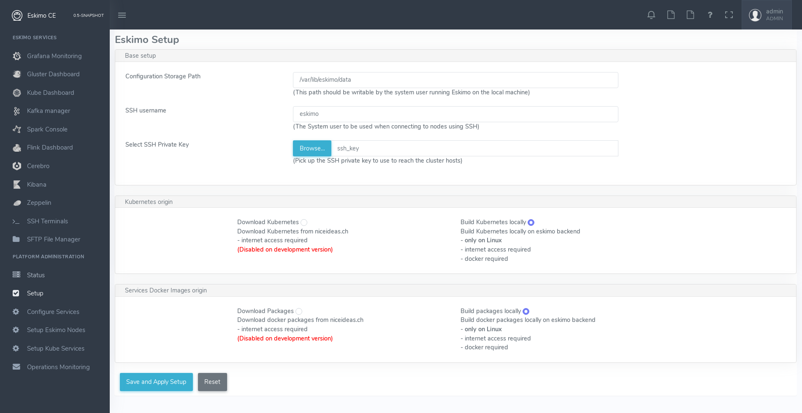

[[chap-installation]]
== Eskimo Installation

WARNING: Eskimo cluster nodes support only the Linux operating system and have to be running a supported Linux
distribution (See <<eskimo_nodes_prerequisites>>). +
The eskimo application itself can very well run on windows though. However, running the Eskimo application on Windows
prevents the user from building his own containers. When running the eskimo backend on Windows, it's only possible to
download pre-built service container images from www.eskimo.sh.

=== Installation target

The eskimo backend itself can either be installed:

* on one of the nodes from the eskimo cluster (for instance one of the node where master services will be installed). +
Doing so is however not recommended since that node would need to have the HTTP port on which Eskimo is listening opened
to external accesses (which is against eskimo's philisophy) and in addition Eskimo would eat some of the resources (RAM
and disk) that would be better left to the business services.
* or on a dedicated node where only the eskimo backend runs (i.e. separated from the Eskimo cluster nodes). This is the
recommended approach.

==== Local Eskimo installation

Eskimo can also be installed on the local computer of the user where that local machine is the single node. +
This is for instance useful when eskimo is intended to be used as a local _Data Science_ laboratory and not targeted
towards large scale Big Data Analytics.

Installing Eskimo on the local user machine is however tricky. +
Eskimo does require indeed a target IP address for the installation. +
A first idea one might have in this case is to use `127.0.0.1` (localhost) as single node target IP to proceed with
the installation. Unfortunately, this doesn't work qs 127.0.0.1 resolved to different loopback interfaces in the
various docker containers running eskimo services and as a consequence eskimo services are not able to reach each
others when `127.0.0.1` is used as installation target.

*So something else needs to be found as target IP address.*

The best approach is tu use the external interface IP address since in every possible configuration, this IP address
will be made available from within Kubernetes PODs and native docker containers, just as services running on
hosts themselves.

==== Installing eskimo on Windows.

As stated in introduction, the eskimo backend can run on Microsoft Windows but in this case it's only possible to
download service container images from www.eskimo.sh. Building one's own container images locally is not possible.

In addition, a property in the configuration file `eskimo.properties` needs to be adapted to a Windows environment,
the properly that configures the path of the user definition file:

`security.userJsonFile=/var/lib/eskimo/eskimo-users.json`

needs to be changed to a folder existing on windows and where the user running Eskimop has _write rights_, such as e.g.

`security.userJsonFile=c:/Windows/Temp/eskimo-users.json`

=== Prerequisites

Some noteworthy elements need to be beared in mind regarding eskimo prerequisites.

==== Java 11 or greater

Eskimo needs Java 11 or greater to run.

In addition, one needs to have either `java` in the path or the `JAVA_HOME` environment variable properly set in prior
to starting eskimo.

Use for instance the following commands on Linux:

.Put java in PATH on Linux
----
export JAVA_HOME=/usr/local/lib/jdk-11 # or wherever it's installed
export PATH=$JAVA_HOME/bin:$PATH
----

(You might want to put the commands above in your `/etc/profile` or `/etc/bash.bashrc`)

Use for instance the following commands on Windows:

.Put java in PATH on Windows
----
set JAVA_HOME=C:\programs\jdk-11 # or wherever it's installed
set PATH=%JAVA_HOME%\bin;%PATH%
----

(On Windows, you might want to define these as _System Variables_: Right-click on "My Computer", choose "Properties",
then "Advanced System Settings", then "Environment Variables" and finally add or update the variables above as "System
Variables")

==== System requirements

In order to run eskimo, one needs to have

* At least 20Gb of disk storage space on the machine running Eskimo
* *At least one linux machine* available on the network (can be the same machine than the one running Eskimo) that will
be put in the eskimo cluster and manipulated by eskimo. See next section regarding requirements for the machines in
the eskimo cluster.

Eskimo is reached using a web browser (see startup logs). Supported web browsers are:

* Microsoft Edge 14 or greater
* Mozilla FireFox 54 or greater
* Google Chrome 58 or greater

Note: there may be other browsers / versions supported (Safari, Opera but they are not certified to work with Eskimo)

==== Network requirements

Network requirements with Eskimo are as follows:

* 100MB ethernet between client machines (accessing eskimo cluster services through web browser) and the machine
running the Eskimo backend.

In case of cluster deployment:

* gigabit ethernet between the machine running the Eskimo backend and Eskimo cluster nodes
* gigabit ethernet required in between cluster nodes

[[eskimo_nodes_prerequisites]]
==== Prerequisites on eskimo cluster nodes

Linux's distributions successfully tested for usage as Eskimo cluster nodes and officially supported are the following:

* Debian Bullseye and greater
* Ubuntu Focal and greater
* CentOS 7.x and 8.x, CentOS stream 8
* RHEL 8.2 and greater
* Fedora 35 or greater

Other Debian-based or Red-Hat-based OSes could be supported as well but haven't been tested so far and may require the
administrator to adapt the setup scripts located in `services_setup`.

===== Minimum hardware

The minimum hardware capacity requirements to run eskimo are as follows:

*Multiple Nodes in the Eskimo cluster, minimum requirement for one node*

In cases where the eskimo cluster runs on multiples nodes (two or more nodes), the minimum hardware capacity for
each these nodes is as follows:

* 30 GB HDD storage space for the system
** additional storage space depending on the data to be manipulated and the replication factor.
** also at least 8Gb disk storage available on `/tmp` if it's a specific partition.
* 4 CPUs (8 CPUs recommended)
* 16 GB RAM (32 GB RAM recommended)

*Single Machine Eskimo deployment, minimum requirement for the single node*

In cases where Eskimo is deployed on a single node (such as the host node running Eskimo itself), the minimum hardware
capacity for this node is as follows:

* 30 GB HDD storage space for the system
** additional storage space depending on the data to be manipulated and the replication factor.
** also at least 8Gb disk storage available on `/tmp` if it's a specific partition.
* 8 CPUs (16 CPUs recommended)
* 32 GB RAM (64 GB RAM recommended)

[[eskimo_nodes_required_packages]]
==== Required packages installation and Internet access on cluster nodes

Eskimo performs some initial setup operations on every node of the cluster it needs to operate. Some of these
operations would require Internet access to download dependencies (either RPM or DEB packages) if these are not properly
installed in advance by administrators.

In case it is not possible to give access to internet to the nodes in the cluster one wishes to operate using eskimo,
one will find below the `yum` and `apt` commands used during nodes setup. +
*In case internet access from cluster node is not possible, one can reproduce these commands on your environment to
find out about the packages that need to be installed in prior to have eskimo operating your cluster nodes:*

Following commands are executed on a debian-based node:

.debian based node setup
----
export LINUX_DISTRIBUTION=`\
    awk -F= '/^NAME/{print $2}' /etc/os-release \
    | cut -d ' ' -f 1 \
    | tr -d \" \
    | tr '[:upper:]' '[:lower:]'`

# system update
apt-get -yq update

# docker dependencies
apt-get -yq install apt-transport-https ca-certificates curl software-properties-common
apt-get -yq install gnupg-agent gnupg2

# docker installation
curl -fsSL https://download.docker.com/linux/$LINUX_DISTRIBUTION/gpg | sudo apt-key add
add-apt-repository deb [arch=amd64] https://download.docker.com/linux/$LINUX_DISTRIBUTION $(lsb_release -cs) stable
apt-get -yq update
apt-get -yq install docker-ce docker-ce-cli containerd.io

# other dependencies
apt-get -y install ipset binutils net-tools attr

# glusterfs client
apt-get -y install glusterfs-client
----

Following commands are executed on a redhat-based node:

.redhat based node setup
----
export LINUX_DISTRIBUTION=`\
    awk -F= '/^NAME/{print $2}' /etc/os-release \
    | cut -d ' ' -f 1 \
    | tr -d \" \
    | tr '[:upper:]' '[:lower:]'`

# system update
sudo yum -y update

# docker dependencies
yum install -y yum-utils device-mapper-persistent-data lvm2

# docker installation
yum-config-manager --add-repo https://download.docker.com/linux/$LINUX_DISTRIBUTION/docker-ce.repo
yum install -y docker-ce docker-ce-cli containerd.io

# other dependencies
yum install -y ipset binutils net-tools anacron

# glusterfs client
yum -y install glusterfs glusterfs-fuse
----

Following commands are executed on a SUSE node:

.suse node setup
----
# system update
sudo zypper --non-interactive refresh | echo 'a'

# install docker
sudo zypper install -y docker

# other dependencies
sudo zypper install -y ipset binutils net-tools cron

# glusterfs client
sudo zypper install -y glusterfs
----

*Again, if eskimo cluster nodes have no internet access in your setup, you need to install all the corresponding
packages* (those listed above and their transitive dependencies) *before you can use these machines as
eskimo cluster nodes.*

After this initial setup is performed (called Eskimo base installation and done by the script
`install-eskimo-base-system.sh`), eskimo operates entirely without any need to access internet.

===== Eskimo system user

Eskimo requires to have a system user properly defined and with SSH access to reach and operate the cluster nodes.
That user can be any user but it has to be configured in Eskimo - see <<user_configuration>> - and has to have SSH
access to every single node to be operated by eskimo using SSH Public Key Authentication -
see <<ssh_key_authentication>>.

*In addition, that user needs to have sudo access (wildcard) without requiring to enter a password!*
This `sudo` ability for the configured user is absolutely key.

On most systems, this means:

* Add the user configured with eskimo to the `sudoers` groups
* Add a file in `/etc/sudoers.d/eskimo` containing `eskimo ALL=(ALL) NOPASSWD:ALL +
(if `eskimo` is the configured user)
`

===== Protecting eskimo nodes with a firewall

The different sevices operated by Eskimo require different set of ports to communicate with each others. As such,
internal cluster communications - all IP addresses used by the cluster nodes - have to be whitelisted in the firewall.

The cluster nodes can protect from external access - IP addresses not belonging to the eskimo cluster nodes - by
blocking pretty much every port except port 22, which is the single port used by eskimo to reach eskimo cluster
services.

*IN ADDITION TO THE STATIC PORTS LISTED BELOW, A WHOLE SET OF PORT RANGES ARE USED BY THE KUBERBNETES INFRASTRUCTURE,
ELASTICSEARCH, SPARK EXECUTORS AND FLINK WORKERS TO COMMUNICATE WITH EACH OTHER. THESE DYNAMIC PORTS ARE CREATED ON THE
FLY AND HAVING THEM CLOSED BY THE FIREWALL WOULD SIMPLY PREVENT THEM FROM WORKING.*

*For this reason, whenever the eskimo cluster nodes are protected by a firewall, it is of UTMOST IMPORTANCE that the
firewall is filtering out the internal eskimo cluster nodes IP addresses from the exclusion rules. +
Every eskimo node should have wide access to every other node in the eskimo cluster. Period.*

Specifically on RHEL, firewalld in its default configuration (coming out of the box) is preventing eskimo services from
reaching each others and compromises Eskimo's behaviour. It needs to be properly configured and white list all
communications (all ports) in between Eskimo cluster nodes. Or just disable firewalld for a non-production critical
deployment (`sudo disable firewalld` and `sudo stop firewalld`).

On the opposite side, as far as external eskimo clustet communications are concerned,
it is important to filter out every single access attempt originating from outside the Eskimo cluster. The
only open port for requests outside of the eskimo cluster should be the port 22 used by SSH since all accesses from the
Eskimo console to the nodes from the Eskimo cluster happens through SSH tunnels.

For the sake of information, the list of static ports used by the different services are listed here:

* [cerebro] : 9000, 31900
* [elasticsearch] : 9200, 9300
* [gluster] : 24007, 24008, 24009, 24010, 49152, 38465, 38466, 38467
* [grafana] : 3000, 31300
* [kafka] : 9092, 9093, 9999
* [kafka-manager] : 22080, 31220
* [kibana] : 5601, 31561
* [kubernetes] : 2379, 2380, 6443, 8091, 8472, 10250, 10251, 10252, 10255
* [ntp] 123
* [prometheus] : 9090, 9091, 9093, 9094, 9100
* [spark] : 7077, 8580, 8980, 8581, 8981, 2304, 18480, 7337, 7222, 8032, 7222
* [flink] : 6121, 6122, 6123, 6130, 8081
* [spark-console] : 18080, 31810
* [zeppelin] : 38080, 38081, 31008, 31009
* [zookeeper] : 2181, 2888, 3888

Again, this list is incomplete since it doesn't reveal the dynamic port ranges mentioned above.

=== Extract archive and install Eskimo

After downloading either the zip ot the tarball archive of eskimo, it needs to be extracted on the local filesystem.
This simple extraction is the only step required to _install_ eskimo.

Then in the folder `bin` under the newly extracted eskimo binary distribution folder, one can find two scripts:

* a script `eskimo.bat` to execute eskimo on Windows
* a script `eskimo.sh` to execute eskimo on Linux.

That's it.

==== SystemD Installation

In case one wants to have Eskimo's backend operated (automatically started, etc.) using SystemD, the script
`bin/utils/__install-eskimo-systemD-unit-file.sh` can be used to perform all the required setup steps for a successful
SystemD launch as well as installing the Eskimo SystemD unit configuration file.

==== Extracted Archive layout and purpose

Once extracted on the filesystem, the Eskimo folder contains the following elements:

* `bin` : contains executables required to start Eskimo as well as utility commands (in `utils` sub-folder)
* `conf` : contains Eskimo configuration files
* `lib` : contains eskimo runtime binaries
* `packages-dev` : contains the Eskimo _docker images (packages) development framework_ which is used to build eskimo
components / services docker images locally (this is not required if the administrators decides to download packages
from www.eskimo.sh)
* `packages_distrib`: contains eventually the eskimo services docker image packages (either build locally or downloaded
from internet)
* `services_setup`: contains the services installation framework. *Each and every customization an administrator wishes
to apply on eskimo services is done by modifying / extending / customizing the shell scripts in this folder*.
* `static_images`: is intended to be used to add additional icons or logos for new custom services added by an
administrator to Eskimo.

==== Utility commands

Some command line utilities to ease eskimo's administration are provided in `bin/utils`:

* `encode-password.bat|.sh` : this script is used to generate the encoded password to be stored in the user definition
file. See <<user_file>>

[[user_file]]
=== Access eskimo

With eskimo properly started using the scripts in `bin` discussed above, one can reach eskimo using
http://machine_ip:9191. +
The default port number is 9191. This can be changed in configuration file `eskimo.properties`.

*The default login / password credentials are _admin_ / _password_.*

This login is configured in the file pointed to by the configuration property `security.userJsonFile`. +
A sample file is created automatically if the target file doesn't exist with the `admin` login above.

The structure of this file is as follows;

.Sample user definition file
----
{
  "users" : [
    {
      "username" : "admin",
      "password" : "$2a$10$W5pa6y.k95V27ABPd7eFqeqniTnpYqYOiGl75jJoXApG8SBEvERYO",
      "role": "ADMIN"
    }
  ]
}
----

The password is a `BCrypt` hash (11 rounds) of the actual password.

The administrator can add as many different users to this file as required on the Eskimo platfoirm.

Users can have either the `ADMIN` or `USER` role.

* the `ADMIN` role enables full acces to every single feature of Eskimo
* the `USER` role limits available functionalities to Data Science tools and prevents the user from making any change
to the cluster configuration or influence runtime operations.

[[user_configuration]]
=== First run and initial setup

Upon first run, eskimo needs to be setup before it can be used.

Right after its first start, one single screen is available : *the setup page*. +
It is the only accessible page as long as initial setup is not properly completed and service
docker images (plus kubernetes packages) have not been either downloaded or built.

The setup page is as follows:

On the setup page, the user needs to input following information:

* *Configuration Storage Path* : a folder on the filesystem where the system user running eskimo needs to have write
access to. The dynamic configuration and state persistence of eskimo will be stored in this location.
* *SSH Username* : the name of the SSH user eskimo has to use to access the cluster nodes. Every node that need to be
managed by eskimo needs to have granted access using SSH Public Key authentication to this user.
* *SSH private key* : the private key to use for SSH Public Key authentication for the above user. See the next section
in regards to how to generate this key : <<ssh_key_authentication>>
* *Kube Origin* : the user needs to choose whether Kubernetes package need to be *built locally* (on eskimo host node) or
whether pre-built versions shall be *downloaded* from the remote packages repository (by default https://www.eskimo.sd.)
* *Docker Images Origin* : the user needs to choose whether service package images needs to be *built locally* or whether
they need to be *downloaded* from the remote packages repository (by default https://www.niceideas.ch.)

Once the settings have been chosen by the user, clicking "Save and Apply Setup" will launch the initial setup process
and the archives will be built locally or downloaded. This can take a few dozen of minutes depending on your internet
connection and/or the eskimo host machine processing abilities.

Regarding the SSH private key, the next section gives indication with regards to how to build a _public / private key
pair_ to enable eskimo to reach and manage the cluster nodes.

The document _"Service Development Framework"_ in the section _"Setting up a remote packages repository"_ presents
the nuts and bolts required in setting up a remote packages repository. +
The remote repository URL is configured in `eskimo.properties` using the configuration property : +
`system.packagesDownloadUrlRoot` : The Root URL to download the packages from.

[[build_packages_locally]]
==== Building packages locally

Building eskimo packages locally means building the services docker images on your local host machine running eskimo.
This means that instead of downloading docker images from the eskimo repository, the user wants to build them on his own
and only download the source package archives from their respective software editor web site (e.g. Apache, Elastic, etc.)

===== Requirements

*There are some important requirements when desiring to build the software packages on one's own:*

* The host machine running eskimo needs at least 25 GB of free hard drive space
* The host machine running eskimo needs at least 16 GB of free RAM space available

In addition, building packages locally requires some tools to be available on the host machine running eskimo itself.
Mostly, `git`, `docker` and `wget` need to be installed on your host machine.

===== Instructions to install these tools

Following commands are required on a debian-based host:

.debian host dependencies to build packages
----
export LINUX_DISTRIBUTION=`\
    awk -F= '/^NAME/{print $2}' /etc/os-release \
    | cut -d ' ' -f 1 \
    | tr -d \" \
    | tr '[:upper:]' '[:lower:]'`

# system update
apt-get -yq update

# eskimo dependencies
apt-get -yq install wget git

# docker dependencies
apt-get -yq install apt-transport-https ca-certificates curl software-properties-common
apt-get -yq install gnupg-agent gnupg2

# docker installation
curl -fsSL https://download.docker.com/linux/$LINUX_DISTRIBUTION/gpg | sudo apt-key add
add-apt-repository deb [arch=amd64] https://download.docker.com/linux/$LINUX_DISTRIBUTION $(lsb_release -cs) stable
apt-get -yq update
apt-get -yq install docker-ce docker-ce-cli containerd.io

# Enable and start docker
systemctl enable docker
systemctl start docker

# Add current user to docker group
usermod -a -G docker $USER

# (system or at least shell / process restart required after this)
----

Following commands are required on a redhat-based host:

.redhat host dependencies to build packages
----
export LINUX_DISTRIBUTION=`\
    awk -F= '/^NAME/{print $2}' /etc/os-release \
    | cut -d ' ' -f 1 \
    | tr -d \" \
    | tr '[:upper:]' '[:lower:]'`

# system update
yum -y update

# eskimo dependencies
yum install -y wget git

# docker dependencies
yum install -y yum-utils device-mapper-persistent-data lvm2

# docker installation
yum-config-manager --add-repo https://download.docker.com/linux/$LINUX_DISTRIBUTION/docker-ce.repo
yum install -y docker-ce docker-ce-cli containerd.io

# Enable and start docker
systemctl enable docker
systemctl start docker

# Add current user to docker group
usermod -a -G docker $USER

# (system or at least shell / process restart required after this)
----

Following commands are required on a SUSE host:

.suse host dependencies to build packages
----
# system update
zypper --non-interactive refresh | echo 'a'

# eskimo dependencies
zypper install -y git wget

# install docker
zypper install -y docker

# Enable and start docker
systemctl enable docker
systemctl start docker

# Add current user to docker group
usermod -a -G docker $USER

# (system or at least shell / process restart required after this)
----

==== Checking for updates

At any time after initial setup - and if and only if the chosen installation method is *downloading* packages, the user
can _apply setup_ again to check on the packages server (by default https://www.eskimo.sh) if updates are available
for service docker images or kubernetes packages.

=== Typical startup issues

Several issues can happen upon first eskimo startup. +
This section describes common issues and ways to resolve them.

==== eskimo-users.json cannot be written

If you meet an error as the following one upon startup:

.Impossible to write eskimo-users.json
----
Caused by: ch.niceideas.common.utils.FileException: ./eskimo-users.json (Unauthorized access)
        at ch.niceideas.common.utils.FileUtils.writeFile(FileUtils.java:154)
        at ch.niceideas.eskimo.security.JSONBackedUserDetailsManager.<init>(JSONBackedUserDetailsManager.java:81)
        at ch.niceideas.eskimo.configurations.WebSecurityConfiguration.userDetailsService(WebSecurityConfiguration.java:127)
        ... 50 more
Caused by: java.io.FileNotFoundException: ./eskimo-users.json (Unauthorized access)
        at java.base/java.io.FileOutputStream.open0(Native Method)
        at java.base/java.io.FileOutputStream.open(FileOutputStream.java:276)
        at java.base/java.io.FileOutputStream.<init>(FileOutputStream.java:220)
        at java.base/java.io.FileOutputStream.<init>(FileOutputStream.java:170)
        at java.base/java.io.FileWriter.<init>(FileWriter.java:90)
        at ch.niceideas.common.utils.FileUtils.writeFile(FileUtils.java:149)
        ... 52 more
----

Eskimo uses a local file to define users and access credentials. Upon first startup, if that file doesn't exist already,
it is created by eskimo (with the default credentials above) at the path pointed to by the property
`security.userJsonFile` in `eskimo.properties`.

If you experience the error above or something alike, change that property to point to a location where the first
version of the file can successfully be created.

[[ssh_key_authentication]]
=== Setting up SSH Public Key Authentication

==== Introduction

Public key authentication is a way of logging into an SSH/SFTP account using a cryptographic key rather than a
password. This is a strong requirement in the current version of eskimo.

==== How Public Key Authentication Works

Keys come in pairs of a public key and a private key. Each key pair is unique, and the two keys work together.

These two keys have a very special and beautiful mathematical property: if you have the private key, you can prove your
identify and authenticate without showing it, by using it to sign some information in a way that only your private key
can do.

Public key authentication works like this:

. Generate a key pair.
. Give someone (or a server) the public key.
. Later, anytime you want to authenticate, the person (or the server) asks you to prove you have the private key that
corresponds to the public key.
. You prove you have the private key.
. You don't have to do the math or implement the key exchange yourself. The SSH server and client programs take care of
this for you.

==== Generate an SSH Key Pair

You should generate your key pair on your laptop, not on your server. All Mac and Linux systems include a command called
ssh-keygen that will generate a new key pair.

If you're using Windows, you can generate the keys on your server. Just remember to copy your keys to your laptop and
delete your private key from the server after you've generated it.

To generate an SSH key pair, run the command `ssh-keygen`.

.Calling `ssh-keygen`
----
eskimo@notebook:/tmp$ ssh-keygen
Generating public/private rsa key pair.
----

You'll be prompted to choose the location to store the keys. The default location is good unless you already have a key.
Press Enter to choose the default location *unless you already have a key pair there in which case you might want to
take great care not to overwrite it*.

----
Enter file in which to save the key (/home/eskimo/.ssh/id_rsa): /tmp/eskimo/id_rsa
----

Next, you'll be asked to choose a password. Using a password means a password will be required to use the private key.
*Eskimo requires at all cost that you leave the password empty otherwise the key won't be usable with eskimo - at least
in this current version*. +
Press two times "Enter" there :

----
Enter passphrase (empty for no passphrase):
Enter same passphrase again:
----

After that, your public and private keys will be generated. There will be two different files. The one named `id_rsa` is
your private key. The one named `id_rsa.pub` is your public key.

----
Your identification has been saved in /tmp/eskimo/id_rsa.
Your public key has been saved in /tmp/eskimo/id_rsa.pub.
----

You'll also be shown a fingerprint and "visual fingerprint" of your key. You do not need to save these.

----
The key fingerprint is:
SHA256:/HPC91ROJtCQ6Q5FBdsqyPyppzU8xScfUThLj+3OKuw eskimo@notebook
The key's randomart image is:
+---[RSA 2048]----+
|           .+=...|
|            +=+. |
|           oo.+* |
|       + ....oo.o|
|        S .o= +.+|
|         = +.+ B.|
|          %.o oo.|
|         o.Boo  o|
|        oo .E.o. |
+----[SHA256]-----+
----

==== Configure an SSH/SFTP User for Your Key

===== Method 1: Using ssh-copy-id

Now that you have an SSH key pair, you're ready to configure your app's system user so you can SSH or SFTP in using your
private key.

To copy your public key to your server, run the following command. Be sure to replace "`x.x.x.x`" with your server's IP
address and `SYSUSER` with the name of the the system user your app belongs to.

----
ssh-copy-id SYSUSER@x.x.x.x
----

===== Method 2: Manual Configuration

If you don't have the `ssh-copy-id` command (for instance, if you are using Windows), you can instead SSH in to your
server and manually create the `~/.ssh/authorized_keys` file so it contains your public key.

First, run the following commands to make create the file with the correct permissions.

----
(umask 077 && test -d ~/.ssh || mkdir ~/.ssh)
(umask 077 && touch ~/.ssh/authorized_keys)
----

Next, edit the file `.ssh/authorized_keys` using your preferred editor. Copy and paste your id_rsa.pub file into the
file.

==== Log In Using Your Private Key

You can now SSH or SFTP into your server using your private key. From the command line, you can use:

----
ssh SYSUSER@x.x.x.x
----

If you didn't create your key in the default location, you'll need to specify the location:

----
ssh -i ~/.ssh/custom_key_name SYSUSER@x.x.x.x
----

If you're using a Windows SSH client, such as PuTTy, look in the configuration settings to specify the path to your
private key.

==== Granting Access to Multiple Keys

The `~/.ssh/authorized_keys` file you created above uses a very simple format: it can contain many keys as long as you
put one key on each line in the file.

If you have multiple keys (for example, one on each of your laptops) or multiple developers you need to grant access
to, just follow the same instructions above using ssh-copy-id or manually editing the file to paste in additional
keys, one on each line.

When you're done, the .ssh/authorized_keys file will look something like this (don't copy this, use your own public
keys):

----
ssh-rsa AAAAB3NzaC1yc2EAAAADAQABAAABAQDSkT3A1j89RT/540ghIMHXIVwNlAEM3WtmqVG7YN/wYwtsJ8iCszg4/lXQsfLFxYmEVe8L9atgtMGCi5QdYPl4X/c+5YxFfm88Yjfx+2xEgUdOr864eaI22yaNMQ0AlyilmK+PcSyxKP4dzkf6B5Nsw8lhfB5n9F5md6GHLLjOGuBbHYlesKJKnt2cMzzS90BdRk73qW6wJ+MCUWo+cyBFZVGOzrjJGEcHewOCbVs+IJWBFSi6w1enbKGc+RY9KrnzeDKWWqzYnNofiHGVFAuMxrmZOasqlTIKiC2UK3RmLxZicWiQmPnpnjJRo7pL0oYM9r/sIWzD6i2S9szDy6aZ eskimo@notebook
ssh-rsa AAAAB3NzaC1yc2EAAAADAQABAAABAQCzlL9Wo8ywEFXSvMJ8FYmxP6HHHMDTyYAWwM3AOtsc96DcYVQIJ5VsydZf5/4NWuq55MqnzdnGB2IfjQvOrW4JEn0cI5UFTvAG4PkfYZb00Hbvwho8JsSAwChvWU6IuhgiiUBofKSMMifKg+pEJ0dLjks2GUcfxeBwbNnAgxsBvY6BCXRfezIddPlqyfWfnftqnafIFvuiRFB1DeeBr24kik/550MaieQpJ848+MgIeVCjko4NPPLssJ/1jhGEHOTlGJpWKGDqQK+QBaOQZh7JB7ehTK+pwIFHbUaeAkr66iVYJuC05iA7ot9FZX8XGkxgmhlnaFHNf0l8ynosanqt badtrash@desktop
----

==== Use the private key in eskimo

Once the above procedure properly followed and the public keys added to the authorized key for your the user to be used
by eskimo, you can use the corresponding private key in the eskimo setup page to grand access to eskimo to the cluster
nodes.
