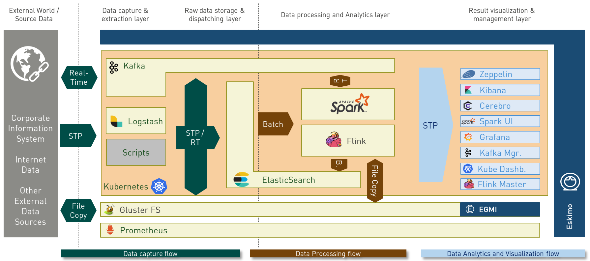
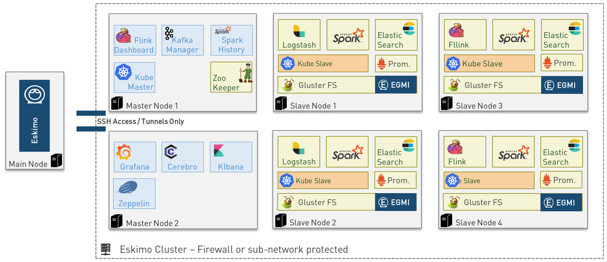

[[chap-introduction]]
== Eskimo Introduction

A state of the art _Big Data Infrastructure_ and _Management Web Console_ to _build_, _manage_ and _operate_
*Big Data 2.0 Analytics clusters* on *Kubernetes*.

image::pngs/eskimo.jpg[50, 50, align="center"]

Eskimo is in a certain way the Operating System of your Big Data Cluster:

* A _plug and play_, working _out of the Box_, *Big Data Analytics platform* fulfilling _enterprise environment
requirements_.
* A *state of the art Big Data 2.0 platform*
** based on _Kubernetes_ (and heavily relying on _Docker_ and _SystemD_ as well)
** packaging _Gluster_, _Spark_, _Kafka_, _Flink_ and _ElasticSearch_
** with all the administration and management consoles such as _Cerebro_, _Kibana_, _Zeppelin_, _Kafka-Manager_,
_Grafana_ and _Prometheus_ and of course the _Kubernetes Dashboard_.
* An _Administration Application_ aimed at drastically simplifying the *deployment, administration and operation* of
your Big Data Cluster
* A _Data Science Laboratory_ and _Production environment_ where Data Analytics is both
** developed and
** operated in production

Eskimo is as well:

* a collection of ready to use docker containers packaging fine-tuned and highly customized plug and play services with
all the _nuts and bolts_ required to make them work perfectly together.
* a framework for developing, building and deploying Big Data and NoSQL services based on _Kubernetes_, _Docker_ and
_SystemD_.

=== Key Features

Eskimo key features are as follows:

[cols=">.^20%,80%"]
|===
a|image::pngs/location.jpg[60, 60]| *Abstraction of Location*

Just define where you want to run which services and let eskimo take care of everything.

Move services between nodes or install new services in just a few clicks.

Don’t bother remembering where you installed Web consoles and UI applications, Eskimo wraps them all in a single and
unified UI.

a|image::pngs/console.jpg[60, 60]| *Eskimo Web Console*

Eskimo’s tip of the iceberg is its flagship web console.

The Eskimo Console is the single and entry point to all your cluster operations, from services installation to
accessing Kibana, Zeppelin and other UI applications.

The Eskimo Console also provides SSH consoles, File browser access and monitoring to your cluster.

a|image::pngs/framework.jpg[60, 60]| *Services Framework*

Eskimo is a Big Data Components service development and integration framework based on Kubernetes, Docker and SystemD.

Eskimo provides out of the box ready-to use components such as Spark, Flink, ElasticSearch, Kafka, Gluster, Zeppelin,
etc.

Eskimo also enables the user to develop his own services very easily.
|===

=== Why is Eskimo cool ?

* *Taking care of it !* +
Making Zookeeper, GlusterFS; Kubernetes, Kafka, ElasticSearch, Flink, Spark, etc. work perfectly together is difficult and
tedious. +
Eskimo takes care of everything.

* *Big Data 2.0* +
Most if not all private-cloud Big Data Platform such as Hortonworks, Cloudera, MapR, etc. are based on Hadoop, HDFS,
YARN, etc. which are quite old components and technology. +
Eskimo is based on GlusterFS, Kubernetes, ElasticSearch, Kafka and Spark,
cutting edge components from a newer generation.

* *Leveraging on docker* +
Most if not all private-cloud Big Data Platform such as those mentioned above would install components natively,
thus having strong requirements and impacts on underlying nodes. +
Eskimo uses docker to isolate Eskimo components from the underlying host OS and vice versa, enabling transparent
upgrades, relocations of services, etc.

* *Eskimo is an open platform.* +
Eskimo works out of the box but users and administrators can customize and extend it the way they like, the way they
decide.

=== Eskimo's DNA

[cols=">.^20%,80%"]
|===
a|image::pngs/big_data_scientist.png[80, 80] a| *Big Data Scientist*

With eskimo, Big Data Scientists can prototype and run their analytics use cases on a thousand nodes cluster should they
need it.

With Flink ML and Spark ML natively available on Flink and Spark and usable from within Zeppelin, Data Scientists can
bring their mission to the next level: the big data way.

SciKit Learn and TensorFlow are also available from within Zeppelin of course.

Develop your business analytics processes and deploy them in production operations in a few clicks.

a|image::pngs/big_data.jpg[80, 80] a| *Big Data 2.0*

In contrary to popular Hadoop-based and other Big Data Platforms, Eskimo is based on cutting-edge technologies:

* GlusterFS instead of HDFS
* Spark instead of Hive or Pig
* Flink and Kafka instead of Storm
* Kubernetes instead of Yarn
* Docker instead of native deployment
* ElasticSearch instead of HBase or Hive

These new generation Big Data components form together a Big Dats 2.0 stack, lightweight and efficient and leveraging
on modern computing abilities (memory oriented vs. IO oriented). +
This Big Data 2.0 software stack is much more efficient and effective than any hadoop based Big Data processing cluster,
while covering an extended subset of the same use cases.

In addition, in contrary to hadoop these software components behave just as good on a single node machine with plenty of
RAM and processor than it does on a cluster of a few small nodes, thanks to their ability of benefiting from the
multi-processor architecture of modern machines. +
In addition, this comes with an interesting benefit : the ability to build on one's machine the very same environment
than on a large production cluster.

a|image::pngs/ring.jpg[80, 80] a| *One ring to Rule them all*

Making docker, gluster, elasticsearch, kafka, spark, flink, zeppelin, etc. all work perfectly and 100% together is very
tedious and difficult.

Eskimo takes care of everything and fine-tunes all these services to make them understand each other and work together.

Eskimo enables you one-click administration of all of them, moving services, provisioning nodes, etc.

Yet it's open : open-source and built on standards

a|image::pngs/one_size.jpg[80, 80] a| *One size fits all*

Do you want to build a production grade Big Data Processing cluster with thousands of nodes to analyze the internet ?

Or do you want to build a small AI laboratory on your own laptop ?

Eskimo is made for you in these both cases.

a|image::pngs/lightweight.jpg[80, 80] a| *Lightweight in DNA*

MapR, Hortonworks, Cloudera and every other hadoop based Big Data Platforms are Behemoths.

Eskimo leverages on GlusterFS, Kubernetes, spark, flink, elasticsearch, logstash, kibana, Zeppelin, etc. - simple and
extremely lightweight components that have a broad use cases coverage while simplifying administration, operation and
usage.

a|image::pngs/platform.jpg[80, 80] a| *Open platform extensible and customizable*

Eskimo works out of the box, taking care of the burden to make all this software works perfectly and 100% together.

Eskimo is not a black box, it’s an open platform. One can fine tune and adapt everything exactly as desired : from
the docker containers building to the services setup on the platform.

Want to leverage on eskimo to integrate other services such as Apache Flink or Cassandra ? declare your own services
and import your own containers, built it as you like !

a|image::pngs/universal.jpg[80, 80] a| *Universal Platform*

Eskimo is exhaustively built on top of Docker.

Only kubernetes binaries are installed on host linux OS running your cluster nodes. +
All the other components - from kafka to zeppelin through spark - run on docker (mostly - but not only - through
Kubernetes).

Eskimo is successfully tested on Ubuntu, Debian, CentOS, Fedora and Red Hat Enterprise Linux nodes so far ... more are
coming.

a|image::pngs/enterprise_grade.png[80, 80] a| *Enterprise-grade requirements*

Eskimo is designed for Enterprise deployments, fulfilling enterprise-grade requirements:

* Security from the grounds-up: data and communication encryption, firewall, authentication and authorization on every action, etc.
* DRP compliance / Backup and restore tooling
* High-Availability out of the box
* State of the art Integration abilities
* Very broad range of use-cases and possibilities

(N.B. Eskimo comes in two flavours, the _Enterprise Edition_ and the _Community Edition_. Eskimo CE - Community Edition
- supports only a subset of the features above.)

a|image::pngs/cloud.jpg[80, 80] a| *Cloud Friendly*

Build your own Big Data Cloud

Eskimo is VM friendly. +
You have a bunch of VMs somewhere on Amazon or google cloud? +
Make it a state of the art big data cluster, your way, not amazon or google's predefined, fixed and constraining way.

Choose your services and let eskimo take care of everything.

|===

=== Eskimo Architecture

==== Technical Architecture

Eskimo's technical architecture can be illustrated as follows:

image::pngs/technical_architecture.png[800, 800, align="center"]

Three components are available in the storage layer:

* *ElasticSearch*: a real-time, scalable, document-oriented and REST operated NoSQL Database
* *Gluster FS*: the distributed filesystem in use with Eskimo along with *EGMI* to operare it.
* *Apache Zookeeper*: the distributed configuration, synchronization and orchestration system

The processing layer makes the following services available:

* *Apache Kafka* : used for real-time data integration and streaming processing
* *Apache Spark* : the large scale very versatile computation engine
* *Apache Flink* : a distributed processing engine for real-time and streaming stateful computations over data stream
* *Elastic Logstash* : used for data ingestion, processing and dispatching
* As a sidenote, ElasticSearch can also be considered part of the processing tier since it provides many processing
abilities (pipeline computations, aggregations, etc.)

All Big Data / NoSQL middlewares as well as all User Interface (UI) Applications are operated by *Kubernetes* to achieve
optimal cluster resources booking and negotiation.

The user layer is intended for data / result visualizations and platform administration with the following components:

* *Elastic Kibana*, *Grafana* and *Apache Zeppelin* for data and result visualizations
** Grafana is also used natively for platform monitoring concerns
* *Cerebro*, The Spark Console (History Server), The Flink Dashboard, the *Kafka Manager*, the *Kubernetes Dashboard*
for platform administration.

Each and every software components is executed with Docker and packaged as a docker container.
Runtime operation is ensured using Kubernetes for most services and some static services are handled with SystemD
directly and defined as SystemD units.

==== Typical Application architecture

A typical Eskimo application architecture can be illustrated as follows:

The above schema illustrates typical data flows within Eskimo

[[sample_system_archi]]
==== Sample System Architecture

This is an example of a possible deployment of Eskimo on a 6 nodes cluster:

The Eskimo application itself can be deployed on any of the cluster nodes or on another, separated machine (as in the
example above),

Requirements on machines to be used as Eskimo Cluster nodes are presented in the following sections:

* <<eskimo_nodes_prerequisites>>
* <<eskimo_nodes_required_packages>>

=== Eskimo building

Eskimo build instructions are given in the file `README.adoc` located in the root folder of the *eskimo source code
distribution*.
