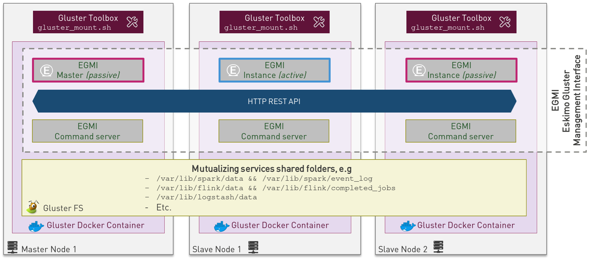

== Eskimo pre-Packaged services

In the current version, eskimo provides pre-packaged docker images as well as services setup configurations for the
pre-packaged software components.

Eskimo takes care of everything regarding the building of the docker images for these software components as well
their setup, installation and operation on the eskimo cluster nodes.

This chapter gives some additional information related to these software components operated by eskimo, presents some
design decisions regarding their operation as well as implementation details of the Eskimo *pre-packaged software
components*.

=== Eskimo services operation principles

Supported packaged services are defined at different levels in order to be operable by Eskimo:

1. They must be defined and configured in the configuration file `services.json`
2. They must have a `setup.sh` script in their `services_setup` folder.
3. (Optionally) they should have a docker image available containing the _ready-to-run_ vanilla software (if it's a
docker service)
4. (Optionally) they should have a SystemD unit file for Eskimo to be able to manage the service through Systemd (for
node native services)
5. (Optionally) they should have a Kubernetes deployment descriptor for Eskimo to be able to manage the service through
Kubernetes (for kubernetes services)

This is detailed in the
https://www.eskimo.sh/doc/service-dev-guide.html#services_installation_framework[Service Installation Framework Guide].

==== SystemD unit configuration files

Some services leverage on SystemD to be managed and operated by Eskimo (node native services). Services themselves are
implemented as docker containers.

This is how docker operations are mapped to systemctl commands :

* `systemctl stop service`: kills and removes the service docker container
* `systemctl start service`: creates and starts a new docker container from the reference image

Since every restart of a service creates actually a new docker container, containers are inherently not stateful and
freshly restarted every time. +
This is why the persistent data is stored under sub-folders of `/var/lib` which is mounted to the docker container.

==== Kubernetes Deployment descriptors

But most services are Kubernetes services instead of node native (SystemD) services.

They can be managed using the Kubernetes Dashboard - which is prepackaged with Eskimo - or with the help of the
`kubectl` command.

Eskimo provided services have kubernetes deployment descriptor generation scripts placed in
`/var/lib/eskimo/kube-services/` by eskimo.

==== Commands wrappers for kafka, logstash, spark and flink

Since software components and services within Eskimo are packaged as docker images, command line tools such
as kafka's `create-producer.sh` or spark's `spark-submit` work only from within the respective kafka or spark
executor docker container.

For this reason, eskimo provides for each of these command line tools a host-level wrapper in `/usr/local/bin`
and `/usr/local/sbin`. +
These wrappers take care of starting the required docker container and calling the corresponding command in it.

Even further, since most analytics services within Eskimo run on Kubernetes, these wrappers take care of tampering at
startup with the container `/etc/hosts` file to dynamically resolve each and every service deployed on Kubernetes based
on the Kube topology at command invocation time.

==== A specific generic wrapper

A specific generic shell wrapper is available in the form of the `eskimo-kube-exec` command located in `/usr/local/bin`.

This wrapper can be used to invoke a shell for instance with access to all Kubernetes services by their names with the
following command call: `eskimo-kube-exec bash`. +
This wrapper uses a generic container with a bunch of command line utilities available and is deployed with the
`kube-shell` kubernetes service.

==== Reloading a Service UI IFrame

Master services that have a web console and other UI applications are wrapped and shown from within the Eskimo UI, in a
consistent and coherent fashion, without the user needing to reach anything else that the Eskimo UI to access all
services and features of an Eskimo cluster.

These wrapped UI applications are displayed as iframes in the Eskimo main UI window.

Whenever a service UI is being displayed by selecting the service from the menu, *clicking the service menu entry a
second time will force refresh the service iframe*.

Now the remaining of this chapter presents each and every pre-packaged service:

=== NTP

NTP - Network Time Protocol - is used within Eskimo to synchronize all node clocks on the eskimo cluster.

Eskimo elects one of the NTP node as master. +
The master synchronizes its time from internet servers (if available) and all other NTP nodes are
considered slaves and synchronize their own clock from this NTP master.

NTP on Eskimo is installed as a host native service (SystemD / docker unit) and doesn't run on Kubernetes.

=== Zookeeper

image::pngs/zookeeper-logo.png[50, 50, align="center"]

Zookeeper is a distributed configuration and election tool used to synchronize kafka and EGMI nodes and processes.

It is an effort to develop and maintain an open-source server which enables highly reliable distributed coordination.

ZooKeeper is a centralized service for maintaining configuration information, naming, providing distributed
synchronization, and providing group services. All of these kinds of services are used in some form or another by
distributed applications.

https://zookeeper.apache.org/

Zookeeper on Eskimo is installed as a host native service (SystemD / docker unit) and doesn't run on Kubernetes.

==== Zookeeper specificities within Eskimo

The script `zkCli.sh` enabling an administrator to browse, query and manipulate zookeeper is available on the host
running the zookeeper container as `/usr/local/bin/zookeeperCli.sh`

=== GlusterFS

Gluster is a free and open source software scalable network filesystem. +
It's suitable for data-intensive tasks such as cloud storage and media streaming. GlusterFS is free and open source
software and can utilize common off-the-shelf hardware.

GlusterFS is the standard distributed filesystem used within eskimo. It is used to store business data and share data
and configuration among eskimo cluster nodes.

https://www.gluster.org/

GlusterFS on Eskimo is installed as a host native service (SystemD / docker unit) and doesn't run on Kubernetes. It is
used by Kubernetes itself to store its shared configuration.

==== Gluster Infrastructure

Eskimo approaches gluster shares management in a specific way.

First Gluster runs from within a docker container and is isolated from the host operating system. +
Then Eskimo leverages on *EGMI* - Eskimo Gluster Management Interface - https://github.com/eskimo-sh/egmi - to manage
and operate the cluster of gluster nodes.

The architecture can be depicted as follows:

*EGMI* is a daemon running on machines or containers alongside Gluster FS and taking care of managing gluster volumes
and peers automatically (for most common operations).

The fundamental idea behind EGMI is that Big Data System administrators should not have to do so much manual operations
to build and maintain a gluster cluster with its volumes and peers.

EGMI inspires from the way most widely used Big Data / NoSQL backends manage their nodes, shards and replicas
transparently, balancing new replicas to new nodes automatically whenever a node goes down, etc. without an
administrator needing to really worry about it. +
EGMI aims eventually at bringing the same level of automation and reliability on top of Gluster FS and at simplifying
most trivial aspects of gluster volumes management and repairing.

EGMI also includes a web interface for monitoring and to help administrators perform some simple manual operations and
configuration.

Please refer to the EGMI page on github linked above for further informmation about EGMI.

*Noteworthy details*:

* EGMI within Eskimo requires all gluster shares used by Eskimo services to be configured in the property `target.volumes`
of the configuration file (part) `egmi.properties` in the Eskimo services configuration file `services.json`. Refer to
the services development guide for an exaplanation on that file.

==== Gluster mounts management

Gluster shares are mounted at runtime using standard mount command (fuse filesystem).

However eskimo provides _Toolbox script_ that takes care of all the burden of mountint shared folders with gluster.

This _Toolbox script_ is the available on cluster nodes at: `/usr/local/sbin/gluster-mount.sh`. +
This script is called as follows:

.calling /usr/local/sbin/gluster-mount.sh
----
/usr/local/sbin/gluster-mount.sh VOLUME_NAME MOUNT_POINT OWNER_USER_ID
----

where:

* `VOLUME_NAME` is the name of the volume to be created in the gluster cluster
* `MOUNT_POINT` is the folder where to mount that volume on the local filesystem.
* `OWNER_USER_ID` the user to which the mount points should belong

The beauty of this script is that it takes care of everything, from manipulating `/etc/fstab` to configuring SystemD
automount properly, etc.

This script is related to the mount part (the client part) on hosts OSes running on the Eskimo cluster.
A similar script is provided to run from within container to mount gluster shares from within containers
(as required for instance for kubernetes operated services) : `inContainerMountGluster.sh`. +
EGMI takes care of the GlusterFS backend management part.

==== Gluster specificities within Eskimo

Some notes regarding gluster usage within Eskimo:

* Eskimo's pre-packaged services leverage on gluster for their data share need between services running on different
cluster nodes. Gluster provides the abstraction of location of the filesystem for services.
* Gluster mounts with fuse are pretty weak and not very tolerant to network issues. For this reason a watchdog runs
periodically that fixes gluster mounts that might have been disconnected following a network cut or another network
problem.

=== Kubernetes

Kubernetes is an open-source container orchestration system for automating software deployment, scaling, and management.

Eskimo leverages on Kubernetes to distribute services and management consoles on the Cluster nodes. Aside of some
services required for Kubernetes itself - such as GlusterFS, Zookeeper (used by EGMI actually) and ntp - all Eskimo
services are now distributed by and operated on Kubernetes.

Kubernetes requires etcd to store and manage its configuration and Eskimo takes care of deploying etcd. +
Eskimo also takes care of each and every bits and bytes of configuration related to Kubernetes. Kubernetes is exposed to
administrators but they are not forced to be aware of it. Eskimo automates each and every task related to Kubernetes
such as deploying services and PODs, configuring endpoints, creating SSL certificates, etc.
Eskimo also creates roles and users required to operate Kubernetes services.

Eskimo also packages and manages _etcd_ automatically as required by Kubernetes. +
Etcd is a strongly consistent, distributed key-value store that provides a reliable way to store data that needs to be
accessed by a distributed system or cluster of machines. It gracefully handles leader elections during network
partitions and can tolerate machine failure, even in the leader node. +
Etcd within Eskimo CE suffers from some limitations related to node removal and addition *post-installation* as
described here <<etcd-limitations>>.

Eskimo separates Kubernetes components in two families :

* The *Kube Master* which packages
** The `kube-apiserver`
** The `kube-controller-manager`
** The `kube-scheduler`
** A Kube proxy process
* The *Kube Slave* which packages
** The `kubelet`
** The `kube-router`

https://kubernetes.io/

==== Kubernetes specificities within Eskimo

The Kube Master takes care of deploying the *CoreDNS* POD and package.

The *Kube Router* is used for networking, firewalling and proxying on eskimo cluster nodes.

Both the Kube Master packages and the Kube Slave package takes care of mounting the gluster volume used to store
the Kubernetes configuration to make it available to both master and slave processes.

All kubernetes system Docker images such as CoreDNS, Pause, etc. are packaged by Eskimo and deployed automatically.

===== Kubernetes services name resolution on host nodes

As of current version of Eskimo (V0.5), no host-level DNS service is setup to provide service name resolution for
node / host level commands and components.

Eskimo provides in place a command `eskimo-kube-exec` which invokes the passed command line within a container where
kubernetes services are dynamically declared in `/etc/hosts`, thus making them available for command line programs.

===== Kubernetes Dashboard

Eskimo packages and provides the Kubernetes Dashboard to monitor and administer Kubernetes out of the box.

Eskimo takes care of login the user in the Kubernetes Dashboard automatically. +
However, upon inactivity of the user, the session is lost frequently and fast. In this case, one will see plenty of
"_401 - unauthorized_" errors. Whenever this happens, the user simply needs to use the upper-right icon to log out of
the Kubernetes dashboard and Eskimo will take care of login the user back in after a few seconds.

=== Elastic Logstash

image::pngs/logstash-logo.png[50, 50, align="center"]

Logstash is an open source, server-side data processing pipeline that ingests data from a multitude of sources
simultaneously, transforms it, and then sends it to your favorite "stash."

Logstash dynamically ingests, transforms, and ships your data regardless of format or complexity. Derive structure from
unstructured data with grok, decipher geo coordinates from IP addresses, anonymize or exclude sensitive fields, and
ease overall processing.

https://www.elastic.co/products/logstash

==== Logstash specificities within Eskimo

Whenever logstash is distributed as a docker container, and yet to be used from other containers, such as Zeppelin,
these containers can hardly (there are ways, but they are cumbersome) instantiate logstash processes. This is solved
within Eskimo by leveraging on a command server and an _always on_ container with the logstash software.

This command server is deployed as a Kubernetes StatefulSet in such a way that Kubernetes schedules this container on
Eskimo cluster node. +
The command server in these containers takes care of invoking logstash processes with the arguments passed to its API.

This works as follows:

1. First, the folder `/var/lib/elasticsearch/logstash/data` is shared between the host, the zeppelin container and the logstash
containers. As such, `/var/lib/elasticsearch/logstash/data` can be used to pass data to logstash. +
In a cluster environment, `/var/lib/elasticsearch/logstash/data` is shared among cluster nodes using Gluster.

2. Eskimo provides a command `/usr/local/bin/logstash-cli` that acts as a command line client to the logstash server
container. +
Whenever one calls `logstash-cli`, this client command invokes logstash in the logstash container (potentially remotely
on another node through kubernetes) and passes the arguments is has been given to that logstash instance.

`logstash-cli` supports all logstash arguments which are passed through to the invoked logstash instance within the
logstash container. +
In addition, it supports a non-standard argument that is specific to eskimo:

* `-std_in /path/to/file` which is used to pass the given file as STDIN to the invoked logstash instance. This is
unfortunately required since piping the STDIN of the logstash-cli command to the remote logstash instance is not
supported yet.

==== logstash-cli package

A specific package called _logstash-cli_ packages the `logstash-cli` command presented above and makes it available on
nodes where it is installed.

In addition to the command server / `logstash-cli` couple, a `logstash` command wrapper is provided that invokes
logstash in an ad'hoc container created on the fly.

`logstash-cli` reaches the logstash instances by the kubernetes service name `logstash.eskimo.svc.cluster.eskimo`.

==== Gluster shares for Logstash

Nodes where logstash is installed automatically have the following gluster share created and mounted:

* `/var/lib/elasticsearch/logstash/data` which can be used to pass data to logstash instances or retrieve data from
logstash instances.

=== ElasticSearch

ElasticSearch is a document oriented real-time and distributed NoSQL database management system.

It is a distributed, RESTful search and analytics engine capable of addressing a growing number of use cases. As the
heart of the Elastic Stack, it centrally stores your data so you can discover the expected and uncover the unexpected.

Elasticsearch lets you perform and combine many types of searches — structured, unstructured, geo, metric — any way
you want. Start simple with one question and see where it takes you.

https://www.elastic.co/products/elasticsearch

ElasticSearch is deployed as a Kubernetes StatefulSet in such a way that Kubernetes schedules an ElasticSearch instance
on every Eskimo cluster node.

Elasticsearch instances are available using the DNS hostname `elasticsearch.eskimo.svc.cluster.eskimo` both within
containers (PODs) running through Kubernetes and within containers running natively on nodes. +
Individual ES instances have specific names but the hostname above enables to reach anyone of them in a random fashion
(high availability),

=== Cerebro

image::pngs/cerebro-logo.png[50, 50, align="center"]

Cerebro is used to administer and monitor elasticsearch nodes and activities. It is an open source elasticsearch web
admin tool.

Monitoring the nodes here includes all indexes, all the data nodes, index size, total index size, etc

https://github.com/lmenezes/cerebro

Cerebro is deployed in Kubernetes as a _deployment_, ensuring it's availability on another node when the former node
running it goes down.

=== Elastic Kibana

Kibana lets you visualize your Elasticsearch data and navigate the Elastic Stack so you can do anything from tracking
query load to understanding the way requests flow through your apps.

Kibana gives you the freedom to select the way you give shape to your data. And you don’t always have to know what
you’re looking for. With its interactive visualizations, start with one question and see where it leads you.

https://www.elastic.co/products/kibana

Kibana is deployed in Kubernetes as a _deployment_, ensuring it's availability on another node when the former node
running it goes down.

==== Kibana specificities within Eskimo

Eskimo is able to provision Kibana dashboards and referenced objects automatically at installation time.

* dashboards and all references objects exports need to be put under `services_setup/kibana/samples/` such as
e.g. `samples/berka-transactions.ndjson`
* These Kibana export archives need to be self-contained : every direct or indirect object referenced by a dashboard
such as obviously visualizations, saved searches, index patterns, etc. need to be selected when creating the extract.

==== Pre-packaged Kibana Dashboards

In addition to the Kibana native samples distributed along Kibana, Eskimo provisions a sample Dashboard for Berka
transactions used in Zeppelin sample notes.

=== Apache Kafka

Kafka is a distributed and low-latency data distribution and processing framework. It is a distributed Streaming
platform.

Kafka is used for building real-time data pipelines and streaming apps. It is horizontally scalable, fault-tolerant,
wicked fast, and runs in production in thousands of companies.

https://kafka.apache.org/

Kafka is deployed as a Kubernetes StatefulSet in such a way that Kubernetes schedules Kafka instances every Eskimo
cluster nodes.

Kafka instances are available using the DNS hostname `kafka.eskimo.svc.cluster.eskimo` both within
containers (PODs) running through Kubernetes and within containers running natively on nodes. +
Individual Kafka instances have specific names but the hostname above enables to reach anyone of them in a random
fashion (high availability),

==== kafka-cli package

A specific package called _kafka-cli_ installs wrappers on the usual kafka command line programs usually bundled with
kafka distributions. It is intended to be installed on nodes where operators, administrators or developers will
interact with kafka.

=== Kafka Manager

Kafka Manager is a tool for managing Apache Kafka.

KafkaManager enables to manage multiples clusters, nodes, create and delete topics, run preferred replica election,
generate partition assignments, monitor statistics, etc.

https://github.com/lmenezes/cerebro

Kafka Manager is deployed in Kubernetes as a _deployment_, ensuring it's availability on another node when the former
node running it goes down.

=== Apache Spark

image::pngs/spark-executor-logo.png[50, 50, align="center"]

Apache Spark is an open-source distributed general-purpose cluster-computing framework. Spark provides an interface
for programming entire clusters with implicit data parallelism and fault tolerance.

Spark provides high-level APIs and an optimized engine that supports general execution graphs. It also supports a rich
set of higher-level tools including Spark SQL for SQL and structured data processing, MLlib for machine learning,
GraphX for graph processing, and Spark Streaming.

https://spark.apache.org/

==== spark-cli package

A specific package called _spark-cli_ installs wrappers on the usual spark command line programs usually bundled with
Spark distributions. It is intended to be installed on nodes where operators, administrators or developers will
interact with spark.

==== Gluster shares for Spark

Nodes where spark is installed (either spark executor or spark history server or zeppelin) automatically have following
gluster shares created and mounted:

* `/var/lib/spark/data` where spark stores its own data but the user can store his own data to be used accross spark
executors as well
* `/var/lib/spark/eventlog` where the spark executors and the spark driver store their logs and used by the spark
history server to monitor spark jobs.

==== Other Spark specificities within Eskimo

The spark runtime is a _registry only_ service. As long as no start job is running, there is no spark POD running in
kubernetes. The spark driver takes care of instantiating spark executor as Kubernetes POD. The Spark driver itself can
run within Kubernetes as a POD or outside Kubernetes as a standalone process.

The _Spark History Server_ on the other hand, leveraging on the same container image as spark runtime PODs, is always up
and running as a Kubernetes POD.

=== Apache Flink

Apache Flink is an open-source stream-processing framework.

Apache Flink is a framework and distributed processing engine for stateful computations over unbounded and bounded data
streams. Flink has been designed to run in all common cluster environments, perform computations at in-memory speed and
at any scale.

Apache Flink's dataflow programming model provides event-at-a-time processing on both finite and infinite datasets. At
a basic level, Flink programs consist of streams and transformations. Conceptually, a stream is a (potentially
never-ending) flow of data records, and a transformation is an operation that takes one or more streams as input, and
produces one or more output streams as a result.

https://flink.apache.org

==== flink-cli package

A specific package called _flink-cli_ installs wrappers on the usual flink command line programs usually bundled with
Flink distributions. It is intended to be installed on nodes where operators, administrators or developers will
interact with flink.

The _remote host_ to use in flink command line tools to reach flink deployed on Kubernetes with Eskimo is
`flink-runtime-rest.eskimo.svc.cluster.eskimo` and the port is `8081`.

==== Gluster shares for Flink

Nodes where Flink is installed (either Flink App Master, Flink worker or Zeppelin) automatically have the following
gluster shares created and mounted:

* `/var/lib/flink/data` used to store data to be shared among flink workers.
* `/var/lib/flink/completed_jobs` where flink completed jobs are stored.

==== pyflink programs requirements on Eskimo

Within Eskimo, the pyflink python environment is available as a virtual environment packaged at the following location:
`/usr/local/lib/flink/opt/python/venv.zip`.

In order for this virtual environment to be available to user submitted pyflink jobs, the following configurations must
be declared:

----
    # specify the Python virtual environment
    t_env.add_python_archive("/usr/local/lib/flink/opt/python/venv.zip")
    # specify the path of the python interpreter which is used to execute the python UDF workers
    t_env.get_config().set_python_executable("venv.zip/venv/bin/python")
----

or using Python DataStream API as following:

----
    stream_execution_environment.add_python_archive("/usr/local/lib/flink/opt/python/venv.zip")
    stream_execution_environment.set_python_executable("venv.zip/venv/bin/python")
----

These configurations in the client job code are unfortunately required as of current version of eskimo.

==== Other Flink specificities within Eskimo

A Flink POD is always running, it's the Job Manager service which is constantly up and running and takes care of
instantiating Task Manager PODs.

=== Apache zeppelin

Apache Zeppelin is a web-based notebook that enables data-driven, interactive data analytics and collaborative
documents with SQL, Scala and more.

Zeppelin is a multiple purpose notebook, the place for all your needs, from Data Discovery to High-end Data Analytics
supporting a Multiple Language Backend.

Within Eskimo, zeppelin can be used to run flink and spark jobs, discover data in ElasticSearch, manipulate files in
Gluster, etc.

https://zeppelin.apache.org/

==== Zeppelin specificities within Eskimo

Within Eskimo, Zeppelin runs from within a docker container. +
Command wrappers and custom command clients are available to enable it to use other services, running themselves as
docker containers under eskimo.

* Elasticsearch, flink and spark are called by using their dedicated intepreter
* Logstash is called by using the `logstash-cli` script from the shell interpreter

In addition, zeppelin has access to shared folders used by the different services in order to be able to share data
with them. +
Following shares are mounted within the Zeppelin container:

* Logstash shared folder:
** `/var/lib/elasticsearch/logstash/data`
* Spark shares:
** `/var/lib/spark/data`
** `/var/lib/spark/eventlog`
* Flink shares:
** `/var/lib/flink/data`
** `/var/lib/flink/completed_jobs`

These shared folders are automatically shared among the different nodes of the cluster using GlusterFS.

An additional share exist in order to be able to share data to the zeppelin docker container:

** `/var/lib/zeppelin/data` used to share data between hosts and the zeppelin container (also automatically shared by
gluster when deploying in cluster mode).

==== _Shared_ or _Per Note_ interpreters

Zeppelin's interpreters - such as the Spark interpreter wrapping the spark submit process or the ElasticSearch
interpreter - can be instantiated globally for the whole zeppelin container of isolated per note. +
Eskimo's settings page enables an administrator to change this configuration globally for all zeppelin interpreters.

The default settings is `shared` which means that interpreters are shared by all notes within zeppelin.

WARNING: It's absolutely key to understand what implication this default setting has in terms of user experience.
Stopping a `shared` interpreter means killing all jobs running on that interpreter for all users working concurrently
with Zeppelin. +
For this reason, *in a production multi-user environment, it's important to make sure to change this setting to
`per_note`* thus enabling a much better isolation between users. +
In this case, it's also very important to significantly increase the amount of memory available to the zeppelin
container to something with minimum 2Gb per user using Zeppelin concurrently with a 2Gb base (e.g. 2 users would
mean 2 Gb Base + 2 x 2 Gb for each user, hence 6Gb RAM in total to give to Zeppelin).

*Eskimo Enterprise Edition* is required if one wishes to separate Zeppelin's interpreters *per user*.

==== Eskimo packaged Zeppelin Sample notes

Upon Zeppelin installation, Eskimo sets up a set of Sample notes in Zeppelin to illustrate the behaviour of the
Eskimo cluster using different frameworks and the different packaged technologies such as Flink, Spark, Logstash, etc.

These sample zeppelin notes are intended to demonstrate the possibilities with Eskimo and to show how Zeppelin can
be used to program Spark batch jobs, Spark Streaming jobs, Flink jobs, etc.

The different sample note packages with Eskimo and available from within Zeppelin are described hereafter.

===== ElasticSearch Demo (Queries)

This is a very simple demo note showing how to submit queries to ElasticSearch from a Zeppelin note.

It uses the elasticsearch interpreter from Zeppelin. +
One needs to have loaded the "Sample flight data" from within Kibana in prior to execute the queries from this notebook.

===== Logstash Demo

The logstash demo note shows how to integrate with logstash on Eskimo from a Zeppelin note.

It uses the shell interpreter from Zeppelin and the command line client wrapper to logstash. +
It uses the "sample berka transaction" datset downloaded from niceideas.ch and inserts it in ElasticSearch using
logstash.

===== Spark RDD Demo

This is a plain old Spark Demo note showing various RDD operations and how to run them from within Zeppelin.

It uses the Spark interpreter from Zeppelin.

===== Spark ML Demo (Regression)

This is a simple note showing some basic ML feature sich as how to run a regression.

It uses the Spark interpreter from Zeppelin.

===== Spark SQL Demo

This is a simple note showing some Spark SQL functions from within Zeppelin and the way to integrate with
Zeppelin's visualizations abilities.

It uses the Spark interpreter from Zeppelin.

===== Spark Integration ES

This note demonstrates how to integrate Spark and ElasticSearch on Eskimo from within Zeppelin.

It uses the Spark Interpreter from Zeppelin and requires to run the "Logstash Demo" note first to have the
"Berka Transaction" dataset available in ElasticSearch in prior to using it.

===== Spark Integration Kafka

This note shows how to integrate Spark Streaming (Structured Streaming / SQL actually) and kafka on Eskimo from
within Zeppelin.

Two sample notes must have been executed in prior to executing this one : the "Logstash Demo" and
"Spark Integration ES", in this order.

It uses the Spark interpreter from Zeppelin.

===== Flink Batch Demo

This is a simple note showing some simple Flink Batch Computing examples.

It uses the Flink interpreter from Zeppelin.

===== Flink Streaming Demo

This note demonstrates a more advanced example of a flink streaming job. It registers a custom data source and
serves as an illustration purpose of Flink's job monitoring abilities.

It uses the Flink interpreter from Zeppelin.

===== Flink Integration Kafka

This note shows how to integrate Flink Streaming with Kafka on Eskimo from within Zeppelin.

Two sample notes must have been executed in prior to executing this one : the "Logstash Demov and
"Spark Integration ES", in this order.

It uses the Flink interpreter from Zeppelin.

===== Kafka Streams Demo

This note shows how to implement a Kafka Streams Program using Zeppelin's java interpreter. +
It does not require any other note executions.

Multiple paragraphs are provided to read data from / send data to the kafka streams demo program as well as top it
(since one can't use the _stop_ button to stop java program run by the java interpreter as of Zeppelin 0.9).

=== Prometheus

image::pngs/prometheus-logo.png[50, 50, align="center"]

Prometheus is an open-source systems monitoring and alerting toolkit.

Prometheus's main features are: a multidimensional data model with time series data identified by metric name and
key/value pairs, PromQL - a flexible query language to leverage this dimensionality, automatic discovery of nodes and
targets, etc.

https://prometheus.io/

==== Prometheus specificities within Eskimo

Within Eskimo, the packaging of prometheus is peculiar:

* The eskimo service identified by `prometheus` is the actual prometheus DB service. It is operated by kubernetes and
  deployed as a single instance service
* The `prom-node-exporter` servie is actually the collection of all host native prometheus exporters and deployed as a
  host native service in each and every eskimo cluster nodes.

=== Grafana

Grafana is the open source analytics & monitoring solution for every database.

Within Eskimo, Grafana is meant as the data visualization tool for monitoring purposes on top of prometheus.

One can use Grafana though for a whole range of other data visualization use cases.

Within Eskimo, Grafana is mostly used as a Data visualization tool on Prometheus raw data, but it can very well be used
to view ElasticSearch data, Spark results, etc.

https://grafana.com/

==== Grafana specificities within Eskimo

===== Admin user / password

The default _username_ / _password_ to administer grafana within eskimo is `eskimo` / `eskimo.` +
These credentials can be changed in the Eskimo grafana configuration part on "Eskimo Services Configuration" page.

WARNING: The default _username_ / _password_ can only be changed *before* Grafana's first start.

===== Grafana dashboards provisionning

Eskimo is able to provision Grafana dashboards automatically at installation time.

* dashboards and all references objects exports need to be put under `services_setup/grafana/provisioning/dashboards`
such as e.g. `services_setup/grafana/provisioning/dashboards/system-monitoring.json` along with a `yaml` file describing
the dashboard (look at examples)

==== Pre-packaged Grafana Dashboards

Eskimo CE provides two pre-packaged Grafana dashboards :

* *Eskimo System Wide Monitoring* : This is the global cluster status monitoring dashboard. This dashboard is the one
used on the Eskimo Status Page.
* *Eskimo Nodes System Monitoring* : This s a complete monitoring dashboard showing all individual eskimo cluster nodes
metrics. It is intended for fine-grained monitoring and debugging purpose.

