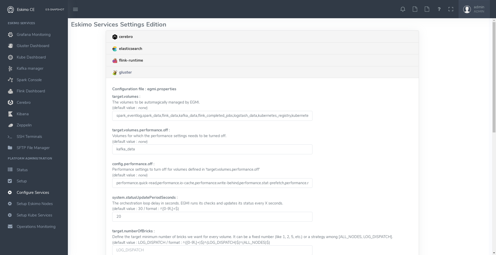
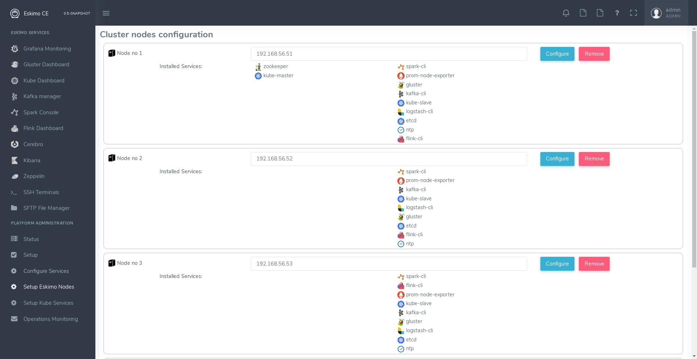
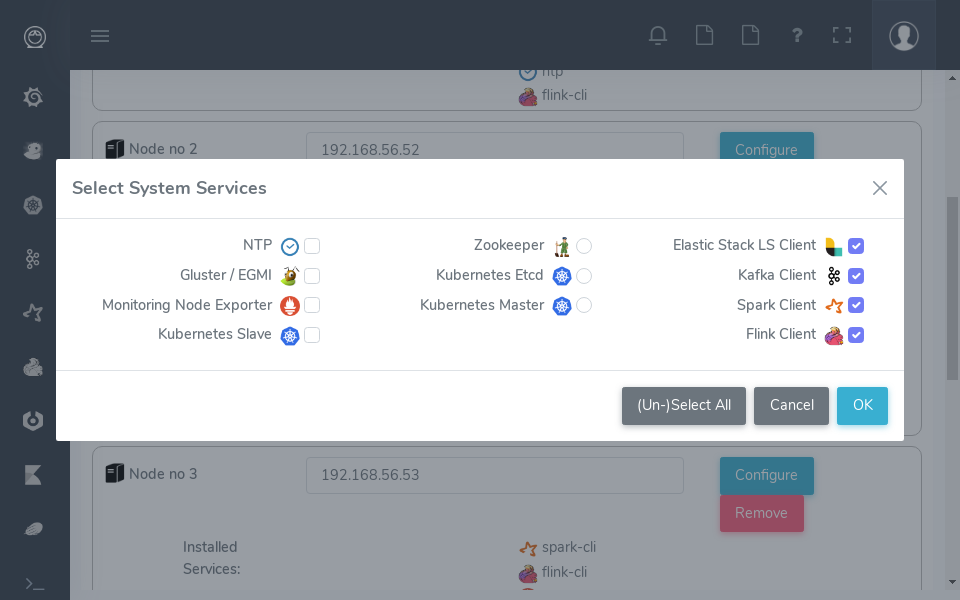
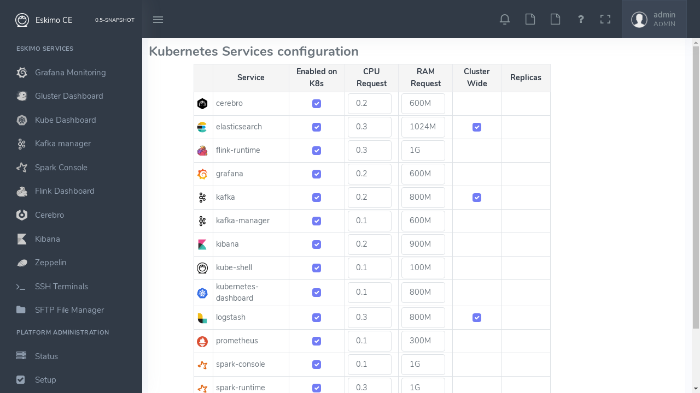

[[chap-cluster-setup]]
== Setting up the eskimo cluster

Right after the initial setup (menu entry "*Setup*") presented in the previous chapter. The administrator can start
setting up and installing the Eskimo Big Data Analytics cluster.

The process is the following:

1. *Service settings configuration*. Fine tune the settings for the services about to be installed on the Eskimo cluster
2. *Nodes and native services layout configuration* : Declare the IP addresses of the Eskimo cluster nodes nodes to
be installed and operated by eskimo and select the native services (as opposed to Kubernetes) that should run on these
nodes
3. *Kubernetes services selection* : Pick up the Kubernetes services to be deployed on the cluster

=== Services settings configuration

The most essential settings for all eskimo pre-packaged services are set automatically in such a way that the nominal
analytics use cases of an eskimo cluster work out of the box.

However, for many specific use cases, the default values for these settings as handled by Eskimo are not satisfactory. +
For this reason, Eskimo CE embeds a settings editor enabling administrators to fine tune runtime settings for eskimo
embedded services.

The service settings editor is available from the menu under "Configured Services", third menu entry under
"*Platform Administration*".

For every service, administrators have access to supported configuration files and supported settings. +
The default values enforced by eskimo right after installation are indicated.

=== Nodes and native services layout configuration

The fourth menu entry under "*Platform Administration*" leads to an essential part of the Eskimo Administration
console: it provides the system administrators / Eskimo Users with a way to deploy the eskimo managed node native
services on the eskimo cluster nodes.

Eskimo native services are docker containers managed (started / stopped / monitored / etc.) by SystemD.
Native services are operated by SystemD directly on the nodes, while Kubernetes services are operated, well, through
kubernetes.

Kubernetes itself is not a docker service but installed natively on nodes in this phase of the installation process as
well.

Setting up a native service on the eskimo cluster usually boils down to these 2 steps:

* Adding nodes to the eskimo cluster - using the _Add Node_ button or ranges of nodes using the _Add Range_ button.
* Selecting the services that should be deployed and operated and the configured nodes.

Below is an example of a tiny cluster with four nodes setup:

Whenever nodes share the same configuration, they can be defined as a _range of IP addresses_ instead
of defining each and every one of them, thus simplifying the configuration as explained in the next section.

==== Adding nodes to the eskimo cluster

Whenever one wants to operate a cluster of a hundred of nodes with Eskimo, one doesn't want to have to define the
hundred nodes one after the other. Not to mention that wouldn't make any sense since most nodes of that cluster would
actually have the very same configuration (in terms of node native services topology).

This is the rationality behind the notion of "_Range of nodes_"- The idea here is to be able to add a single and
unified configuration to all the nodes sharing the same configuration.

Single node configurations and range of nodes can be combined at will. Eskimo will however refuse to apply configuration
if the resolution of the various ranges and single nodes leads to an IP address being defined several times.

Also, all nodes in a range are expected to be up and running and Eskimo will consider them so and report errors if one
node in a range is not answering. +
*Should you have holes in your range of IP addresses, you are expected to define multiple ranges, getting rid of the
holes in your range of IPs.* This is fairly important if you want Eskimo to be able to manage your cluster without
errors popping up frequently.

WARNING: In its current version (0.5 at the time of writing this document), eskimo *requires at all cost nodes to be
defined using IP addresses* and in no way are hostnames or DNS names supported. In this version of eskimo, only IP
addresses are supported, period. +
This is because unfortunately with big data technologies and especially spark and kubernetes, supporting DNS or
hostnames is significantly more complicated than direct IP addresses lookup. +
We are working on this and in a further version of eskimo will support working with hostnames instead of IP addresses.
But for the time being, administrators need to configure eskimo using IP addresses and only IP addresses.

==== Deploying services

With all nodes from the cluster to be managed by eskimo properly identified (either as single node or as part of a
range of nodes), services can be configured and deployed.

==== Master services

Some services are considered *master services* and are identified on the _services selection_ window as unique services
(understand services that can be deployed only once, e.g. Zookeeper, the Kube Master, etc.) and configured using
a radio button

These "_Master services_" - considered unique - can only be configured in single node configuration and only once for
the whole cluster:

==== Slave services

Some other services are considered *slave services* and can be deployed at will, on one single or all nodes of the
cluster (understand services that can be deployed multiple times, e.g. NTP, GlusterFS, Kube Slave, etc.) and
configured using a checkbox on the _services selection_ window.

These "_Slave Services_" - considered multiple - can be configured at will.

[[apply_configuration]]
==== Applying nodes configuration

Once all nodes are properly configured with their desired set of services, clicking on "_Apply Configuration_" will
initiate the *Nodes Configuration process*.

That setup process can be quite long on large clusters with plenty of nodes even though a lot of tasks are performed in
parallel.

*One should note that this configuration can be changed at will! Master services can be moved back and forth between
nodes, slave services can be removed from nodes or added at will after the initial configuration has been applied,
Eskimo takes care of everything !*

As a sidenote, _Eskimo Community Edition_ doesn't support high availability for master services, one needs to acquire
_Eskimo Enterprise Edition_ for full high availability anf failover support.

*Applying configuration* is also useful when a service is reporting an error for instance such as needing a restart or
being reported as vanished. +
In such cases a first step to resolve the problem is getting to the _"Configure Eskimo Nodes"_ screen and re-applying
configuration.

Finally, whenever an installation or another operation fails, after fixing the problem (most of the time correcting the
service installation scripts in the service installation framework), the installation or other operations can be
recovered from where it failed by simply re-applying the configuration here.

Applying nodes configuration is re-entrant / idempotent.

==== Forcing re-installation of a service.

The button "Force reinstall" enables the user to select services that will be reinstalled on every node from the
latest service docker image available. +
Dependent services will be properly restarted.

[[kube_configuration]]
=== Kubernetes Services Selection

The last step in the Eskimo cluster installation consists in deploying kubernetes services.

This is performed by the fifth menu entry under "*Platform Administration*" called "*Config. Kubernetes Services*".

The process is actually very simple and one just needs to select the services to be installed and operated automatically
by Kubernetes, along with the CPU and RAM resource request to be passed to Kubernetes and the replication / distribution
strategy for multiple instances services.

Just as for native node host services, Eskimo provides a possibility to force the reinstallation of Kubernetes services. +
Just click on the "Force Reinstall" button and choose which services should be re-installed on kubernetes.

