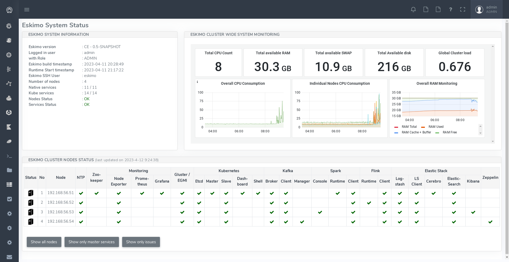

[[chap-usage]]
== Eskimo User Guide

This chapter is the eskimo user guide and related to feature available to both administrators and standard users.

=== The menu

The menu on the left is separated in two parts :

. *Eskimo Services* : Eskimo services declaring a web console are automatically available from within this menu. The
web console is available in an iframe from within eskimo. Clicking again on the menu entry while the web console is
already displayed forced a refresh of the iframe.

. *Platform Administration* : This is where eskimo is configured, the layout of the services on cluster nodes defined
and the cluster monitored.

=== Eskimo System Status Screen

One of the most essential screen of the Eskimo Web Console, the one which is reach just after login, is the
_System status screen_.

This is an example of the status screen showing a three nodes cluster and the services installed on this cluster.

On the example above, all services are in _green_, which indicates that they are working fine.

Services can be in:

* [green]#OK (Check)# - green : the service is working alright
* [red]#OK (Check)# - red) : the service is working alright although it needs to be restarted following some dependencies
updates or re-installation.
* [purple]#OK (Check)# - purple : the service is running but pending removal from the node.
* [red]#KO (Cross)#  - red: the service is reporting errors (down)
* [red]#NA (Question Mark)# - red : the service is installed (and should be available) but cannot be found on node

The user can choose between the node view (default) as above or the table view which is more suited to monitor large
clusters with hundreds of nodes.

==== Action Menu

When _mouse-over_'ing a service on a node in the table view, the user has access to the
service action menu which he can use to stop / start / restart a service or even force its full re-installation.

In addition to these default commands, Eskimo Services can provide additional custom commands made available to
administrators and/or users in this action menu.

This is for instance the action menu when clicking on Zeppelin in the table view:

image::pngs/context-menu.png[300, 300, align="center"]

=== Acting on services reporting errors upon installation

Should you encounter an error upon Eskimo's pre-packaged services installation, it most of the time comes from some edge
conditions that can happen once in a while (this is very rare). +
Whenever that happens, a first step is to simply try to reapply the _Nodes Services configuration_ - See
<<apply_configuration>> - if the error happens again, then look at service installation logs or SystemD logs.

The same applies to Kubernetes Services in which case one should attempt to re-apply the _Kubernetes Services
Configuration_ - See <<kube_configuration>>,

=== SSH and SFTP Client

The last and last but one menu entries in the "_Eskimo Services_" part are special consoles implemented within eskimo to
administer the cluster nodes.

==== SSH Terminal

The menu "*SSH Terminals*" gives access to SSH terminals to each and every node configured in the eskimo cluster, just
as a plain old SSH console, but from within your web browser.

As a design choice, the SSH Terminal doesn't provide any toolbar but leverages on keyboard shortcuts to perform most
useful actions.

*SSH Terminal shortcuts*:

* `Ctrl + Shift + Left` : show terminal tab on the left
* `Ctrl + Shift + Right` : show terminal tab on the right
* `Ctrl + Shift + C` : Copy the currently selected text - Using `Ctrl + Shift + C` instead of `Ctrl + C` since
`Ctrl + C` is reserved for cancelling current / pending command
* `Ctrl + V` : Paste the clipboard content to the console - Here since Eskimo runs as a web app, it is unfortunately
obligatory to use `Ctrl + V` for pasting the clipboard due to browser limitations (Only an event answering to `Ctrl + V`
can access the clipboard)

*Various notes related to Eskimo terminal console usage:*

* The initial terminal size is computed automatically from the available window size. Unfortunately in the current
version, resizing the terminal is not supported. Whenever the user resizes its Web Browser window, the only way to
resize the terminal is by closing it and reopening it.
* `Shift + PgUp` and `Shift + PgDown` to scroll the terminal is not supported. A sound usage of `| less` is recommended
when pagination is required.

==== SFTP File Manager

The Menu "*SFTP File Manager*" gives access to a web file manager which one can use to

* Browse the nodes filesystem
* Visualize text files stored on nodes
* Download binary file stored on nodes
* Upload files on nodes
* etc.

=== Services Web Consoles

Some services managed by eskimo are actually application with a _Web Graphical User Interface_ or *Web Console* in the
Eskimo terminology. +
If properly configured for it - See _Eskimo Services Developer Guide_ - these web consoles are detected as is and
available from within Eskimo.

They are disposed in the menu under "_Eskimo Services_".

The pre-packaged web consoles with Eskimo are Zeppelin, EGMI, Kibana, Grafana, Cerebro, Spark History Server,
Flink App Manager, Kafka Manager and the Kubernetes Dashboard.

==== Demo Mode

Eskimo supports a _Demo Mode_ which is in use for instance, on the DemoVM downloadable from the eskimo web site. +
The purpose of the Demo Mode is to be able to showcase all possibilities of Eskimo - including administration features -
while minimizing the runtime size and preventing users from breaking eskimo.

In Demo Mode, following actions are blocked:

* Reinstalling a service
* Changing or re-applying nodes configuration
* Changing or re-applying kubernetes configuration
* Changing or re-applying setup configuration

Demo Mode is activated by changing the property `eskimo.demoMode` to `true` in the configuration file
`eskimo.properties`:

.Configuration Property related to _Demo Mode_
----
# Whether to put eskimo in Demo Mode (true, false)
# The eskimo demo mode is used for the DemoVM. In demo mode, following restrictions apply:
# - Cannot change nodes config
# - Cannot change kubernetes config
# - Cannot re-install a service
eskimo.demoMode=false
----

==== The DemoVM

The Eskimo DemoVM downloadable from the eskimo web site. It is intended as a demonstration of the features of the eskimo
platform and enables users to test eskimo's possibilities and feel it's administrator and user experience.

The Eskimo DemoVM is provided with _Demo Mode_ enabled by default, with the limits explained above (some actions are
blocked).

In case a user wants to use the features that are disabled in _Demo Mode_, he needs to disable _Demo Mode_.

*Note*: the "_host only_" interface IP address of the DemoVM needs to be `192.168.56.41`. Eskimo works by targetting
cluster nodes using their IP addresses. In the case of the Demo VM, the targe cluster node is the very same VM itself.
In this case, Eskimo is using the IP address of its own VM as installation target. So if the IP address of the DemoVM
changes from `192.168.56.41` to anything else, Eskimo will interpret it as the target machine having disappeared.

==== Deactivating Demo Mode on the demo VM

In order to deactivate _Demo Mode_, change the property `eskimo.demoMode` back to to `false` in the confguration file
`eskimo.properties`.

Unfortunately, this is not sufficient. The Eskimo DemoVM, for the sake of shortening it's size, doesn't package the
_Eskimo Service Package Images_, it just packages placeholders instead. +
So these placeholders need to be removed and the actual _Eskimo Service Package Images_ need to be re-created or
downloaded.

In order to do this, one should delete the content of the folder `packages_distrib` from the Eskimo installation folder:

.Delete `packages_distrib` content
----
# connect to your VM, then:
sudo rm -RF /usr/local/lib/eskimo-V0.3/packages_distrib/*
----

When this is done the Eskimo Web UI will automatically bring the user back to the setup page and enable him to either
build or download the _Eskimo Service Package Images_. Internet access from the VM is required.

=== Docker images versioning

Every service deployed on the Eskimo Nods cluster by Eskimo takes a practical form of a docker image instantiated in a
docker container either through SystemD (for node native services) or Kubernetes.

These Docker images are installed automatically either in the node local repo (for native services) or in a Docker
Registry (for kubernetes services).

Services can be customized and reinstalled at will and as frequently as required. +
Eskimo manages version numbers as image tags automatically. +
The first time a service is installed, the corresponding image will get version number "1" as tag, the second time, it
will get version "2", and so on.

This is explained in more detals in the Eskimo "_Services Development Guide_" (another document).