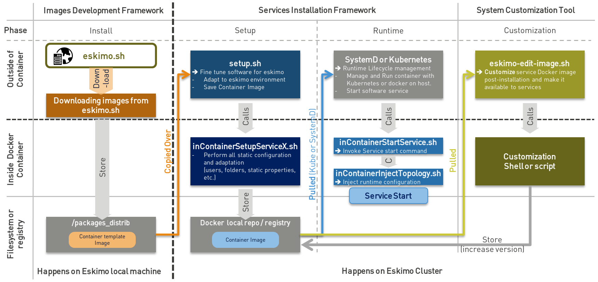

////
This file is part of the eskimo project referenced at www.eskimo.sh. The licensing information below apply just as
well to this individual file than to the Eskimo Project as a whole.

Copyright 2019 - 2023 eskimo.sh / https://www.eskimo.sh - All rights reserved.
Author : eskimo.sh / https://www.eskimo.sh

Eskimo is available under a dual licensing model : commercial and GNU AGPL.
If you did not acquire a commercial licence for Eskimo, you can still use it and consider it free software under the
terms of the GNU Affero Public License. You can redistribute it and/or modify it under the terms of the GNU Affero
Public License  as published by the Free Software Foundation, either version 3 of the License, or (at your option)
any later version.
Compliance to each and every aspect of the GNU Affero Public License is mandatory for users who did no acquire a
commercial license.

Eskimo is distributed as a free software under GNU AGPL in the hope that it will be useful, but WITHOUT ANY
WARRANTY; without even the implied warranty of MERCHANTABILITY or FITNESS FOR A PARTICULAR PURPOSE. See the GNU
Affero Public License for more details.

You should have received a copy of the GNU Affero Public License along with Eskimo. If not,
see <https://www.gnu.org/licenses/> or write to the Free Software Foundation, Inc., 51 Franklin Street, Fifth Floor,
Boston, MA, 02110-1301 USA.

You can be released from the requirements of the license by purchasing a commercial license. Buying such a
commercial license is mandatory as soon as :
- you develop activities involving Eskimo without disclosing the source code of your own product, software,
  platform, use cases or scripts.
- you deploy eskimo as part of a commercial product, platform or software.
For more information, please contact eskimo.sh at https://www.eskimo.sh

The above copyright notice and this licensing notice shall be included in all copies or substantial portions of the
Software.
////

:sectnums:
:toc:
:authors: eskimo.sh - https://www.eskimo.sh - 2019-2023
:copyright: eskimo.sh - https://www.eskimo.sh - 2019-2023

= Eskimo Service Developer Guide

[[chap-introduction]]
== Introduction

=== Eskimo

A state of the art _Big Data Infrastructure_ and _Management Web Console_ to _build_, _manage_ and _operate_
*Big Data 2.0 Analytics clusters*

Eskimo is in a certain way the Operating System of your Big Data Cluster:

* A _plug and play_, working _out of the Box_, *Big Data Analytics platform* fulfilling _enterprise environment
requirements_.
* A *state of the art Big Data 2.0 platform*
** based on _Kubernetes_, _Docker_  and _Systemd_
** packaging _Gluster_, _Spark_, _Kafka_, _Flink_ and _ElasticSearch_
** with all the administration and management consoles such as _Cerebro_, _Kibana_, _Zeppelin_, _Kafka-Manager_,
_Grafana_, _Prometheus_ and of course the _Kubernetes Dashboard__:__.
* An _Administration Application_ aimed at drastically simplifying the *deployment, administration and operation* of
your Big Data Cluster
* A _Data Science Laboratory_ and _Production environment_ where Data Analytics is both
** developed and
** operated in production

Eskimo is as well:

* a collection of ready to use docker container images packaging fine-tuned and highly customized plug and play
  services with all the _nuts and bolts_ required to make them work perfectly together.
* a framework for building and deploying Big Data and NoSQL software components on Kubernetes as well as SystemD for
  host native components.

image::pngs/eskimo_platform.png[800, 800, align="center"]

=== Key Features

Eskimo key features are as follows:

[cols=">.^20%,80%"]
|===
a|image::pngs/location.jpg[60, 60]| *Abstraction of Location*

Just pick up the services you need, define where and how you want to run them and let eskimo take care of everything.

Move native services between nodes, change their configuration or install new services in just a few clicks.

Don’t bother remembering where and how things run, Eskimo wraps everything up in a single and coherent User Interface.

a|image::pngs/console.jpg[60, 60]| *Eskimo Web User Interface*

Eskimo’s tip of the iceberg is its flagship Web User Interface.

The Eskimo User Interface is the single and only entry point to all your cluster operations, from services installation to
accessing Kibana, Zeppelin and other UI applications.

The Eskimo User Interface also provides SSH consoles, File browser access and monitoring to your cluster.

a|image::pngs/framework.jpg[60, 60]| *Services Framework*

Eskimo is a Big Data Components service development and integration framework based on Kubernetes, Docker and Systemd.

Eskimo provides out of the box ready-to use components such as Spark, Flink, ElasticSearch, Kafka, Kubernetes Dashboard,
Zeppelin, etc.

Eskimo also enables developers and administrators to implement and package their own services very easily.
|===

=== The Service Developer Guide

This documentation is related to the last of the key features presented above : *The Services Development Framework.* +
It presents all concetps and aspects a developer needs to understand and know to implement his own services and let
eskimo distribute and operate them, or extend current services.

== Introducing the Service Development Framework

The *Service Development framework* is actually composed by two distinct parts:

* The <<docker_images_development_framework>> which is used to *build* the docker images deployed on the eskimo cluster
  nodes
* The <<services_installation_framework>> which is used to *install and setup* these images as services on the eskimo
  cluster nodes.

=== Principle schema

The whole services development framework can be represented as follows:

image::pngs/services-development-framework.png[800, 800, align="center"]

* The <<docker_images_development_framework>> is used to develop and build _Service Container
template_ images that are later used to build the actual docker containers images that are fine-tuned to Eskimo
deployed on Kubernetes or natively on individual Eskimo cluster nodes. +
The _Service Container Template_ Image itself is very generic docker image around the underlying software component
(e.g. Kafka, Spark, etc.) and might well be used outside of Eskimo.
* The <<services_installation_framework>> which creates the actual _Eskimo
Service container_ image from the template image by adapting it to the specific situation of the eskimo node or kube
cluster on which it is being deployed. +
The actual _Eskimo Service Container_ Image if very specific to Eskimo; even further, it is very specific to the very
Eskimo cluster on wich it is being deployed.

The different scripts involved in the different stages are presented on the schema above along with their
responsibilities and the environment in which they are executed (outside of the container - on the eskimo host machine
or the eskimo cluster node - or from within the docker container, operated through Kubernetes or not).

=== Core principles

The core principles on which both the _Docker Images Development Framework_ and the _Services Installation Framework_
are built are as follows:

* A service is eventually two things
** a docker image packaging the software component and its dependencies (also, rarely, it can be an archive of native
  programs directly deployed on the cluster node, e.g. for the Kubernetes stack).
** a set of shell scripts aimed at installing and setting up the service
** plus essentially:
*** _either_ A kubernetes service deployment YAML file describing the components to deploy on kubernetes
*** _or_ a systemd unit configuration file aimed to operate it on nodes
* Everything - from building the docker image to installing it on cluster nodes - is done using simple shell scripts.
With Eskimo, a system administrator desiring to leverage on eskimo to implement his own services in order to integrate
additional software components on Eskimo doesn't need to learn any new and fancy technology, just plain old shell
scripting, docker, and aiether systemd or perhaps a bit of kubernetes configuration; that's it.
* Eskimo leverages on unix standards. Software components are installed in `/usr/local`, log files are in sub-folders of
`/var/log`, persistent data is in sub-folders of `/var/lib`, etc.

=== A note on images' template download.

At eskimo first start, the user (administrator) needs to choose whether he wants to build the services images (docker
container templates images) locally or download them from _eskimo.sh_.

* *Buidling the images locally* means creating each and every docker template image using the `build.sh` script. Only
  the vanilla software packages are downloaded from internet (such as the elasticsearch distribution, the spark or flink,
  archive, etc.). +
  This can take a significant time, several dozens of minutes or more.
* *Downloading the images from internet* means downloading _ready-to-use_ docker template images from _eskimo.sh_

The whole setup process when downloading the images from internet can be represented this way:

:service-dev-guide-embedded: OK

// include package developer README
include::../../../packages_dev/README.adoc[leveloffset=0,lines=90..360]

// include service developer README
include::../../../services_setup/README.adoc[leveloffset=0,lines=90..1270]

[appendix]
== Copyright and License

Eskimo is Copyright 2019 - 2023 eskimo.sh / https://www.eskimo.sh - All rights reserved. +
Author : eskimo.sh / https://www.eskimo.sh

Eskimo is available under a dual licensing model : commercial and GNU AGPL. +
If you did not acquire a commercial licence for Eskimo, you can still use it and consider it free software under the
terms of the GNU Affero Public License. You can redistribute it and/or modify it under the terms of the GNU Affero
Public License  as published by the Free Software Foundation, either version 3 of the License, or (at your option)
any later version. +
Compliance to each and every aspect of the GNU Affero Public License is mandatory for users who did no acquire a
commercial license.

Eskimo is distributed as a free software under GNU AGPL in the hope that it will be useful, but WITHOUT ANY
WARRANTY; without even the implied warranty of MERCHANTABILITY or FITNESS FOR A PARTICULAR PURPOSE. See the GNU
Affero Public License for more details.

You should have received a copy of the GNU Affero Public License along with Eskimo. If not,
see <https://www.gnu.org/licenses/> or write to the Free Software Foundation, Inc., 51 Franklin Street, Fifth Floor,
Boston, MA, 02110-1301 USA.

You can be released from the requirements of the license by purchasing a commercial license. Buying such a
commercial license is mandatory as soon as :

* you develop activities involving Eskimo without disclosing the source code of your own product, software,  platform,
  use cases or scripts.
* you deploy eskimo as part of a commercial product, platform or software.

For more information, please contact eskimo.sh at https://www.eskimo.sh

The above copyright notice and this licensing notice shall be included in all copies or substantial portions of the
Software.
