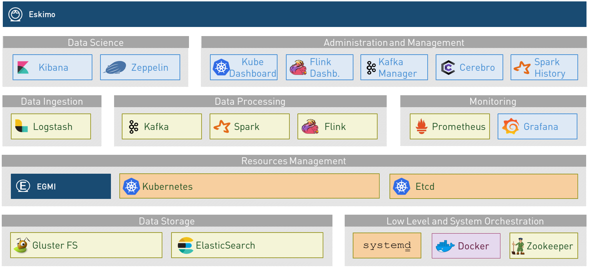

////
This file is part of the eskimo project referenced at www.eskimo.sh. The licensing information below apply just as
well to this individual file than to the Eskimo Project as a whole.

Copyright 2019 eskimo.sh / https://www.eskimo.sh - All rights reserved.
Author : eskimo.sh / https://www.eskimo.sh

Eskimo is available under a dual licensing model : commercial and GNU AGPL.
If you did not acquire a commercial licence for Eskimo, you can still use it and consider it free software under the
terms of the GNU Affero Public License. You can redistribute it and/or modify it under the terms of the GNU Affero
Public License  as published by the Free Software Foundation, either version 3 of the License, or (at your option)
any later version.
Compliance to each and every aspect of the GNU Affero Public License is mandatory for users who did no acquire a
commercial license.

Eskimo is distributed as a free software under GNU AGPL in the hope that it will be useful, but WITHOUT ANY
WARRANTY; without even the implied warranty of MERCHANTABILITY or FITNESS FOR A PARTICULAR PURPOSE. See the GNU
Affero Public License for more details.

You should have received a copy of the GNU Affero Public License along with Eskimo. If not,
see <https://www.gnu.org/licenses/> or write to the Free Software Foundation, Inc., 51 Franklin Street, Fifth Floor,
Boston, MA, 02110-1301 USA.

You can be released from the requirements of the license by purchasing a commercial license. Buying such a
commercial license is mandatory as soon as :
- you develop activities involving Eskimo without disclosing the source code of your own product, software,
  platform, use cases or scripts.
- you deploy eskimo as part of a commercial product, platform or software.
For more information, please contact eskimo.sh at https://www.eskimo.sh

The above copyright notice and this licensing notice shall be included in all copies or substantial portions of the
Software.
////

:sectnums:
:toc:
:authors: eskimo.sh / https://www.eskimo.sh / 2019
:copyright: eskimo.sh / https://www.eskimo.sh / 2019

= Eskimo Service Developer Guide

[[chap-introduction]]
== Introduction

=== Eskimo

Eskimo is a Big Data Management Web Console to _build_, _manage_ and _operate_
*Big Data 2.0* clusters using *Docker*, *SystemD* and *Mesos*.

image::pngs/eskimo.jpg[50, 50, align="center"]

Eskimo is in a certain way the Operating System of your Big Data Cluster:

* a *Web Based Administration Application* aimed at drastically simplifying the deployment, administration and
  operation of your Big Data Cluster
* a state of the art *Big Data 2.0* platform based on *Docker, Mesos and Systemd* and packaging *Gluster, Zookeeper, Spark,
  Kafka, Flink and ElasticSearch* with all the required tools and consoles required to use and  manage them such
  as *Cerebro, Kibana, Zeppelin, Kafka-Manager, Grafana and Prometheus*.
* a collection of ready to use docker containers packaging fine-tuned and highly customized plug and play services with
  all the _nuts and bolds_ required to make them work well together.
* a framework for building and deploying Big Data and NoSQL services based on docker and systemd

=== Key Features

Eskimo key features are as follows:

[cols=">.^20%,80%"]
|===
a|image::pngs/location.jpg[60, 60]| *Abstraction of Location*

Just define where you want to run which services and let eskimo take care of everything.

Move services between nodes or install new services in just a few clicks.

Don’t bother remembering where you installed Web consoles and UI applications, Eskimo wraps them all in a single and
consistent UI.

a|image::pngs/console.jpg[60, 60]| *Eskimo Web Console*

Eskimo’s tip of the iceberg is its flagship web console.

The Eskimo Console is the single and only entry point to all your cluster operations, from services installation to
accessing Kibana, Zeppelin and other UI applications.

The Eskimo Console also provides SSH consoles, File browser access and monitoring to your cluster.

a|image::pngs/framework.jpg[60, 60]| *Services Framework*

Eskimo is a Big Data Components service development and integration framework based on Docker and Systemd.

Eskimo provides out of the box ready-to use components such as Spark, Flink, ElasticSearch, Kafka, Mesos, Zeppelin, etc.

Eskimo also enables the user to develop his own services very easily.
|===

=== The Service Developer Guide

This documentation is related to the last of the key features presented above : The Services Framework. +
It presents everything a developer needs to understand and know to develop his own services and let eskimo distribute
and operate them, or extend current services.

== Introducing the Service Development Framework

The *Service Development framework* is actually composed by two distinct parts:

* The <<docker_images_development_framework>> which is used to *build* the docker images deployed on the eskimo cluster
nodes
* The <<services_installation_framework>> which is used to *install and setup* these images as services on the eskimo cluster nodes.

=== Core principles

The core principles on which both the _Docker Images Development Framework_ and the _Services Installation Framework_
are built are as follows:

* A service is eventually two things
** a docker image packaging the software component and its dependencies
** a set of shell scripts aimed at installing and setting up the service
** a systemd unit configuration file aimed at operate it
* Everything - from building the docker image to installing it on cluster nodes - is done using simple shell scripts.
With Eskimo a system administrator desiring to leverage on eskimo to implement his own services in order to integrate
additional software components on Eskimo doesn't need to learn any new and fancy technology, just plain old shell
scripting, docker and systemd. Period.
* Eskimo leverages on unix standards. Software components are installed in `/usr/local`, log files are in sub-folders of
`/var/log`, persistent data is in sub-folders of `/var/lib`, etc.

// included package developer README

include::../../../packages_dev/README.adoc[leveloffset=0,lines=60..310]

// included service developer README

include::../../../services_setup/README.adoc[leveloffset=0,lines=60..550]

[appendix]
== Copyright and License

Eskimo is Copyright 2019 eskimo.sh / https://www.eskimo.sh - All rights reserved. +
Author : eskimo.sh / https://www.eskimo.sh

Eskimo is available under a dual licensing model : commercial and GNU AGPL. +
If you did not acquire a commercial licence for Eskimo, you can still use it and consider it free software under the
terms of the GNU Affero Public License. You can redistribute it and/or modify it under the terms of the GNU Affero
Public License  as published by the Free Software Foundation, either version 3 of the License, or (at your option)
any later version. +
Compliance to each and every aspect of the GNU Affero Public License is mandatory for users who did no acquire a
commercial license.

Eskimo is distributed as a free software under GNU AGPL in the hope that it will be useful, but WITHOUT ANY
WARRANTY; without even the implied warranty of MERCHANTABILITY or FITNESS FOR A PARTICULAR PURPOSE. See the GNU
Affero Public License for more details.

You should have received a copy of the GNU Affero Public License along with Eskimo. If not,
see <https://www.gnu.org/licenses/> or write to the Free Software Foundation, Inc., 51 Franklin Street, Fifth Floor,
Boston, MA, 02110-1301 USA.

You can be released from the requirements of the license by purchasing a commercial license. Buying such a
commercial license is mandatory as soon as :

* you develop activities involving Eskimo without disclosing the source code of your own product, software,  platform,
  use cases or scripts.
* you deploy eskimo as part of a commercial product, platform or software.

For more information, please contact eskimo.sh at https://www.eskimo.sh

The above copyright notice and this licensing notice shall be included in all copies or substantial portions of the
Software.
