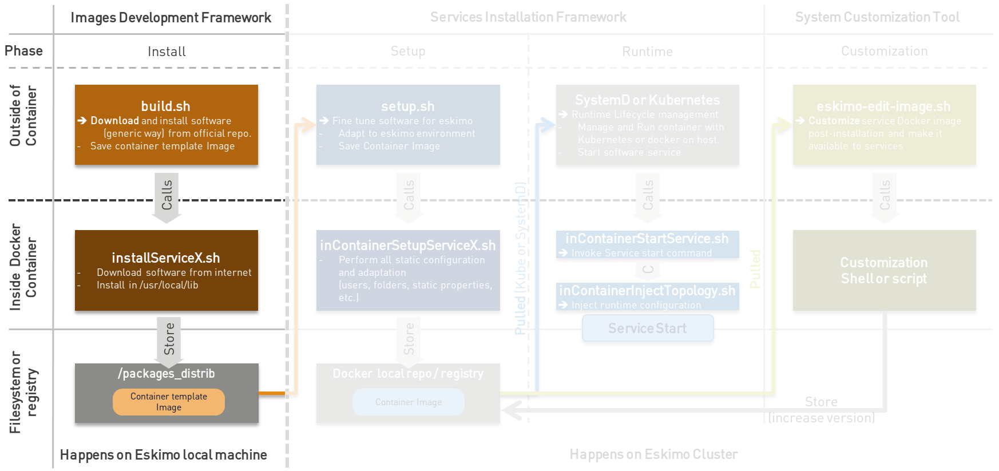

////
This file is part of the eskimo project referenced at www.eskimo.sh. The licensing information below apply just as
well to this individual file than to the Eskimo Project as a whole.

Copyright 2019 www.eskimo.sh - All rights reserved.
Author : http://www.eskimo.sh

Eskimo is available under a dual licensing model : commercial and GNU AGPL.
If you did not acquire a commercial licence for Eskimo, you can still use it and consider it free software under the
terms of the GNU Affero Public License. You can redistribute it and/or modify it under the terms of the GNU Affero
Public License  as published by the Free Software Foundation, either version 3 of the License, or (at your option)
any later version.
Compliance to each and every aspect of the GNU Affero Public License is mandatory for users who did no acquire a
commercial license.

Eskimo is distributed as a free software under GNU AGPL in the hope that it will be useful, but WITHOUT ANY
WARRANTY; without even the implied warranty of MERCHANTABILITY or FITNESS FOR A PARTICULAR PURPOSE. See the GNU
Affero Public License for more details.

You should have received a copy of the GNU Affero Public License along with Eskimo. If not,
see <https://www.gnu.org/licenses/> or write to the Free Software Foundation, Inc., 51 Franklin Street, Fifth Floor,
Boston, MA, 02110-1301 USA.

You can be released from the requirements of the license by purchasing a commercial license. Buying such a
commercial license is mandatory as soon as :
- you develop activities involving Eskimo without disclosing the source code of your own product, software,
  platform, use cases or scripts.
- you deploy eskimo as part of a commercial product, platform or software.
For more information, please contact eskimo.sh at https://www.eskimo.sh

The above copyright notice and this licensing notice shall be included in all copies or substantial portions of the
Software.
////

:sectnums:
:authors: www.eskimo.sh / 2019
:copyright: www.eskimo.sh / 2019

:toc:

== Eskimo Introduction

Eskimo is a Big Data Management Web Console to _build_, _manage_ and _operate_
*Big Data 2.0* clusters using (mostly) *Kubernetes* (and Docker and SystemD).

Reach https://www.eskimo.sh for more information on Eskimo or look at the documentation in the folder `doc`.

=== Eskimo Service Development Framework

The *Service Development framework* is actually composed by two distinct parts:

1. The *Docker Images Development Framework* which is used to build the docker images deployed on the eskimo cluster
nodes
2. The *Services Installation Framework* which is used to install these images as services on the eskimo cluster nodes.

This document presents "1. The *Docker Images Development Framework*"

=== Principle schema

The whole services development framework can be represented as follows:

ifdef::service-dev-guide-embedded[]
// suppress inspection "AsciiDocLinkResolve"
image::pngs/services-development-framework.png[800, 800, align="center"]
endif::service-dev-guide-embedded[]
ifndef::service-dev-guide-embedded[]
image::../doc/guides/service-dev-guide/pngs/services-development-framework.png[800, 800, align="center"]
endif::service-dev-guide-embedded[]

* The <<docker_images_development_framework>> (this very guide) is used to develop and build _Service Container
template_ images that are later used to build the actual docker containers images that are fine-tuned to Eskimo
deployed on Kubernetes or natively on individual Eskimo cluster nodes. +
The _Service Container Template_ Image itself is very generic docker image around the underlying software component
(e.g. Kafka, Spark, etc.) and might well be used outside of Eskimo.
* The *Services  Installation Framework* (See `README.adoc` in `/services_setup`) which creates the actual _Eskimo
Service container_ image from the template image by adapting it to the specific situation of the eskimo node or kube
cluster on which it is being deployed. +
The actual _Eskimo Service Container_ Image if very specific to Eskimo; even further, it is very specific to the very
Eskimo cluster on wich it is being deployed.

The different scripts involved in the different stages are presented on the schema above along with their
responsibilities and the environment in which they are executed (outside of the container - on the eskimo host machine
or the eskimo cluster node - or from within the docker container, operated through Kubernetes or not).

// marker for inclusion : line 90
[[docker_images_development_framework]]

== Docker Images Development Framework

Eskimo manages services (e.g. Flink, Kafka, ElasticSearch, Kibana, etc.) as Docker containers. A docker container is
most of the time the individual and single unit representing a service to be managed by Eskimo (exceptions are CLI
- commad line tools - packages for instance). +
Docker containers packaging eskimo services should be most of the time downloaded from the Eskimo online package
repository. But an administrator can very well decide to build his own versions of Eskimo provided service template
images or even implement his own service packages. +
This is described in this section.

The _Docker Images Development Framework_ provides tools and defines standards to build the docker images deployed on
the eskimo cluster nodes.

Eskimo is leveraging on docker to deploy services either on Kubernetes or natively across the cluster nodes and to
ensure independence from host OSes and specificities as well as proper isolation between services.

Again, Docker images can be downloaded from internet (or the internal network of the corporation) or build locally on the
machine running the Eskimo backend.

=== Requirements

In order for one to be able to either build the eskimo software components packages locally (or have eskimo building
them locally), there are a few requirements:

* Docker must be installed and available on the user local computer or the Eskimo host machine in case Eskimo builds
  them.
* The Eskimo host machine should have access to Internet
* At least 10Gb of hard drive space on the partition hosting `/tmp` must be available.
* At least 15Gb of hard drive space on the partition hosting the eskimo installation folder (Eskimo backend) must be
  available.

=== Principle

The principle is pretty straightforward:

* Every docker image (or package) is built by calling `build.sh` from the corresponding package folder, i.e. a
sub-folder of this very folder `packages_dev`
* That `build.sh` script is free to perform whatever it wants as long as the result is a docker image with the expected
name put in the folder `packages_distrib` in the parent folder and properly packaging the target software component.
* By convention, the actual software component download and installation from within the container is done by a script
names `installServiceX` (for a component that would be called "_serviceX_". More on that below.

This principle is illustrated as follows:

ifdef::service-dev-guide-embedded[]
// suppress inspection "AsciiDocLinkResolve"
image::pngs/images-development-framework.png[800, 800, align="center"]
endif::service-dev-guide-embedded[]
ifndef::service-dev-guide-embedded[]

endif::service-dev-guide-embedded[]

Build files are provided for each and every service pre-packaged within eskimo.

The user is welcome to modify them in order to fine tune everything the way he wants or implement his own packages for
other software components not yet bundled with eskimo. +
Again, the only requirement is that at the end of the build process a corresponding image is put in `packages_distrib`
as well as that some conventions are properly followed as explained below.

Internet is usually required on the eskimo machine to build or re-build the eskimo provided pre-packages images since
the target software component is downloaded from Internet.

=== identifying required images in `services.json`

Eskimo needs a way during initial setup time to know which packages need to be built or downloaded. The list of docker
images to be built is composed by the conjunction of two lists:

* The images referenced by services in `services.json` (See <<services_json>> )
* The additional packages from configuration property `system.additionalPackagesToBuild` in the configuration file
`eskimo.properties`, such as, for instance: base-eskimo

.default `system.additionalPackagesToBuild` property
----
system.additionalPackagesToBuild=base-eskimo
----

The property `system.additionalPackagesToBuild` is required to identify 3rd party or additional images that are required
when building service images. +
Only service images can be declared in `services.json`. +
By default, only the image `base-eskimo` being used by all the orher package images needs to be built in addition to the
ones actually in use by services and declared in  `services.json`.

=== Standards and conventions over requirements

There are no requirements when building an eskimo package docker image. The image developer is free to install the
software package within the image the way he wants and no specific requirement is enforced by eskimo.

As long as eventually, _The Service Installation framework_ for the new software package provides a systemd unit
configuration file enabling the eskimo framework to manipulate the service, a service developer has all the freedom to
design his docker container the way he wants.

However, adhering to some conventions eases a lot the implementation and maintenance of these images. +
These standard conventions are as follows:

* All docker images are based on the `base-eskimo` image which is itself based on a lightweight debian bullseye image
(as of version 0.5 of esimo)
* A software component named _X_ with _version Y_ should be installed in `/usr/local/lib/_x_-_y_` (if and only if it is
not available in apt repositories and installed using standard debian `apt-get install x`).
** In this case, a symlink preventing the further *Services Installation framework* from the need to mess with version
numbers should be created : `/usr/local/lib/x` pointing to `/usr/local/lib/x-version`.
** This symlink is pretty important. In the second stage, when installing services on eskimo cluster nodes, it is
important that setup and installation scripts can be prevented from having to know about the actual version of the software
component being installed. Hence the need for that symlink.
* The presence of a single `build.sh` script is a requirement. That script is called by eskimo to build the package if
it is not yet available (either built or downloaded)
* A helper script `../common/common.sh` can be linked in the new package build folder using
`ln -s ../common/common.sh`. This common script provides various helper functions to build the docker
container, save it to the proper location after building, etc.
* The script performing the _in container installation_ of the software component _X_ is usually called `installX.sh`.
* Software versions to be downloaded and installed within docker images are defined _once and for all_ in the file
`../common/common.sh`. This is actually a requirement since most of the time software version for common components such
as ElasticSearch or scala are used in several different packages. Defining version numbers of software components to be
downloaded and installed in a common place helps to enforce consistency.
* The result image put in `packages_distrib` should follow a strict naming convention:
`docker_template_{software-name}_{software.version}_{eskimo.version}.tar.gz`, e.g.
`docker_template_kafka_2.8.2_1.tar.gz`. This is mandatory for Eskimo to be able to manipulate the image later on.

An eskimo component package developer should look at pre-packaged services to get inspired and find out how eskimo
packaged services are usually implemented.

=== Typical build.sh process

==== Operations performed

The build process implemented as a standard in the `build.sh` script has two different stages:

. The container preparation and all the container setup operated from outside the container
. The software installation done from inside the container

As a convention, installation of all dependencies is performed from outside the container but then the installation of
the software packaged in the container is performed from a script called within the container (script `installX.sh` for
package X).

The build process thus typically looks this way:

1. From outside the container:
* Creation of the container from the base eskimo image (debian based)
* Installation of the prerequisites (Java JDK, Scala, python, etc.) using `docker exec ...`
* Calling of the software installation script : `docker exec -it ... installX.sh`

2. From inside the container:
* Downloading of the software from internet
* Installation in a temporary folder
* Moving of the installation software to `/usr/local/lib/X-Version` or else
* symlinking the software from `/usr/local/lib/X` (without version number)

And that's it.

The package installation is limited to this, all the customizations and fine tuning the image for its use by eskimo is
done at a later stage, during the *Service Installation* on Kubernetes or directly on eskimo cluster nodes (for native
node services).

=== Look for examples and get inspired

Look at the packages development scripts of eskimo pre-packaged components for examples and the way they are built to
get inspired when implementing your own packages.

=== Building the Kubernetes archive

Building the Kubernetes archive is different than building the component images as presented above. As a matter of fact,
Kubernetes is installed natively on Eskimo cluster nodes and not through docker.

The `build.sh` script in the `binary_k8s` folder behaves differently. It's objective is to package all of the Kubernetes
runtime components software within a single archive. These components, from etcd to the different kube master and slave
processes are packages together and extracted natively on Eskimo cluster nodes for native execution during the
node base installation process.

=== Specific and various notes related to individual components shipped with Eskimo

This section presents different important notes related to some specific services shipped with Eskimo building aspects.

==== Zeppelin building

Zeppelin can be built from a checkout of the latest git repository master or from an official release.

The file `common/common.sh` defines a variable `ZEPPELIN_IS_SNAPSHOT` which, when defined to true, causes the build
system to work from git and rebuild zeppelin from the sources instead of downloading a released package.

----
export ZEPPELIN_IS_SNAPSHOT="false" # set to "true" to build zeppelin from zeppelin git master
----

Importantly, zeppelin will be build in the folder `/tmp/` of the host machine running eskimo (using a docker container
though) which maps `/tmp` to its own `/tmp`). +
*At least 20 GB of storage space needs to be available in `/tmp` of the machine running eskimo for the build to
succeed.*

It is recommended though to use a binary archive of Zeppelin since the build from the source rarely succeeds out of the
box (Zeppelin build system is fairly complicated and the eskimo team maintains the "build from source" feature only when
the last binary release of Zeppelin suffers from impacting bugs or limitations we want to workaround).

=== Setting up a remote packages repository

When setuping eskimo after initial launch, software packages - either service docker images or the Kube binary archive
- can be either built or downloaded from a *remote packages repository*.

Setting up a remote packages repository is extremely simple:

* The software packages need to be downloadable from internet at a specific URL using either HTTP or HTTPS.
* at the same location where packages are downloaded, a meta-data file should be downloadable and present the various
available packages.

For instance the following layout should be available from internet or the local network:

* *https://www.eskimo.sh/eskimo/V0.5/eskimo_packages_versions.json*
* https://www.eskimo.sh/eskimo/V0.5/docker_template_base-eskimo_0.2_1.tar.gz
* https://www.eskimo.sh/eskimo/V0.5/docker_template_cerebro_0.8.4_1.tar.gz
* https://www.eskimo.sh/eskimo/V0.5/docker_template_elasticsearch_6.8.3_1.tar.gz
* https://www.eskimo.sh/eskimo/V0.5/docker_template_flink_1.9.1_2.tar.gz
* https://www.eskimo.sh/eskimo/V0.5/docker_template_gluster_debian_09_stretch_1.tar.gz
* etc.
* https://www.eskimo.sh/eskimo/V0.5/eskimo_kube_1.23.5_1.tar.gz

A software package should be named as follows:

* `docker_template_[software-name]\_[software.version]_[eskimo.version].tar.gz` for service docker images
* `eskimo_kube\_[software.version]_[eskimo.version].tar.gz` for kube archive

The file `eskimo_packages_versions.json` describes the repository of packages and the available packages.

.Example eskimo_packages_versions.json
----
{
  "base-eskimo" : {
    "software" : "0.2",
    "distribution" : "1"
  },
  "cerebro": {
    "software": "0.8.4",
    "distribution": "1"
  },
  "elasticsearch" : {
    "software": "6.8.3",
    "distribution": "1"
  },
  "flink" : {
    "software" : "1.9.1",
    "distribution": "1"
  },
  "gluster": {
    "software" : "debian_09_stretch",
    "distribution": "1"
  },
  ...
  "kube": {
    "software": "1.23.5",
    "distribution": "1"
  }
}
----

It's content should be aligned with the following properties from the configuration file `eskimo.properties`:

* `system.additionalPackagesToBuild` and images declared on `services.json` giving the set of docker images for packages to be or downloaded
* `system.kubePackages` giving the name of the kubernetes package to be built or downloaded

// marker for exclusion : line 360

[appendix]
== Copyright and License

Eskimo is Copyright 2019 - 2023 eskimo.sh - All rights reserved. +
Author : https://www.eskimo.sh

Eskimo is available under a dual licensing model : commercial and GNU AGPL. +
If you did not acquire a commercial licence for Eskimo, you can still use it and consider it free software under the
terms of the GNU Affero Public License. You can redistribute it and/or modify it under the terms of the GNU Affero
Public License  as published by the Free Software Foundation, either version 3 of the License, or (at your option)
any later version. +
Compliance to each and every aspect of the GNU Affero Public License is mandatory for users who did no acquire a
commercial license.

Eskimo is distributed as a free software under GNU AGPL in the hope that it will be useful, but WITHOUT ANY
WARRANTY; without even the implied warranty of MERCHANTABILITY or FITNESS FOR A PARTICULAR PURPOSE. See the GNU
Affero Public License for more details.

You should have received a copy of the GNU Affero Public License along with Eskimo. If not,
see <https://www.gnu.org/licenses/> or write to the Free Software Foundation, Inc., 51 Franklin Street, Fifth Floor,
Boston, MA, 02110-1301 USA.

You can be released from the requirements of the license by purchasing a commercial license. Buying such a
commercial license is mandatory as soon as :

* you develop activities involving Eskimo without disclosing the source code of your own product, software,  platform,
  use cases or scripts.
* you deploy eskimo as part of a commercial product, platform or software.

For more information, please contact eskimo.sh at https://www.eskimo.sh

The above copyright notice and this licensing notice shall be included in all copies or substantial portions of the
Software.

