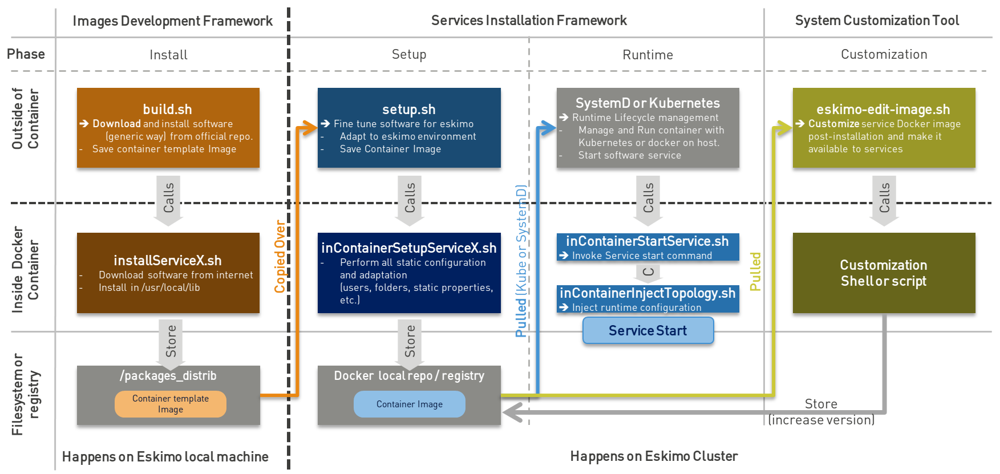

////
This file is part of the eskimo project referenced at www.eskimo.sh. The licensing information below apply just as
well to this individual file than to the Eskimo Project as a whole.

Copyright 2019 www.eskimo.sh - All rights reserved.
Author : http://www.eskimo.sh

Eskimo is available under a dual licensing model : commercial and GNU AGPL.
If you did not acquire a commercial licence for Eskimo, you can still use it and consider it free software under the
terms of the GNU Affero Public License. You can redistribute it and/or modify it under the terms of the GNU Affero
Public License  as published by the Free Software Foundation, either version 3 of the License, or (at your option)
any later version.
Compliance to each and every aspect of the GNU Affero Public License is mandatory for users who did no acquire a
commercial license.

Eskimo is distributed as a free software under GNU AGPL in the hope that it will be useful, but WITHOUT ANY
WARRANTY; without even the implied warranty of MERCHANTABILITY or FITNESS FOR A PARTICULAR PURPOSE. See the GNU
Affero Public License for more details.

You should have received a copy of the GNU Affero Public License along with Eskimo. If not,
see <https://www.gnu.org/licenses/> or write to the Free Software Foundation, Inc., 51 Franklin Street, Fifth Floor,
Boston, MA, 02110-1301 USA.

You can be released from the requirements of the license by purchasing a commercial license. Buying such a
commercial license is mandatory as soon as :
- you develop activities involving Eskimo without disclosing the source code of your own product, software,
  platform, use cases or scripts.
- you deploy eskimo as part of a commercial product, platform or software.
For more information, please contact eskimo.sh at https://www.eskimo.sh

The above copyright notice and this licensing notice shall be included in all copies or substantial portions of the
Software.
////

:sectnums:
:authors: www.eskimo.sh / 2019
:copyright: www.eskimo.sh / 2019

:toc:

== Eskimo Introduction

Eskimo is a Big Data Management Web Console to _build_, _manage_ and _operate_
*Big Data 2.0* clusters leveraging on  *Kubernetes*.

Reach http://www.eskimo.sh for more information on Eskimo or look at the documentation in the folder `doc`.

=== Eskimo Service Development Framework

The *Service Development framework* is actually composed by two distinct parts:

1. The *Docker Images Development Framework* which is used to build the docker images deployed on the eskimo cluster
   nodes
2. The *Services Installation Framework* which is used to install these images as services on kubernetes or natively on
   the eskimo cluster nodes.

This document presents "2. The *Services Installation Framework*"

=== Principle schema

The whole services development framework can be represented as follows:

ifdef::service-dev-guide-embedded[]
// suppress inspection "AsciiDocLinkResolve"
image::pngs/services-development-framework.png[800, 800, align="center"]
endif::service-dev-guide-embedded[]
ifndef::service-dev-guide-embedded[]

endif::service-dev-guide-embedded[]

* The **Docker Images  Development  Framework* (See `README.adoc` in `/packages_dev`) is used to develop and build
_Service Container template_ images that are later used to build the actual docker containers images that are fine-tuned
to Eskimo deployed on Kubernetes or natively on individual Eskimo cluster nodes. +
The _Service Container Template_ Image itself is very generic docker image around the underlying software component
(e.g. Kafka, Spark, etc.) and might well be used outside of Eskimo.
* The <<services_installation_framework>> (this very guide) which creates the actual _Eskimo
Service container_ image from the template image by adapting it to the specific situation of the eskimo node or kube
cluster on which it is being deployed. +
The actual _Eskimo Service Container_ Image if very specific to Eskimo; even further, it is very specific to the very
Eskimo cluster on wich it is being deployed.

The different scripts involved in the different stages are presented on the schema above along with their
responsibilities and the environment in which they are executed (outside of the container - on the eskimo host machine
or the eskimo cluster node - or from within the docker container, operated through Kubernetes or not).

// marker for inclusion : line 90
[[services_installation_framework]]
== Services Installation Framework

The Services Installation Framework provides _tools_, _standards_ and _conventions_ to install the packaged docker
images containing the target software component - through it's tmplate docker image - on Kubernetes or natively on the
eskimo cluster nodes.

Eskimo is leveraging on _Kubernetes_ to run and operate most of the services and the couple _docker_ and _SystemD_
for the few of them - such as gluster, ntp, etc - that need to run natively on Eskimo cluster nodes.

* An eskimo package has to be a _docker image_
* An eskimo package has to provide
** either a *SystemD unit configuration file* to enable eskimo to operate the component natively on the cluster nodes.
** or a *Kubernetes YAML configuration file generator* to delegate the deployment and operation to Kubernetes.

The Eskimo Web User Interface takes care of installing the services defined in the `services.json`
configuration file and copies them over to the nodes where they are intended to be installed (native node or Kubernetes)
along with the corresponding _package template docker image_.
After the proper installation, eskimo relies either on plain old `systemctl` or `kubectl` commands to operate
(deploy / start / stop / restart / query / etc.) the installed services.

=== Principle

The principle is pretty straightforward:

* Whenever a service `serviceX` is to be deployed, eskimo makes an archive of the folder
`services_setup/serviceX`, copies that archive over to the target node and extracts it in a subfolder of `/tmp`.
** The target node is the intended installation cluster node for a node native service
** and the node runhing the `kube-master` service for a kubernetes service.
* Then eskimo calls the script `setup.sh` from within that folder. The script `setup.sh` can do whatever it wants but has
to respect a few constraints
** After that `setup.sh` script is properly executed, the service should be
*** either installed natively on the node along with a systemd system unit file with name `serviceX.service` which is
used to control the _serviceX_ service lifecycle through
commands such as `systemctl start serviceX`,
*** or properly deployed in Kubernetes and executing a POD name prefixed by the service name and a kube service matching
it. All of them being declared in a file `serviceX.k8s.yml.sh` which is actualyl a script generating the service file
after proper injection of Eskimo Topology and configuration.
** If the service is a CLI package, then a dummy systemd unit file still needs to be provided (it can simply periodically
check that the CLI command are still installed or the used dockre image still available for instance).
* By convention, the script `setup.sh` uses a script `inContainerSetuServiceX.sh` to perform in container
  configurations.

The principle can be illustrated as follows:

ifdef::service-dev-guide-embedded[]
// suppress inspection "AsciiDocLinkResolve"
image::pngs/services-installation-framework.png[800, 800, align="center"]
endif::service-dev-guide-embedded[]
ifndef::service-dev-guide-embedded[]

endif::service-dev-guide-embedded[]

Aside from the above, nothing is enforced and service developers can implement services the way they want.

==== Gluster share mounts

Many Eskimo services can leverage on gluster to share data across cluster nodes. +
SystemD services rely on the host to mount gluster shares and then mount the share to the gluster container from the
host mount. +
The way to do this is as follows:

* The service `setup.sh` script calls the script `/usr/local/sbin/gluster-mount.sh [SHARE_NAME] [SHARE_PATH] [OWNER_USER]` +
  This script will take care of registering the gluster mount with SystemD, fstab, etc.
* The service SystemD unit file should define a dependency on the SystemD mount by using the following statements +
  `After=gluster.service` +
  `After=[SHARE_PATH_HYPHEN-SEPARATED].mount`

Using the host to mount gluster shares is interesting since it enables Eskimo users to see the content of the gluster
share using the Eskimo File Manager.

The approach is very similar for Kubernetes services, except they can't be relying on SystemD (which is not available
to Kube containers) +
So Kubernetes services actually mount the gluster share directly from inside the docker container. +
The way to do this is as follows:

* The container startup script calls the script `inContainerMountGluster.sh [SHARE_NAME] [SHARE_PATH] [OWNER_USER]`

==== OS System Users creation

OS system users required to execute Kubernetes and native services are required to be created on every node of the
Eskimo cluster nodes with consistent user IDs across the cluster . For this reason,
the linux system users to be created on every node are not created in the individual services `setup.sh` scripts. They
are created by a specific script `/usr/local/sbin/eskimo-system-checks.sh` generated at installation time by  the eskimo
base system installation script `install-eskimo-base-system.sh`.

=== Standards and conventions over requirements

There are no requirements when setting up a service on a node aside from the constraints mentioned above.
Services developers can set up services on nodes the way then want and no specific requirement is enforced by eskimo.

However, adhering to some conventions eases a lot the implementation and maintenance of these services. +
These standard conventions are as follows (illustrated for a service called `serviceX`).

* Data persistency
** Cluster node native Services should put their persistent data (to be persisted between two docker container restart)
   in `/var/lib/serviceX` which should be mounted from the host by the called to docker in the SystemD unit file
** Kubernetes services should either rely on Kubernetes provided persistent storage or use a gluster share.
** In any case, gluster shares to be created for services should be declared in the `gluster` service definition in
   `services.json` in the _editable settings_ property `target.volumes` (look at pre-packaged `services.json` for
   examples)
* Services should put their log files in `/var/log/serviceX` which is mounted from the runtime host.
* If the service requires a file to track its PID, that file should be stored under `/var/run/serviceX` to be mounted
  from the runtime host as well.
* Whenever a service `serviceX` requires a subfolder of `/var/log/serviceX` to be shared among cluster nodes, a script
`setupServiceXGlusterSares.sh` should be defined that calls the common helper script (define at eskimo base system
installation on every node) `/usr/local/sbin/gluster-mount.sh` in the following way, for instance to define
 the _flink data_ share : `/usr/local/sbin/gluster-mount.sh flink_data /var/lib/flink/data flink`
* The approach is the same from within a container, but the name if the script to call is different:
`/usr/local/sbin/inContainerMountGlusterShare.sh`.

At the end of the day, it's really plain old Unix standards. The only challenge comes from the use of docker and/or
Kubernetes which requires to play with docker mounts a little bit. +
Just look at eskimo pre-packaged services to see examples.

=== Typical setup.sh process

==== Operations performed

The setup process implemented as a standard in the `setup.sh` script has three different stages:

. The container instantiation from the pre-packaged image performed from outside the container
. The software component setup performed from inside the container
. The registration of the service to _SystemD_ or _Kubernetes_
. The software component configuration applied at runtime, i.e. at the time the container starts, re-applied everytime.

The fourth phase is most of the time required to apply configurations depending on environment dynamically at startup
time and not statically at setup time. +
The goal is to address situations where, for instance, master services are moved to another node (native deployment) or
moved around by Kubernetes. In this case,
applying the master setup configuration at service startup time instead of statically enables to simply restart a slave
service whenever the master node is moved to another node instead of requiring to entirely re-configure them.

The install and setup process thus typically looks this way:

1. From outside the container:
* Perform required configurations on host OS (create `/var/lib` subfolder, required system user, etc.)
* Run docker container that will be used to create the set up image
* Call in container setup script

2. From inside the container:
* Create the in container required folders and system user, etc.
* Adapt configuration files to eskimo context (static configuration only !)

3. At service startup time:
* Adapt configuration to topology (See <<topology>> below)
* Start service

And that's it.

Again, the most essential configuration, the adaptation to the cluster _topology_ is not done statically at container
setup time but dynamically at service startup time.

==== Standard and conventions

While nothing is really enforced as a requirement by eskimo (aside of SystemD / Kubernetes and the name of the
`setup.sh` script, there are some standards that should be followed (illustrated for a service named `serviceX`:

* The "in container" setup script is usually called `inContainerSetupServiceX.sh`
* The script taking care of the dynamic configuration and the starting of the service - the one actually called by
SystemD or Kubernetes upon service startup - is usually called `inContainerStartServiceX.sh`
* Then dependening on the type of service:
** For a native node service, the SystemD system configuration file is usually limited to stopping and starting the
   docker container
** For a Kubernetes service, the Kubernetes deployment file usually create a deployment (for ReplicaSet) or a
   StatefulSet along with all services required to reach the software component.

==== Look for examples and get inspired

Look at examples and the way the eskimo pre-packages services are set up and get inspired for implementing your own
packages.

=== Eskimo services configuration

Creating the service setup folder and writing the `setup.sh` script is unfortunately not sufficient for eskimo to be
able to operate the service. +
A few additional steps are required, most importantly, defining the new service in the configuration file
`services.json`.

[[services_json]]
==== Configuration file `services.json`

In order for a service to be understood and operable by eskimo, it needs to be declared in the *services configuration
file*  `services.json`. +
Eskimo understands how to operate a service from the configuration provided in `services.json`.

A service declaration in `services.json` for instance for `serviceX` would be defined as follows:

.ServiceX declaration in `services.json`
----
"serviceX" : {

  "config": {

    ## [mandatory] This is used to order the services in the status table on the
    ## status page.
    "order": [0-X],

    ## [optional] whether or not it has to be instaled on every node
    ## Default value is false.##
    "mandatory": [true,false],

    ## [unique] whether the service is a unique service (singpe instance) or a
    ## multiple instances service
    "unique": [true,false],

    ## [unique] whether the service is managed through Kubernetes (true) or
    ## natively on nodes with SystemD (false)
    "kubernetes": [true,false],

    ## [optional] name of the group to associate it in the status table
    "group" : "{group name}",

    ## [mandatory] name of the service. must be consistent with service under
    ## 'service_setup'
    "name" : "{service name},

    ## [mandatory] name of the image. must be consistent with docker image name
    ## under 'packages_dev'
    ## Most of the time, this is the same as {service name}
    "imageName" : "{image name},

    ## [mandatory] where to place the service in 'Service Selection Window'
    "selectionLayout" : {
      "row" : [1 - X],
      "col" : [1 - X]
    },

    ## memory to allocate to the service
    ## (negligible means the service is excluded from the memory allocation policy
    ##  Kubernetes services are accounted specifically:
    ##  - services running on all nodes are account as native services
    ##  - services running as replicaSet are accounted globally and their total
    ##    required memory is divided amongst all nodes.
    ## )
    "memory": "[negligible|small|medium|large|verylarge]",

    ## [mandatory] The logo to use whenever displaying the service in the UI is
    ##     required
    ## Use "images/{logo_file_name}" for resources packaged within eskimo web app
    ## Use "static_images/{logo_file_name}" for resources put in the eskimo
    ##    distribution folder "static_images"
    ## (static_images is configurable in eskimo.properties with property
    ##    eskimo.externalLogoAndIconFolder)
    "logo" : "[images|static_images]/{logo_file_name}"

    ## [mandatory] The icon to use ine the menu for the service
    ## Use "images/{icon_file_name}" for resources packaged within eskimo web app
    ## Use "static_images/{icon_file_name}" for resources put in the eskimo
    ##    distribution folder "static_images"
    ## (static_images is configurable in eskimo.properties with property
    ##    eskimo.externalLogoAndIconFolder)
    "icon" : "[images|static_images]/{icon_file_name}"

    ## [optional]  This is used to have eskimo automatically create and maintain
    ## a system (OS) level user on each and every node of the eskimo cluster
    "user": {

      ## The username of the user to create
      "name": "{username}",  ## e.g. "kafka"

      ## The user ID (/)UID) of the user to create
      "id": {UID}  ## e.g. 3303
    }.

    ## The specific Kubernetes configuration for kubernetes=true services
    "kubeConfig": {

      ## the resource request to be made by PODs
      "request": {

        ## The number of CPUs to be allocated to the POD(s) by Kubernetes
        ## Format : X for X cpus, can have decimal values
        "cpu": "{number of CPU},  ## e.g. 0.5

        ## The amount of RAM to be allocated to the POD(s) by Kubernetes
        ## Format: X[k|m|g|p] where k,m,g,p are multipliers (kilo, mega, etc.)
        "ram": "{amount of RAM},  ## e.g. 1600m

      }
    }
  },

  ## [optional] configuration of the serice web console (if anym)
  "ui": {

    ## [optional] (A) either URL template should be configured ...
    "urlTemplate": "http://{NODE_ADDRESS}:{PORT}/",

    ## [optional] (B) .... or proxy configuration in case the service has
    ## to be proxied by eskimo
    "proxyTargetPort" : {target port},

    ## [mandatory] the time  to wait for the web console to initialize before
    ## making it available (expressed in milliseconds)
    ## (Giving a few seconds is always a good idea, specific services such as
    ## kibana need more than 8 seconds to properly initialize)
    "waitTime": {1000 - X},

    ## [mandatory] the name of the service i nthe left menu
    "title" : "{menu name}",

    ## [mandatory] the role that the logged in user needs to have to be able
    ## to see and use the service (UI)
    ## Possible values are :
    ##  - "*" for any role (open access)
    ## - "ADMIN" to limit usage to administrators
    ## - "USER" to limit usage to users (makes little sense)
    "role" : "[*|ADMIN|USER]",

    ## [optional] the title to use for the link to the service on the status page
    "statusPageLinktitle" : "{Link Title}",

    ## [optional] Whether standard rewrite rules need to be applied to this
    ## service
    ## (Standard rewrite rules are documented hereunder)
    ## (default is true)
    "applyStandardProxyReplacements": [true|false],

    ## [optional] List of custom rewrite rules for proxying of web consoles
    "proxyReplacements" : [

      ## first rewrite rule. As many as required can be declared
      {

        ## [mandatory] Type of rwrite rule. At the moment only PLAIN is supported
        ## for full text search and replace.
        ## In the future REGEXP type shall be implemented
        "type" : "[PLAIN]",

        ## [optional] a text searched in the URL. this replacement is applied only
        ## if the text is found in the URL
        "urlPattern" : "{url_pattern}",  ## e.g. controllers.js

        ## [mandatory] source text to be replaced
        "source" : "{source_URL}",  ## e.g. "/API"

        ## [mandatory] replacement text
        "target" : "{proxied_URL}"  ## e.g. "/eskimo/kibana/API"
      }
    ],

     ## [optional] List of page scripter
     ## Page scripters are added to the target resource just above the closing
     ## 'body' tag
    "pageScripters" : [
      {

        ## [mandatory] the target resource where the script should be added
        "resourceUrl" : "{relative path to target resource}",

        ## [mandatpry] content of the 'script' tag to be added
        "script": "{javascript script}"
      }
    ],

    ## [optional] list of URL in headers (e.g. for redirects) that should be
    ## rewritten
    "urlRewriting" : [
      {

        # [mandatory] the start pattern of the URL to be searched in returned headers
        "startUrl" : "{searched prefix}"  ## e.g. "{APP_ROOT_URL}/history/",

        # [mandatory] the replacement for that pattern
        "replacement" : "{replacement}"  ## e.g.
                                   ## "{APP_ROOT_URL}/spark-console/history/"
      }
    ]
  },

  ## [optional] Master detection strategy.
  ## Whenever the administrator wants to expose a Web UI on a services running
  ## as multiple instances throughout the Eskimo cluster, then defining this
  ## is mandatory
  "masterDetection": {

    ## [mandatory] the strategy to use (only "LOG_FILE" is supported for now)
    "strategy" : "LOG_FILE",

    ## [mandatory] the log file to search for the marker in the last lines
    "logFile" : "{log file to search in}",  ## e.g. /var/log/gluster/egmi/egmi.log"

    ## [mandatory] the marker to search for
    "grep": "{marker to search for}",       ## e.g. "I am the new leader"

    ## [mandatory] the REGEX to extract the timestamp from the log line
    ## containing the marker
    "timeStampExtractRexp" : "{REGEX to extract the timesamp}", ## e.g.
                                            ## ([0-9\\-]+ [0-9.:,]+).*"

    ## [mandatory] the SimpleDateFormat pattern to parse the timestamp
    "timeStampFormat" : "{timesamp format}", ## e.g. "yyyy-MM-dd HH:mm:ss,SSS"
  },

  ## [optional] array of dependencies that need to be available and configured
  "dependencies": [

    ## first dependency. As many as required can be declared
    {

      ## [mandatory] For services not operated by kubernetes, this is
      ## essential: it defines how the master service is determined.
      "masterElectionStrategy": "[NONE|FIRST_NODE|SAME_NODE_OR_RANDOM|RANDOM|RANDOM_NODE_AFTER|SAME_NODE|ALl_NODES]"

      ## [mandatory] the service relating to this dependency
      "masterService": "{master service name}",

      ## [mandatory] The number of master expected
      "numberOfMasters": [1-x],

      ## whether that dependency is mandatory or not
      "mandatory": [true|false],

      ## whether or not the dependent service (parent JSON definition) should be
      ## restarted in case an operation affects this service
      "restart": [true|false],

      ## [optional] Hooks are command to be called on master whenever an action
      ## is performed on service
      "hooks": {

        ## [optional] A preinstall hook is a command called on master whenever the
        ## service is about to be uninstalled
        "preUninstallHook": "{command}"  ## e.g.
           ## "/usr/local/bin/eskimo-kubectl delete_node NULL {service.node.address}"
      }
    }
  ]

  ## [optional] array of configuration properties that should be editable using the
  ## Eskimo UI. These configuration properties are injected
  "editableConfigurations": [

    ## first editable configuration. As many as required can be declared
    {

      ## the name of the configuration file to search for in the software
      ## installation directory (and sub-folders)
      "filename": "{configuration file name}", ## e.g. "server.properties"

      ## the name of the service installation folder under /usr/local/lib
      ## (eskimo standard installation path)
      "filesystemService": "{folder name}",  ## e.g. "kafka"

      ## the type of the property syntax
      ##  - "variable" for a simple approach where a variable declaration of the
      ##    expected format is searched for
      ##  - "regex" for a more advanced approach where the configuration is searched
      ##    and replaces using the regex given in format
      "propertyType": "variable",

      ## The format of the property definition in the configuration file
      ## Supported formats are:
      ##  - "{name}: {value}" or
      ##  - "{name}={value}" or
      ##  - "{name} = s{value} or"
      ##  - "REXG with {name} and {value} as placeholders"
      "propertyFormat": "property format",  ## e.g. "{name}={value}"

      ## The prefix to use in the configuration file for comments
      "commentPrefix": "#",

      ## The list of properties to be editable by administrators using the eskimo UI
      "properties": [

        ## first property. As many as required can be declared
        {

          ## name of the property
          "name": "{property name}",  ## e.g. "num.network.threads"

          ## the description to show in the UI
          "comment": "{property description}",

          ## the default value to use if undefined by administrators
          "defaultValue": "{default property value}",  ## e.g. "3"

          ## [optional] a REGEX used to validate the user input value
          "validationRegex": "{REGEX}"  ## e.g. "^[0-9\\.]+$"
        }
      ]
    }
  ],

  ## [optional] array of custom commands that are made available from the context
  ## menu on the System Status Page (when clicking on services status (OK/KO/etc.)
  "commands" : [
    {

      ## ID of the command. Needs to be a string with only [a-zA-Z_]
      "id" : "{command_id}",  ## e.g. "show_log"

      ## Name of the command. This name is displayed in the menu
      "name" : "{command_name}",  ## e.g. "Show Logs"

      ## The System command to be called on the node running the service
      "command": "{system_command}",  ## e.g. "cat /var/log/ntp/ntp.log"

      ## The font-awesome icon to be displayed in the menu
      "icon": "{fa-icon}"  ## e.g. "fa-file"
    }
  ],

  ## Additional environment information to be generated in eskimo_topology.sh
  ## This can contain multiple values, all possibilities are listed underneath as
  ## example
  "additionalEnvironment": {

    # Create an env var that lists all nodes where serviceX is installed
    "ALL_NODES_LIST_serviceX",

    # Create a env var that gives the number for this service, in a consistent and
    # persistent way (can be 0 or 1 based
    "SERVICE_NUMBER_[0|1]_BASED",

    # Give in evnv var the context path under which the eskimo Wen Use Interface is
    # deployed
    "CONTEXT_PATH"

  }
}
----

(Bear in mind that since json actually doesn't support such thing as comments, the example above is actually not a valid
JSON snippet - comments starting with '##' would need to be removed.)

Everything is pretty straightforward and one should really look at the services pre-packaged within eskimo to get
inspiration when designing a new service to be operated by eskimo.

[[topology]]
==== Eskimo Topology and dependency management

As stated above, the most essential configuration property in a _service definition_ is the `masterElectionStrategy`
of a dependency. +
The whole master / slave topology management logic as well as the whole dependencies framework of eskimo relies on it.

This is especially important for non-kubernetes services since most of the time the notion of "master" (in the eskimo
sense) is replaced by the usage of a _kubernetes service definition_ to reach the software component deployed on
Kubernetes.

WARNING: This is a little confusing in this documentation BTW. Most of the time in this documentation, by _kubernetes
service_  we mean an *eskimo service deployed on Kubernetes*, and not the _service_ definition / feature of kubernetes.

===== Master Election strategy

Let's start by introducing what are the supported values for this `masterElectionStrategy` property:

* `NONE` : This is the simplest case. This enables a service to define as requiring another service without
bothering where it should be installed. It just has to be present somewhere on the cluster and the first service
doesn't care where. +
It however enforces the presence of that dependency service somewhere and refuses to validate the installation if the
dependency is not available somewhere on the eskimo nodes cluster.
* `FIRST_NODE` : This is used to define a simple dependency on another service. In addition, `FIRST_NODE` indicates that
the service where it is declared wants to know about at least one node where the dependency service is available. +
That other node should be the _first node_ found where that dependency service is available. +
_First_ node means that the nodes are processed by their order of declaration. The first node than runs the dependency
service will be given as dependency to the declaring service.
* `SAME_NODE_OR_RANDOM` : This is used to define a simple dependency on another service. In details,
`SAME_NODE_OR_RANDOM` indicates that the first service wants to know about at least one node where the dependency
service is available. +
In the case of `SAME_NODE_OR_RANDOM`, eskimo tries to find the dependency service on the very same node than
the one running the declaring service if that dependent service is available on that very same node. +
If no instance of the dependency service is not running on the very same node, then any other random node running the
dependency service is used as dependency. _(This is only possible for native nodes SystemD services)_
* `RANDOM` : This is used to define a simple dependency on another service. In details, `RANDOM` indicates that the
first service wants to know about at least one node where the dependency service is available. That other node can be
any other node of the cluster where the dependency service is installed.
* `RANDOM_NODE_AFTER` : This is used to define a simple dependency on another service. In details, `RANDOM_NODE_AFTER`
indicates that the first service wants to know about at least one node where that dependency service is available. +
That other node should be any node of the cluster where the second service is installed yet with a *node number*
(internal eskimo node declaration order) greater than the current node where the first service is installed. +
This is useful to define a chain of dependencies where every node instance depends on another node instance in a
circular way - pretty nifty for instance for elasticsearch discovery configuration if the operator wants to install
them as native services. _(This is only possible for native nodes SystemD services)_
* `SAME_NODE` : This means that the dependency service is expected to be available on the same node than the first
service, otherwise eskimo will report an error during service installation. _(This is only possible for native nodes
SystemD services)_
* `ALL_NODES` : this means that every service defining this dependency will receive the full list of nodes running
the master service in an topology variable.

*The best way to understand this is to look at the examples in eskimo pre-packaged services declared in the bundled
`services.json`.*

===== Examples

Let's see some examples.

* Etcd wants to use the co-located instance of gluster. Since gluster is expected to be available from all nodes of the
eskimo cluster, this dependency is simply expressed as:

.etcd dependency on gluster
----
    "dependencies": [
      {
        "masterElectionStrategy": "SAME_NODE",
        "masterService": "gluster",
        "numberOfMasters": 1,
        "mandatory": false,
        "restart": true
      }
    ]
----

* kube-slave services needs to reach the first node where kube-master is available (only one in Eskimo Community
edition in anyway), so the dependency is defined as follows:

.kube-slave dependency on first kube-master
----
    "dependencies": [
      {
        "masterElectionStrategy": "FIRST_NODE",
        "masterService": "kube-master",
        "numberOfMasters": 1,
        "mandatory": true,
        "restart": true
      },
----

* kafka-manager needs to reach any random instance of kafka running on the cluster, so the dependency is expressed as
simply as:

.kafka-manager dependency on kafka:
----
    "dependencies": [
      {
        "masterElectionStrategy": "FIRST_NODE",
        "masterService": "zookeeper",
        "numberOfMasters": 1,
        "mandatory": true,
        "restart": true
      },
      {
        "masterElectionStrategy": "RANDOM",
        "masterService": "kafka",
        "numberOfMasters": 1,
        "mandatory": true,
        "restart": false
      }
----

Look at other examples to get inspired.

==== Memory allocation

Another pretty important property in a service configuration in `services.json` is the memory consumption property:
`memory`.

===== Services memory configuration

The possible values for that property are as follows :

* `negligible` : the service is not accounted in memory allocation
* `small` : the service gets a single share of memory
* `medium` : the service gets two shares of memory
* `large` : the service gets three shares of memory

The system then works by computing the sum of shares for all nodes and then allocating the available memory on the node
to every service by dividing it amongst shares and allocating the corresponding portion of memory to every service. +
Of course, the system first removes from the available memory a significant portion to ensure some room for kernel and
filesystem cache.

Also, Kubernetes services deployed as statefulSet on every node are accounted on every node; while unique kubernetes
services are accounted only partially, with a ratio corresponding to the amount of memory it would take divided by the
number of nodes. +
Since unique Kubernetes services are spread among nodes, this works well in practice as it's quite realistic.

===== Examples of memory allocation

Let's imagine the following services installed on a cluster node, along with their memory setting:

Native services :

* *ntp* - negligible
* *prometheus* - negligible
* *gluster* - negligible
* *zookeeper* - small

Kubernetes services :

* *elasticsearch* - large
* *logstash* - small
* *kafka* - large
* *kibana* - medium
* *zeppelin* - very large

The following table gives various examples in terms of memory allocation for three different total RAM size values on the
cluster node running these services. +
The different columns gives how much memory is allocated to the different services in the different rows for various
size of total RAM.

[width="80%",frame="topbot",options="header"]
|===================
| Node total RAM                | Nbr. parts | 8 Gb node | 16 Gb node | 20 Gb node
|                               |       |       |       |
| *ntp*                         |   0   |  -    |  -    |  -
| *prometheus*                  |   0   |  -    |  -    |  -
| *gluster*                     |   0   |  -    |  -    |  -
| *zookeeper*                   |   1   |  525m | 1125m | 1425m
|                               |       |       |       |
| *elasticsearch*               |   3   | 1575m | 3375m | 4275m
| *logstash*                    |   1   |  525m | 1125m | 1425m
| *kafka*                       |   3   | 1575m | 3375m | 4275m
| *kibana*                      |  2/3*  |  350m |  750m | 950m
| *zeppelin*                    |  5/3*  |  875m | 1875m | 2375m
|                               |       |       |       |
| *_Filesystem cache reserve_*  |   3   | 1575m | 3375m | 4275m
| *_OS reserve_*                |   -   | 1000m | 1000m | 1000m
|===================

(*For 3 nodes)

The services Kibana and Zeppelin are unique services running on Kubernetes, this example above accounts that there would
be 3 nodes in the cluster, hence their memory share is split by 3 on each node.

===== Kubernetes services memory configuration

The memory configurtion above is injected directly in the services themselves, without any consideration for the memory
requested by the corresponding Kubernetes POD. One should take that into account and declare a comparable amount of
memory when declaring the requested POD memory for Kubernetes Services.
In fact, one should declare a little more memory as Kubernetes requested memory for POD accounting for overhead.

===== Custom memory allocation

Every Eskimo service provides a mean for an administrator to specify the memory the service process should be using in
the *Eskimo Service Settings* Configuration page.

==== Topology file on cluster nodes

Every time the cluster nodes / services configuration is changed. Eskimo will verify the global services topology and
generate for every node of the cluster a "*topology definition file*".

That topology definition file defines all the dependencies and where to find them (using the notion of MASTER) for every
service running on every node.
It also gives indications about the last known services installation status along with kubernetes memory and cpu
requests, etc.

The "topology definition file" can be fond on nodes in `/etc/eskimo_topology.sh`.

[[proxying]]
=== Proxying services web consoles

Many services managed by eskimo have web consoles used to administer them, such as the kubernetes dashboard, cerebro,
kafka-manager, etc.
Some are even only web consoles used to administer other services or perform Data Science tasks, such as Kibana,
Zeppelin or Grafana, etc.

With Eskimo, these consoles, either running natively or managed by kubernetes, are reach from within Eskimo and can be
completely isolated from the client network. +
Eskimo provides these Web User Interfaces in its own UI and takes care of proxying the backend call through SSH tunnels
to the actual service running in the Eskimo cluster.

Proxying is however a little more complicated to set up since eskimo needs to perform a lot of rewriting on the text
resources (javascript, html and json) served by the proxied web console to rewrite served URLs to make them pass
through the proxy.

Eskimo provides a powerful rewrite engine that one can use to implement the rewrite rules defined in the configuration
as presented above.

*The minimum configuration that needs to be given to put in place a proxy for a service is to give a value to the
property `[serviceName].ui.proxyTargetPort` indicating the target port where to find the service (either on the cluster
npdes where it runs or through the Kubernetes proxy.).*

The different possibilities to configure rewrite rules and replacements are presented above in the section
<<services_json>>.

==== Source text replacements

Proxying web consoles HTTP flow means that a lot of the text resources served by the individual target web consoles
need to be processed in such a way that absolute URLs are rewritten.
This is unfortunately tricky and many different situations can occur, from URL build dynamically in javascript to static
resources URLs in CSS files for instance.

An eskimo service developer needs to analyze the application, debug it and understand every pattern that needs to be
replaced and define a *proxy replacement* for each of them.

===== Standard replacements

A set of standard proxy replacements are implemented once and for all by the eskimo HTTP proxy for all services. By default
these standard rewrite rules are enabled for a service unless the service config declares
`"applyStandardProxyReplacements": false` in which case they are not applied to that specific service. +
This is useful when a standard rule is actually harming a specific web console behaviour.

The standard replacements are as follows:

.Standard replacements
----

{
  "type" : "PLAIN",
  "source" : "src=\"/",
  "target" : "src=\"/{PREFIX_PATH}/"
},
{
  "type" : "PLAIN",
  "source" : "action=\"/",
  "target" : "action=\"/{PREFIX_PATH}/"
},
{
  "type" : "PLAIN",
  "source" : "href=\"/",
  "target" : "href=\"/{PREFIX_PATH}/"
},
{
  "type" : "PLAIN",
  "source" : "href='/",
  "target" : "href='/{PREFIX_PATH}/"
},
{
  "type" : "PLAIN",
  "source" : "url(\"/",
  "target" : "url(\"/{PREFIX_PATH}/"
},
{
  "type" : "PLAIN",
  "source" : "url('/",
  "target" : "url('/{PREFIX_PATH}/"
},
{
  "type" : "PLAIN",
  "source" : "url(/",
  "target" : "url(/{PREFIX_PATH}/"
},
{
  "type" : "PLAIN",
  "source" : "/api/v1",
  "target" : "/{PREFIX_PATH}/api/v1"
},
{
  "type" : "PLAIN",
  "source" : "\"/static/",
  "target" : "\"/{PREFIX_PATH}/static/"
},
----

===== Custom replacements

In addition to the standard rewrite rules - that can be used or not by a service web console - an eskimo service
developer can define as many custom rewrite rules as he wants in the service configuration in `services.json` as
presented above.

Some patterns can be used in both the `source` and `target` strings that will be replaced by the framework before they
are searched, respectively injected, in the text stream:

* `CONTEXT_PATH` will be resolved by the context root at which the eskimo web application is deployed, such as for
instance `eskimo`
* `PREFIX_PATH` will be resolved by the specific context path of the service web console context, such as for instance
for kibana `\{CONTEXT_PATH\}/kibana`, e.g. `eskimo/kibana` or `kibana` if no context root is used.
* `APP_ROOT_URL` will be resolved to the full URL used to reach eskimo, e.g. `http://localhost:9191/eskimo`

==== URL rewriting

URL rewriting is another mechanism available to fine tune eskimo proxying. +
Sometimes, a service backend sends a redirect (HTTP code 302 or else) to an absolute URL. In such cases, the absolute
URL needs to be replaced by the corresponding sub-path in the eskimo context.

This is achieved using URL rewriting rules.

.URL rewriting rule example for spark-console
----

      "urlRewriting" : [
        {
          "startUrl" : "{APP_ROOT_URL}/history/",
          "replacement" : "{APP_ROOT_URL}/spark-console/history/"
        }
----

The spark history servre uses such redirect when it is loading a spark log file for as long as the spark log file is
being loaded.
The rule above takes care or replacing such URL used in the HTTP redirect.

==== Page scripters

Page scripters form a third mechanism aimed at customizing the behaviour of proxied application. They consists of
declaring a javascript snippet that is injected at the bottom of the `body` tag in the referenced HTML document.

==== Master detection system (for multiple instances services)

Services running as unique service are detected automatically by the proxy redirection system and administrator have
nothing specific to do for the proxying to work effectively.

Services running as multiple instances services are another story. Eskimo needs a way to understand which of these
multiple instances is currently the master. +
Imaging a zookeeper cluster for instance. At any moment in time, only one of the is master. But the master can change at
any moment and eskimo might need a way to know about this. Now Zookeeper is not a good example since the slave instances
would still be able to answer requests. +
A better example is EGMI: Slave EGMI instance User Interfaces redirect the user automatically to the master EGMI User
Interface (URL). This unfortunately can't work in ESKIMO since this redirection is not compatible with the Eskimo
proxying system. So Eskimo needs a way to know at any given moment in time which is the EGMI master to direct the user
to.

This is achieved by using the *Master Detection* sub-system.

This is how this system is used by EGMI in `services.json`:

.master detection for EGMI in `services.json`
----
    "masterDetection": {
      "strategy" : "LOG_FILE",
      "logFile" : "/var/log/gluster/egmi/egmi.log",
      "grep": "I am the new leader",
      "timeStampExtractRexp" : "([0-9\\-]+ [0-9.:,]+).*",
      "timeStampFormat" : "yyyy-MM-dd HH:mm:ss,SSS"
    },
----

And this is how it works:

* `"strategy" : "LOG_FILE"` means that the system will parse the log file of the different instances searching for a
  specific marker. As of current version of Eskimo (0.5) `LOG_FILE` is the only supported strategy.
* The `"logFile"` configuration defines the log file to search for the marker in the last lines.
* `"grep"` gives the marker to be searched for
* `"timeStampExtractRexp"` and `"timeStampFormat"` are used to be able to get the timestamp if the log entry containing
  the searched marker. This is crucial to underatand which is the last one, giving us the latest master.

Everytime a service with multiple running instances is deployed (either natively on cluster nodes or through kubernetes,
this really doesn't matter) and if this service provides a WEB UI that the administrator wants to expose through the
Eskimo proxy to the Eskimo UI, then such a master detection definition needs to be provided.

[[utility_framework]]
=== BASH Utilities framework and functions

Eskimo provides multiple utility features and functions to ease the development of new services within Eskimo.
Most of these functions and features are implemented in the file `eskimo-utils.sh` installed by the base Eskimo setup
step on cluster nodes in `/usr/local/sbin`. +
Some other features are provided as independent scripts. +
This is noe detailed below.

==== Locking Framework

Whenever a service is starting, it's sometimes required to take a lock to ensure multiple services requiring the same
resource - such as a gluster mount for instance, or services initializing a common configuration file - avoid spurious
effects comming from race conditions. +
This is especially important for native node services starting on multiple nodes at the very same time.

Eskimo provides a locking framework based on filesystem-level locks (`flock` primitive) that can very well work in a
distributed way to synchronize services cluster-wide by leveraging on Gluster FS.

The BASH functions provided by eskimo for this purpose in  `eskimo-utils.sh` are as follows:

* `take_lock` takes a lock based on the file passed in argument. +
  e.g. `take_lock test_lock /var/lib/eskimo` would take a lock called test_lock on an ad'hoc file created in the
  folder `/var/lib/eskimo`. +
  A call to `take_lock `exports a variable called `LAST_LOCK_HANDLE` where the lock handle identifier to be used in
  order to release the lock later on is stored. This should be saved in another user-level variable immediately after a
  call to `take_lock`.
* `release_lock` releases a lock identified by the handle identifier passed in argument. +
  e.g. `release_lock 732:/var/lib/eskimo/test_lock.lock` would release the lock taken by the preceding example.
  A more realistic call would be `release_lock $LAST_LOCK_HANDLE` as explained above, even though that is discouraged
  and the user should favor storing that variable value in another user-defined variable.
* `take_global_lock` behaves as `take_lock` except that the user doesn't need to explicitly release the lock. +
  A lock taken with `take_global_lock` is released automatically when the shell process exits. Global here is meant
  as _global to the process_.

These locking functions are used extensively in Eskimo pre-packaged services, have a look and get inspired.

==== CLI utilities docker volume mount needs detection

CLI utilities in eskimo pre-packages services - such as logstash, pyspark, flink-shell, etc. - are implemented as
wrappers that instantiates the real CLI command in a docker container containing the relevant software stack properly
installed and configured. +
This causes problems whenever these command line tools takes in argument folder or files from the local filesystem since
these folders and files wouldn't be available from within the docker container.

For this reason, Eskimo provides an utility function called `parse_cli_docker_volume_mounts` in `eskimo-utils.sh`.
This function parses the command line tool supported arguments and defines the corresponding mount options to be used
by `docker run` to make these folders and files available from within the container as well.

The function `parse_cli_docker_volume_mounts` is invoked as follows:

`parse_cli_docker_volume_mounts "arg_flags_to_search_for" _type_ [separator] "$@"`

where _type_ is either `multiple` - whenever multiple files or folders can be passed to the corresponding argument, in
which case the separator must be indicated as well - or `single` - in which case a single file or folder path is
expected.

Some examples:

* `parse_cli_docker_volume_mounts "--jars,--py-files,--files" multiple "," "$@"` +
   seaches for `-jars`, `--py-files` and `--files` arguments in `$@` and supports finding many paths seperated by a
   comma.
* `parse_cli_docker_volume_mounts "-driver-class-path" multiple ":" "$@"` +
   searches for a typical classpath definition passed as `-driver-class-path` in `$@`
* `parse_cli_docker_volume_mounts "--properties-file" single "$@"` +
   searches for a properties file passed as `--properties-file` in `$@`

This function is used everywhere in every command from the Eskimo CLI packages, have a look and get inspired.

==== Getting last tag to use for an Eskimo service docker image

As explained in the next section <<docker_images_versioning>>, Eskimo services docker images follow a versioning scheme
where a re-installation of a service (following a customization script evolution for instance, or an upgrade of the
underlying software component, or whatever) causes the version (image tag) to be incremented.

For this reason, whenever a SystemD service startup script or a Kubernetes Deployment descriptor generation script
wants to start a service, it first needs to find out about the latest version / tag to use.

The function `get_last_tag` in `eskimo-utils.sh` is provided for this purpose. It's invoked by passing the eskimo
service name (which resolves the docker image name by convention) to the function call and returns on _stdout_ the
latest tag found either in Docker registry or in local docker image set.

==== Gluster Mount utility script

Gluster shares are mounted at runtime using standard mount command (fuse filesystem).

However eskimo provides _Toolbox script_ that takes care of all the burden of managing shared folders with gluster.

This _Toolbox script_ is the available on cluster nodes at: `/usr/local/sbin/gluster-mount.sh`. +
This script is called as follows:

.calling /usr/local/sbin/gluster-mount.sh
----
/usr/local/sbin/gluster-mount.sh VOLUME_NAME MOUNT_POINT OWNER_USER_ID
----

where:

* `VOLUME_NAME` is the name of the volume to be created in the gluster cluster
* `MOUNT_POINT` is the folder where to mount that volume on the local filesystem.
* `OWNER_USER_ID` the user to which the mount points should belong

The beauty of this script is that it takes care of everything, from manipulating `/etc/fstab` to configuring SystemD
automount properly, etc.

This script is related to the mount part (the client part) on hosts OSes running on the Eskimo cluster.
A similar script is provided to run from within container to mount gluster shares from within containers
(as required for instance for kubernetes operated services) : `inContainerMountGluster.sh`. +
EGMI takes care of the GlusterFS backend management part.

[[docker_images_versioning]]
=== Docker Images Versioning

Eskimo services docker images are versioned by incrementing the tag attribute every time the service gets reinstalled
by eskimo.

==== Principle

The different scripts presented above in chapter <<services_installation_framework>> and available with each and every service as part of the _Services Installation
Framwork_ can be customized at will and as often as required. +
Whenever one of these scripts is updated or customized, one simply needs to _reinstall_ the service using

* either the "_Setup Eskimo Nodes_" platform administration menu entry (for node native services)
* or the "_Setup Kube Services_" platformadministration menu entry (for node kubernetes services)

This can be done as frequently as required.

The system works by incrementing the image tag number at each and every installation and restarting the service (either
using SystemD for native services, or _kubectl_ for Kubernetes services.

The first time a service is installed, it will get the number "1" as tag, the second time will make the tag number
increased to the number "2", and so on. +
The system automatically purges and clobbers the previous tags and the docker filesystem layers (overlay) that might
not be required anymore.

[[services_customizatio_tool]]
==== Services Customization Tool

Services can be customized by updating or customizing the different scripts presented in
<<services_installation_framework>> above and available with each and every service. As explained in
<<docker_images_versioning>>, this can be done at will and one just needs to reinstall the corresponding service to make
his changes deployed on the system.

But eskimo also provides an utility tool to perform such customization on the live systen, without requiring to get
back to the eskimo UI and reinstall a service from the UI. +
Whenever one is developing a new service or feature, having to get back to Eskimo and the full reinstallation procedure
is cumbersome. This script is intended for this purpose, being able to quickly evolve services in an efficient and easy
fashion.

The principle is illustrated as follows:

ifdef::service-dev-guide-embedded[]
// suppress inspection "AsciiDocLinkResolve"
image::pngs/services-customization-tool.png[800, 800, align="center"]
endif::service-dev-guide-embedded[]
ifndef::service-dev-guide-embedded[]

endif::service-dev-guide-embedded[]

This tool takes the form of a shell script and is named `eskimo-edit-image.sh`.

.`eskimo-edit-image.sh usage
----
[root@test-node1 vagrant]# eskimo-edit-image.sh -h
eskimo-edit-image [-h] SERVICE [SCRIPT]
where SERVICE is the eskimo service / container name whose image is to be edited
SCRIPT is an optional script path to perfom customization
[root@test-node1 vagrant]#

----

It takes as argument the name of the service to be modified (which corresponds to the docker image name once a service
is installed) as well as an optional _shell script path_ aimed at performing the customization. +
If the customization script is omitted, then an interactive shell prompt is presented to the user for him to be able to
perform the customization interactively.

As an example, this would be the way to make the `vim` command available in the `cerebro` container:

.Install `vim` in cerebro
----
[root@test-node1 vagrant]# eskimo-edit-image.sh cerebro
 - Image to be edited is kubernetes.registry:5000/cerebro
 - Parsing arguments
 - Creating Kubernetes service DNS entries
 - Temp container name is e6d78843-9469-4ed2-bb04-a381d0e588a5
 - Finding new tag for container image
 - Launching Container ...
 - Invoking shell in container. You can now type commands!
root@test-node1:/# apt-get install vim
Reading package lists... Done
Building dependency tree... Done
Reading state information... Done
The following additional packages will be installed:
  vim-common vim-runtime xxd
Suggested packages:
  ctags vim-doc vim-scripts
The following NEW packages will be installed:
  vim vim-common vim-runtime xxd
0 upgraded, 4 newly installed, 0 to remove and 0 not upgraded.
Need to get 8138 kB of archives.
After this operation, 36.9 MB of additional disk space will be used.
Do you want to continue? [Y/n] y
...
root@test-node1:/# exit
exit
 - Customization command exited successfully, will now save change as new tag in kubernetes.registry:5000/cerebro:2
 - Committing the changes to the container
 - Stopping container
 - Pushing image in docker registry
 - Deleting previous tag
 - Deleting previous container image tag 1
 - Attempting to delete it with registry tag as well
 - Searching for previous image tag 1 in registry to delete it (if appliable)
   + Deleting previous container image tag 1 from registry
   + Garbage collecting layers
----

As a result of the above sequence, a new tag version "2" will be available in the system for the docker image use by
the service `cerebro`. +
The user is then left with restarting _cerebro_ manually on Kubernetes, which can be done with the help of the
`eskimo-kubectl` command:

.restarting cerebro on Kubernetes
----
[root@test-node1 vagrant]# eskimo-kubectl restart cerebro kubernetes
 - Restart Service cerebro
   + Deleting cerebro
service "cerebro" deleted
deployment.apps "cerebro" deleted
   + (Re-)applying cerebro
service/cerebro created
deployment.apps/cerebro created
[root@test-node1 vagrant]#
----

// marker for exclusion : line 1270

[appendix]
== Copyright and License

Eskimo is Copyright 2019 - 2023 eskimo.sh - All rights reserved. +
Author : http://www.eskimo.sh

Eskimo is available under a dual licensing model : commercial and GNU AGPL. +
If you did not acquire a commercial licence for Eskimo, you can still use it and consider it free software under the
terms of the GNU Affero Public License. You can redistribute it and/or modify it under the terms of the GNU Affero
Public License  as published by the Free Software Foundation, either version 3 of the License, or (at your option)
any later version. +
Compliance to each and every aspect of the GNU Affero Public License is mandatory for users who did no acquire a
commercial license.

Eskimo is distributed as a free software under GNU AGPL in the hope that it will be useful, but WITHOUT ANY
WARRANTY; without even the implied warranty of MERCHANTABILITY or FITNESS FOR A PARTICULAR PURPOSE. See the GNU
Affero Public License for more details.

You should have received a copy of the GNU Affero Public License along with Eskimo. If not,
see <https://www.gnu.org/licenses/> or write to the Free Software Foundation, Inc., 51 Franklin Street, Fifth Floor,
Boston, MA, 02110-1301 USA.

You can be released from the requirements of the license by purchasing a commercial license. Buying such a
commercial license is mandatory as soon as :

* you develop activities involving Eskimo without disclosing the source code of your own product, software, platform,
  use cases or scripts.
* you deploy eskimo as part of a commercial product, platform or software.

For more information, please contact eskimo.sh at https://www.eskimo.sh

The above copyright notice and this licensing notice shall be included in all copies or substantial portions of the
Software.